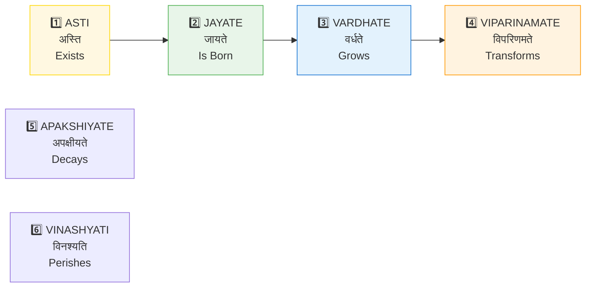
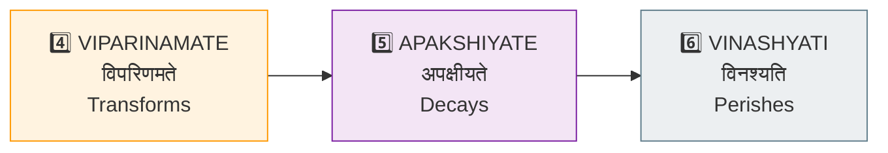
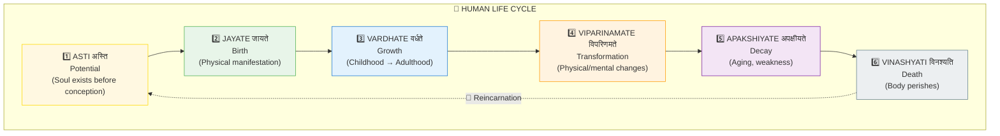
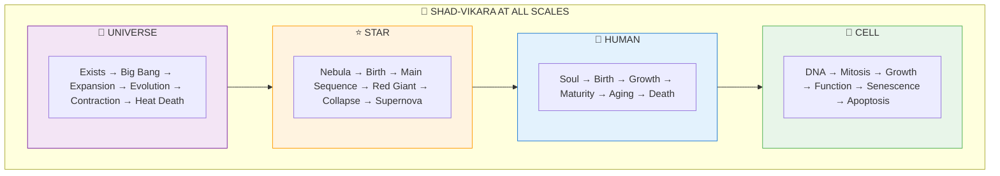
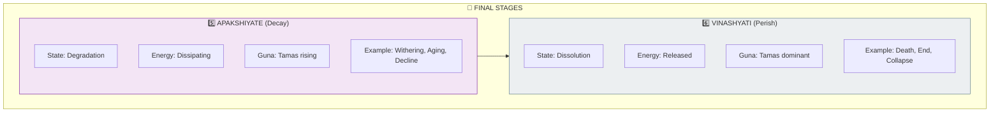
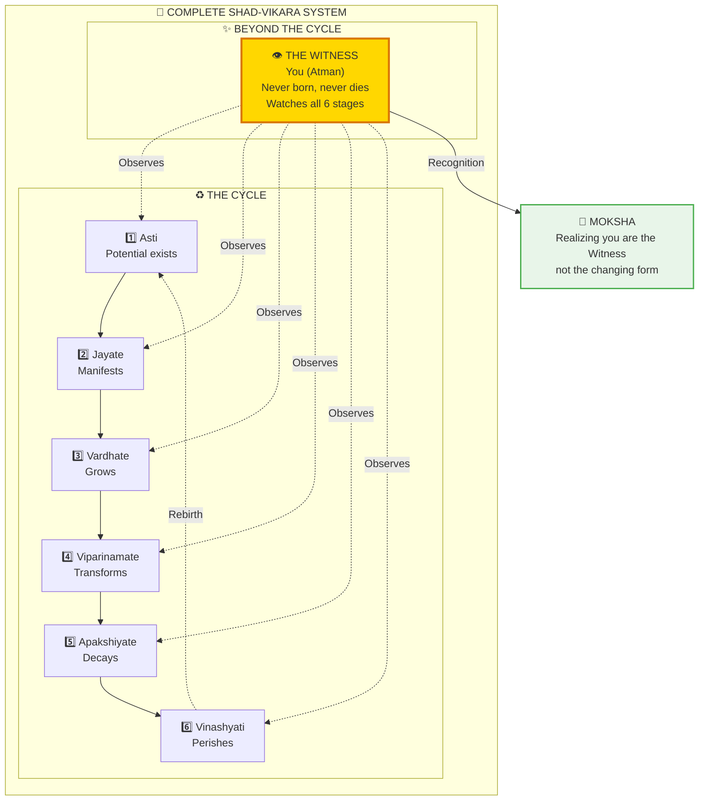

# 🔄 SHAD-VIKARA — Six Stages of Existence

> **"अस्ति जायते वर्धते विपरिणमते अपक्षीयते विनश्यति"**
> "Asti jayate vardhate viparinamate apakshiyate vinashyati"
> "Exists, is born, grows, transforms, decays, and perishes."
> — Bhagavata Purana

Shad-Vikara (षड्-विकार) describes the six inevitable stages every manifest thing passes through — from birth to death. This applies at ALL scales.

---

## 📊 Diagram 1: Simple Linear Sequence (Beginner)

**What it shows:** The six stages in order.

**Key Insight:** EVERYTHING with form goes through this!

---

## 📊 Diagram 2: Human Life Example (Intermediate)

**What it shows:** The six stages in a human lifetime.

---

## 📊 Diagram 3: Fractal Application (Intermediate)

**What it shows:** Same six stages at different scales.

---

## 📊 Diagram 4: Detailed Stage Characteristics (Advanced)

**What it shows:** What defines each stage.

```mermaid
flowchart TD
    subgraph Details["📜 STAGE CHARACTERISTICS"]
        subgraph Stage1["1️⃣ ASTI (Existence)"]
            A1["State: Potential"]
            A2["Energy: Latent"]
            A3["Guna: Pure Sattva"]
            A4["Example: Seed, DNA, Idea"]
        end
        
        subgraph Stage2["2️⃣ JAYATE (Birth)"]
            B1["State: Manifestation"]
            B2["Energy: Activation"]
            B3["Guna: Rajas rising"]
            B4["Example: Sprout, Baby, Project start"]
        end
        
        subgraph Stage3["3️⃣ VARDHATE (Growth)"]
            C1["State: Expansion"]
            C2["Energy: Building"]
            C3["Guna: Rajas dominant"]
            C4["Example: Plant, Child, Success"]
        end
        
        subgraph Stage4["4️⃣ VIPARINAMATE (Transform)"]
            D1["State: Maturation"]
            D2["Energy: Peak then shifting"]
            D3["Guna: S/R/T balance"]
            D4["Example: Fruit, Adult, Completion"]
        end
    end
    
    Stage1 --> Stage2 --> Stage3 --> Stage4
    
    style Stage1 fill:#FFF8E1,stroke:#FFD700
    style Stage2 fill:#E8F5E9,stroke:#4CAF50
    style Stage3 fill:#E3F2FD,stroke:#1976D2
    style Stage4 fill:#FFF3E0,stroke:#FF9800
```

---

## 📊 Diagram 5: Complete Cycle with Liberation (Expert)

**What it shows:** The cycle and how to exit it.

---

## 📋 Six Stages Summary

| # | Sanskrit | Meaning | Phase | Guna Dominant | Example |
|---|----------|---------|-------|---------------|---------|
| 1 | **Asti** | Exists | Potential | Sattva | Seed in soil |
| 2 | **Jayate** | Is Born | Emergence | Rajas ↑ | Sprout breaks ground |
| 3 | **Vardhate** | Grows | Expansion | Rajas | Plant grows tall |
| 4 | **Viparinamate** | Transforms | Maturation | S/R/T balance | Flowers bloom |
| 5 | **Apakshiyate** | Decays | Degradation | Tamas ↑ | Leaves wither |
| 6 | **Vinashyati** | Perishes | Dissolution | Tamas | Plant dies |

---

## 🎯 Practical Understanding

**What this means:**

1. **Everything changes** — No form is permanent
2. **Resistance is suffering** — Fighting stages causes pain
3. **You are the witness** — Not the body going through stages
4. **Death is transition** — Not end, just stage 6 before rebirth

**Liberation insight:** When you realize YOU don't go through these stages (only your body does), you're free.

---

## 🔗 Related Topics

- [Gunas](./gunas.md) — Which Guna dominates each stage
- [Death Mechanics](../../scientific_papers/05_NEUROSCIENCE/death/death_mechanics/README.md)
- [Moksha](./moksha.md) — Escaping the cycle

---

**[← Back to Diagram Library](./README.md)** | **[← Back to Site](../index.md)**
