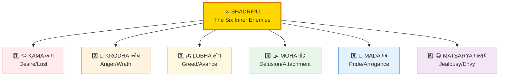
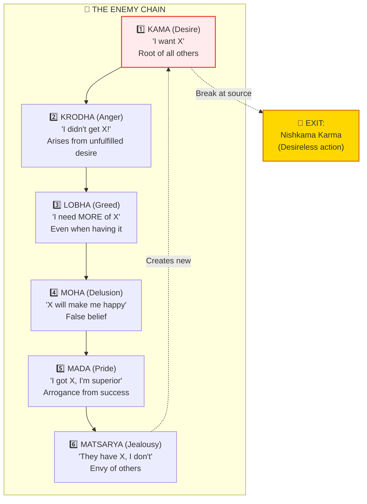
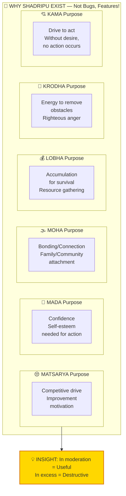
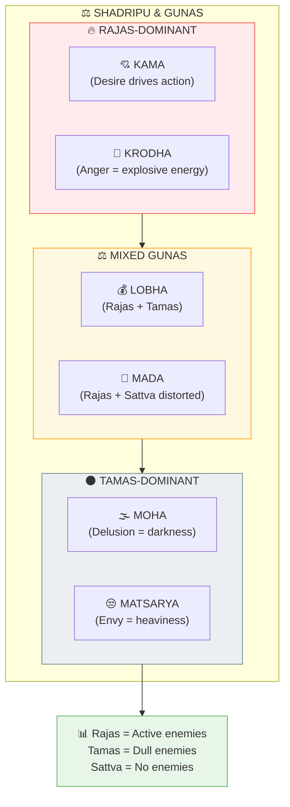
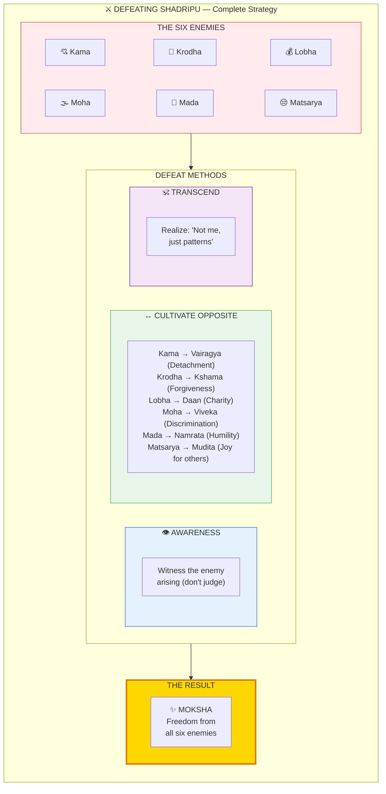

# ⚔️ SHADRIPU — The Six Inner Enemies

> **"काम क्रोध लोभ मोह मद मात्सर्य"**
> "Kama, Krodha, Lobha, Moha, Mada, Matsarya"
> — Bhagavad Gita 16.21

Shadripu (षड्रिपु/Six Enemies) are the six inner obstacles to Moksha. They are NOT bugs — they are **FEATURES** designed to create resistance for soul growth. Like gym weights build muscle, these enemies build Viveka (discrimination).

---

## 📊 Diagram 1: The Six Enemies (Beginner)

**What it shows:** The six inner enemies and their core nature.

**Key Insight:** These aren't "evil" — they're training weights. Without them, no spiritual growth possible.

---

## 📊 Diagram 2: How They Chain Together (Intermediate)

**What it shows:** How one enemy leads to another in sequence.

---

## 📊 Diagram 3: Why They Exist (Purpose) (Advanced)

**What it shows:** The evolutionary purpose of each enemy.

---

## 📊 Diagram 4: Guna Association (Advanced)

**What it shows:** Which Guna each enemy belongs to.

---

## 📊 Diagram 5: Defeating the Enemies (Expert)

**What it shows:** Complete strategy for transcending each enemy.

---

## 📋 Summary Table: The Six Enemies

| # | Enemy | Sanskrit | Core Nature | Antidote | Guna |
|---|-------|----------|-------------|----------|------|
| 1 | **Desire** | Kama (काम) | Wanting/Craving | Vairagya (Detachment) | Rajas |
| 2 | **Anger** | Krodha (क्रोध) | Rage/Hatred | Kshama (Forgiveness) | Rajas |
| 3 | **Greed** | Lobha (लोभ) | Hoarding/Avarice | Daan (Charity) | Rajas+Tamas |
| 4 | **Delusion** | Moha (मोह) | False belief/Attachment | Viveka (Discrimination) | Tamas |
| 5 | **Pride** | Mada (मद) | Arrogance/Ego | Namrata (Humility) | Rajas |
| 6 | **Jealousy** | Matsarya (मात्सर्य) | Envy/Resentment | Mudita (Sympathetic joy) | Tamas |

---

## 💡 Key Insights

### They Are NOT "Evil"
**Wrong View:** "I must destroy these enemies"  
**Right View:** "I must UNDERSTAND and TRANSCEND them"

### Why They're Called "Enemies"
- They block Moksha (liberation)
- They bind you to Samsara (cycle)
- They create suffering (when in excess)

### But Also... They're Teachers
- Kama → Teaches you about desire
- Krodha → Shows you attachment
- Each enemy is a LESSON, not just an obstacle

---

## 🎯 Practical Examples

### Kama (Desire) in Daily Life
- **Moderate:** Desire for food (survival)
- **Excess:** Addiction, lust, craving

### Krodha (Anger) in Daily Life
- **Moderate:** Righteous anger at injustice
- **Excess:** Rage, hatred, violence

### Lobha (Greed) in Daily Life
- **Moderate:** Saving for future
- **Excess:** Hoarding, never satisfied

### Moha (Delusion) in Daily Life
- **Moderate:** Healthy family bonds
- **Excess:** Blind attachment, codependency

### Mada (Pride) in Daily Life
- **Moderate:** Healthy self-esteem
- **Excess:** Arrogance, superiority complex

### Matsarya (Jealousy) in Daily Life
- **Moderate:** Motivation to improve
- **Excess:** Envy, resentment, bitterness

---

## 🧘 Practical Defeat Strategies

### For Kama (Desire)
1. Practice Pranayama (reduces Rajas)
2. Fast occasionally (builds control)
3. Meditate on impermanence

### For Krodha (Anger)
1. Pause before reacting
2. Practice forgiveness (Kshama)
3. Understand: "Anger hurts ME most"

### For Lobha (Greed)
1. Practice charity (Daan)
2. Simplify life (minimalism)
3. Contemplate: "Enough is enough"

### For Moha (Delusion)
1. Practice Viveka (discrimination)
2. Study Vedanta (truth)
3. See impermanence of all

### For Mada (Pride)
1. Practice humility (Namrata)
2. Serve others (Seva)
3. Remember: "I am not the doer"

### For Matsarya (Jealousy)
1. Rejoice in others' success (Mudita)
2. Focus on own path
3. Understand: "Their gain ≠ My loss"

---

## 🔗 Related Topics

- [Gunas](./gunas.md) — The qualities behind each enemy
- [Karma](./karma.md) — Actions driven by enemies
- [Samskaras](./samskaras_vasanas.md) — Grooves created by enemies
- [Moksha](./moksha.md) — Freedom from all six

---

**[← Back to Diagram Library](./README.md)** | **[← Back to Site](../index.md)**
