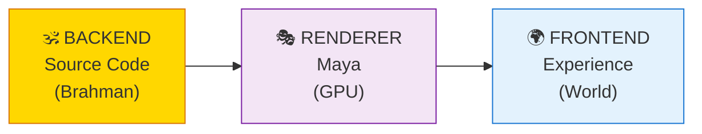
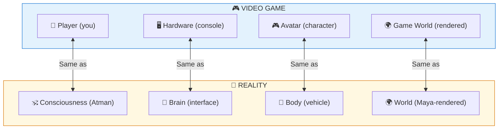
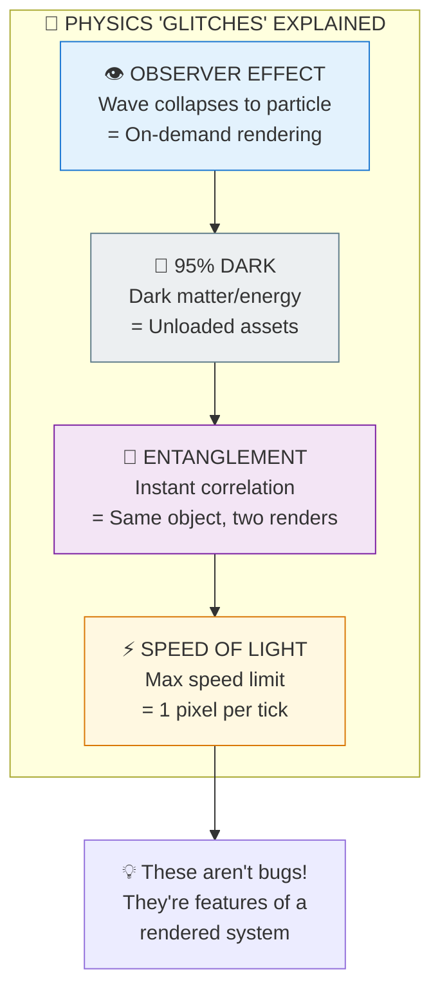
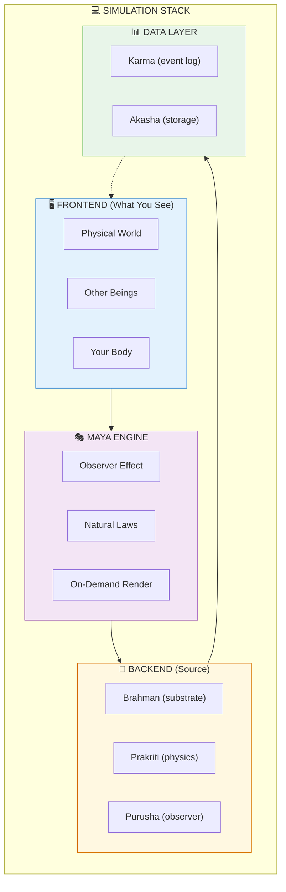
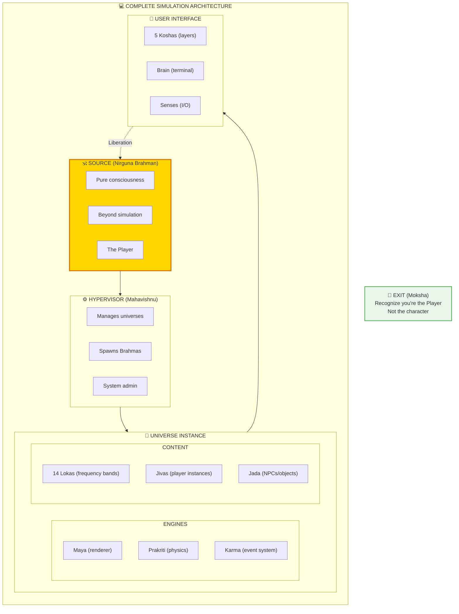

# 💻 SIMULATION — Reality as Rendered Experience

> **"ब्रह्म सत्यं जगन्मिथ्या"**
> "Brahman is real, the world is apparent."
> — Shankaracharya

The Simulation perspective shows reality as a rendered experience — not "fake," but constructed by consciousness through Maya. This framework unifies Vedic wisdom with modern physics.

---

## 📊 Diagram 1: Simple Overview (Beginner)

**What it shows:** Reality has backend (source) and frontend (experience).

**Key Insight:** Like a video game — the player (consciousness) uses hardware (brain) to experience a rendered world!

---

## 📊 Diagram 2: Game Comparison (Intermediate)

**What it shows:** Direct mapping between games and reality.

---

## 📊 Diagram 3: Physics Glitches (Intermediate)

**What it shows:** Physics anomalies explained by simulation model.

---

## 📊 Diagram 4: Simulation Stack (Advanced)

**What it shows:** The complete architecture from source to experience.

---

## 📊 Diagram 5: Complete Simulation Model (Expert)

**What it shows:** Full architecture with all components.

---

## 📋 Comparison Table

| Game Concept | Reality Equivalent | Vedic Term |
|--------------|-------------------|------------|
| Player | Consciousness | Atman |
| Console | Brain/Body | Annamaya Kosha |
| Avatar | Identity | Ahamkara |
| Game World | Physical Universe | Virat |
| Graphics Engine | Maya | Maya |
| Physics Engine | Natural Laws | Prakriti |
| Save File | Karma Record | Akashic Record |
| Game Rules | Dharma | Rta |
| Quitting Game | Liberation | Moksha |

---

## 🎯 Practical Implications

**Why this matters:**
1. **You're not the character** — You're the player
2. **Death isn't the end** — Character dies, player continues
3. **Reality is malleable** — Observer affects observed
4. **Liberation is possible** — Can exit the game

**Key insight:** Don't take the game too seriously, but play it well!

---

## 🔗 Related Topics

- [Maya](./maya.md) — The rendering engine
- [Observer Effect Paper](../../scientific_papers/02_PHYSICS/quantum_mechanics/observer_effect/README.md)
- [Simulation Paper](../../scientific_papers/11_COMPUTER_SCIENCE/simulation_theory/simulation_maya/README.md)

---

**[← Back to Diagram Library](./README.md)** | **[← Back to Site](../index.md)**
