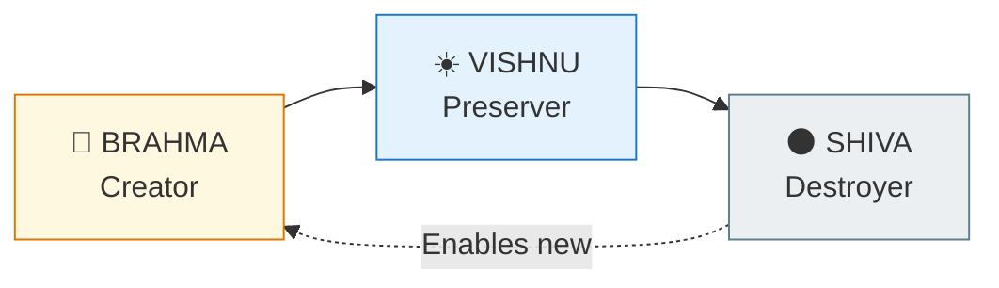
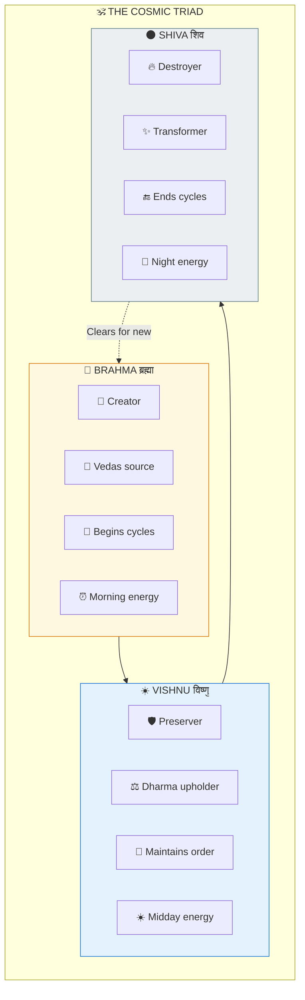
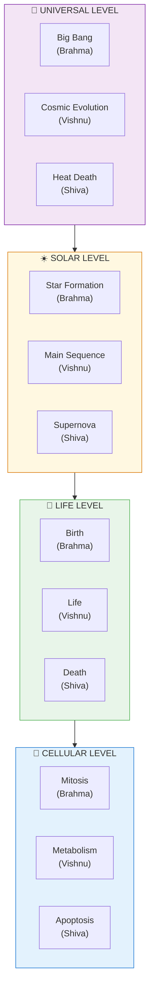
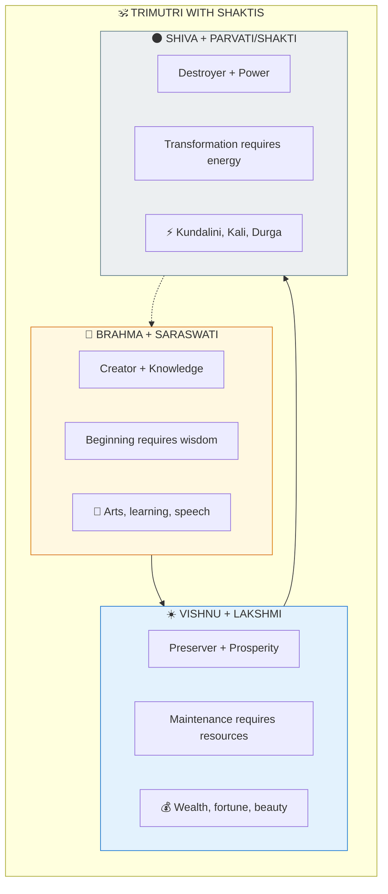
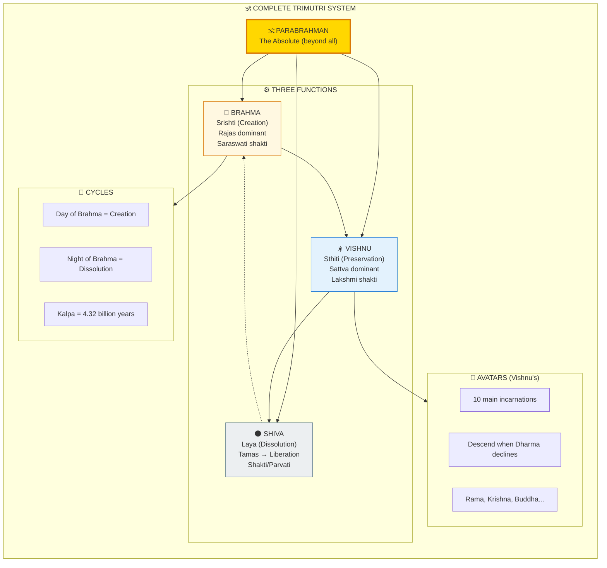

# 🕉️ TRIMUTRI — Brahma, Vishnu, Shiva

> **"सृष्टि स्थिति लय कारणं ब्रह्म विष्णु महेश्वरं"**
> "Brahma, Vishnu, Maheshvara — the causes of creation, maintenance, and dissolution."
> — Traditional Mantra

The Trimutri (त्रिमूर्ति) represents the three cosmic functions — Creation, Preservation, and Dissolution. This pattern repeats at every level of existence.

---

## 📊 Diagram 1: Simple Overview (Beginner)

**What it shows:** The three functions of the cosmic system.

**Key Insight:** Destruction is not evil — it's necessary for renewal. Without Shiva, no new creation is possible!

---

## 📊 Diagram 2: Cosmic Functions (Intermediate)

**What it shows:** What each deity represents and does.

---

## 📊 Diagram 3: Fractal Pattern (Intermediate)

**What it shows:** This pattern repeats at every scale.

---

## 📊 Diagram 4: Shaktis (Consorts) (Advanced)

**What it shows:** Each deity has a Shakti (power/consort).

---

## 📊 Diagram 5: Complete System (Expert)

**What it shows:** Full Trimutri architecture with all relationships.

---

## 📋 Summary Table

| Deity | Function | Guna | Shakti | Symbol |
|-------|----------|------|--------|--------|
| **Brahma** | Creation | Rajas | Saraswati | Four heads, Vedas |
| **Vishnu** | Preservation | Sattva | Lakshmi | Chakra, Conch |
| **Shiva** | Dissolution | Tamas→Beyond | Parvati/Shakti | Trishul, Third Eye |

---

## 🎯 Practical Understanding

**In your daily life:**
- Morning = Brahma time (start projects)
- Afternoon = Vishnu time (maintain, work)
- Evening = Shiva time (end, release)

**In your growth:**
- Create new habits (Brahma)
- Sustain good practices (Vishnu)
- Release what doesn't serve (Shiva)

---

## 🔗 Related Topics

- [Gunas](./gunas.md) — Trimutri maps to Gunas
- [Pralaya](./pralaya.md) — Shiva's dissolution types
- [Yugas](./yugas.md) — Vishnu's avatars across Yugas

---

**[← Back to Diagram Library](./README.md)** | **[← Back to Site](../index.md)**
