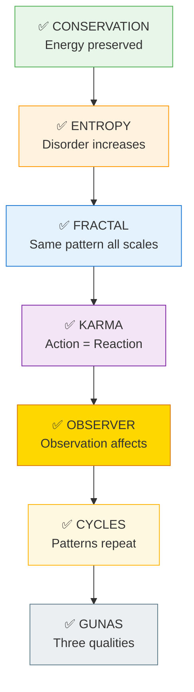
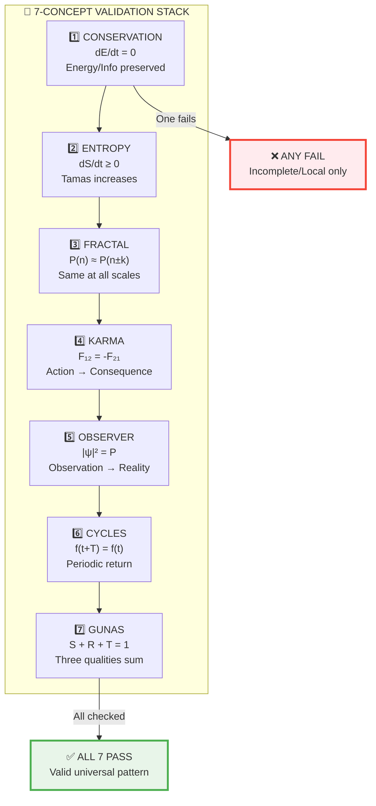
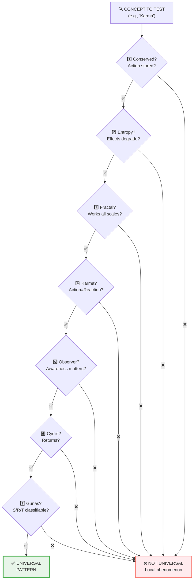
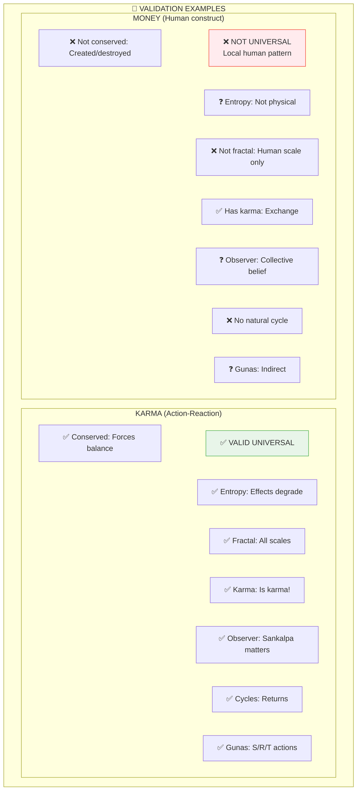
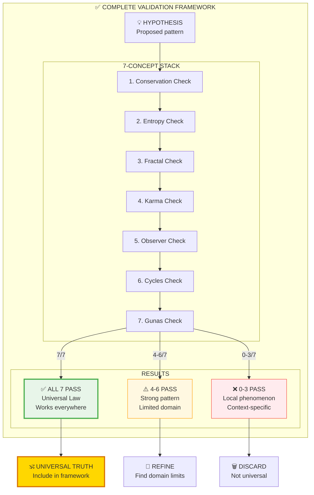

# ✅ 7-CONCEPT VALIDATION — Universal Testing Framework

> **"परीक्ष्य लोकान् कर्मचितान्"**
> "Parikshya lokan karmachitan"
> "Having examined the worlds built by action."
> — Mundaka Upanishad 1.2.12

The 7-Concept Validation Stack is a universal testing framework — every genuine pattern in reality must pass all 7 checks.

---

## 📊 Diagram 1: Simple Stack (Beginner)

**What it shows:** The 7 universal validations.

**Key Insight:** If something fails even ONE check, it's incomplete!

---

## 📊 Diagram 2: With Formulas (Intermediate)

**What it shows:** Mathematical validation for each concept.

---

## 📊 Diagram 3: Testing a Concept (Intermediate)

**What it shows:** How to validate if something is a universal pattern.

---

## 📊 Diagram 4: Examples Tested (Advanced)

**What it shows:** Testing different patterns against the 7 concepts.

---

## 📊 Diagram 5: Complete Validation Framework (Expert)

**What it shows:** Using validation to discover universal truths.

---

## 📋 Validation Checklist

Use this for any pattern you want to test:

| Check | Question | Pass Criteria |
|-------|----------|---------------|
| **1. Conservation** | Is something preserved? | Energy/Info/Pattern survives |
| **2. Entropy** | Does disorder increase? | System degrades over time |
| **3. Fractal** | Same at all scales? | Pattern repeats micro→macro |
| **4. Karma** | Action = Reaction? | Cause-effect relationship |
| **5. Observer** | Does observation matter? | Awareness affects outcome |
| **6. Cycles** | Does it repeat? | Periodic or cyclical |
| **7. Gunas** | S/R/T classifiable? | Can identify qualities |

---

## 🎯 Practical Application

**How to use this:**

1. **Testing ideas** — Run any concept through 7 checks
2. **Debugging theories** — Find which check fails
3. **Discovering truth** — Only 7/7 are universal
4. **Avoiding delusion** — Don't believe patterns that fail checks

**Examples:**
- Karma: 7/7 ✅
- Gunas: 7/7 ✅
- Fractals: 7/7 ✅
- Money: 2/7 ❌ (not universal)
- Fashion trends: 1/7 ❌ (local pattern)

---

## 🔗 Related Topics

- [Universal Principles](../../vishnu_engine/spec/backend/02_UNIVERSAL_PRINCIPLES.md) — 54 validated principles
- [Fractal Validation](../../vishnu_engine/spec/backend/05_FRACTAL_VALIDATION.md) — 10-point checklist
- [Scientific Papers](../../scientific_papers/) — All papers use this validation

---

**[← Back to Diagram Library](./README.md)** | **[← Back to Site](../index.md)**
