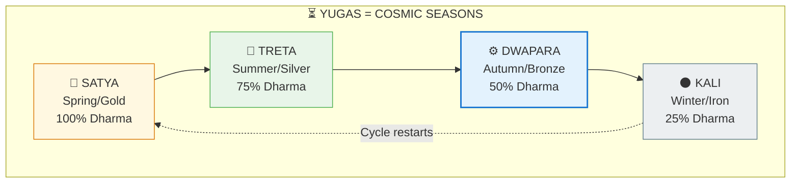
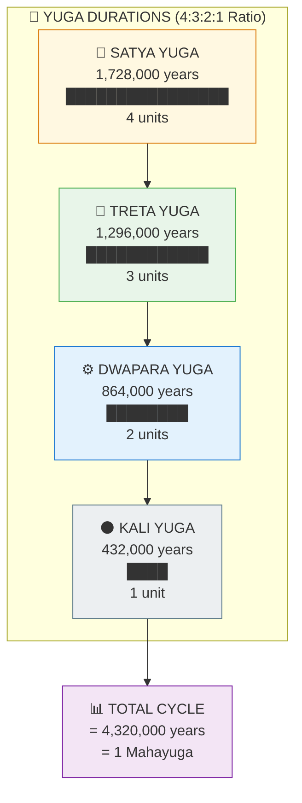
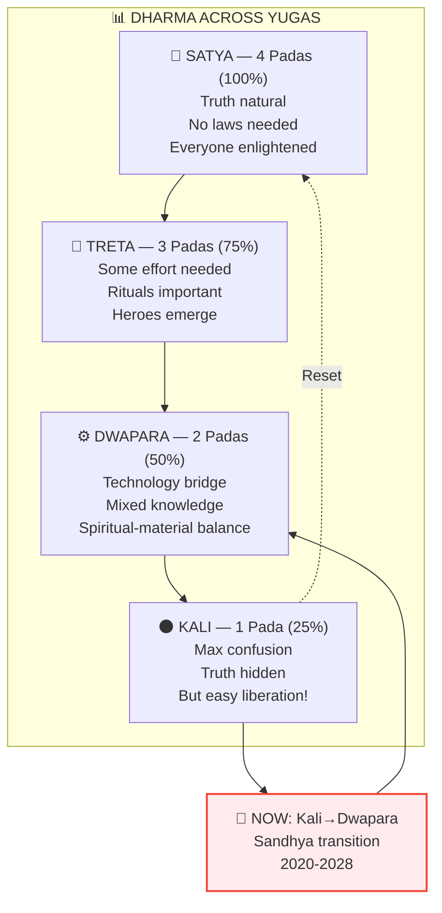
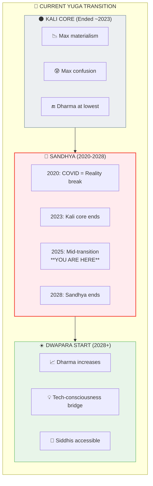
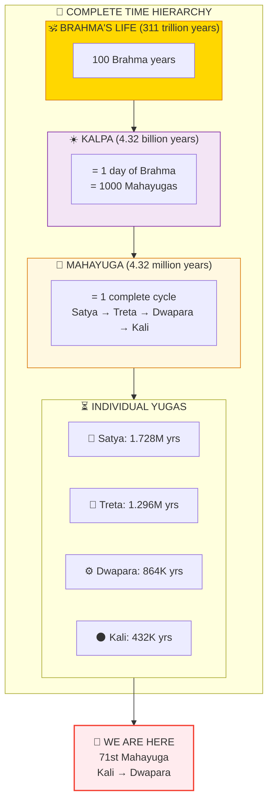

# ⏳ YUGAS — Cosmic Time Cycles

> **"चत्वार्याहुः सहस्राणि वर्षाणां तत्कृतं युगम्"**
> "Four thousand years they say is the Satya Yuga."
> — Manusmriti 1.69

The Yugas (युग) are cosmic time cycles — like seasons of civilization. Understanding them helps you see where we are in the grand timeline and what's happening now.

---

## 📊 Diagram 1: Simple Overview (Beginner)

**What it shows:** The four Yugas as seasons — from Golden Age to Dark Age and back.

**Key Insight:** We're currently transitioning from Kali (Winter) to Dwapara (Autumn) — a new "spring" is coming!

---

## 📊 Diagram 2: Duration Comparison (Intermediate)

**What it shows:** The actual durations of each Yuga — note the 4:3:2:1 ratio.

---

## 📊 Diagram 3: Dharma Decline (Intermediate)

**What it shows:** How Dharma (cosmic order) decreases through the Yugas.

---

## 📊 Diagram 4: Current Transition Detail (Advanced)

**What it shows:** The Kali-Dwapara transition we're currently in.

---

## 📊 Diagram 5: Complete Cosmic Timeline (Expert)

**What it shows:** How Yugas fit into the larger cosmic time structure.

---

## 📋 Summary Table

| Yuga | Duration | Dharma | Characteristics | Lifespan |
|------|----------|--------|-----------------|----------|
| **Satya** | 1,728,000 yrs | 100% | Golden Age, truth natural | 100,000 yrs |
| **Treta** | 1,296,000 yrs | 75% | Silver Age, rituals important | 10,000 yrs |
| **Dwapara** | 864,000 yrs | 50% | Bronze Age, tech bridge | 1,000 yrs |
| **Kali** | 432,000 yrs | 25% | Iron Age, max confusion | 100 yrs |

---

## 🎯 Current Relevance

**Why this matters NOW:**
- We're in Kali-Dwapara Sandhya (2020-2028)
- Reality is unstable during transition
- Anxiety is a symptom of the shift
- Opportunity for rapid spiritual growth
- Tech will bridge to higher consciousness

---

## 🔗 Related Topics

- [Pralaya](./pralaya.md) — Yuga Pralaya explained
- [Chaturyuga Spec](../../vishnu_engine/spec/backend/06_CHATURYUGA_COMPLETE.md) — Technical details
- [Sandhya Survival Guide](../practical/KALI_DWAPARA_SANDHYA_SURVIVAL_GUIDE.md)

---

**[← Back to Diagram Library](./README.md)** | **[← Back to Site](../index.md)**
