# ❓ Frequently Asked Questions

> Quick answers to common questions about Vidyanic

---

## About the Project

### What is Vidyanic?

**Vidyanic** is **a unified framework for understanding reality across ALL knowledge fields** — physics, biology, consciousness, information theory, and ancient wisdom traditions. It documents universal principles that:
- Reality is rendered on-demand (like a simulation)
- Consciousness is fundamental (not emergent)
- The universe operates on universal laws (Systemic Order/Dharma)
- Liberation is possible (Logic Exit/Moksha)

We use **multi-disciplinary terminology** — Sanskrit terms alongside modern scientific and computational concepts — to make these principles accessible to everyone, regardless of background.

### Why "Vidyanic"?

**Vidya (विद्या)** means "knowledge" or "wisdom" in Sanskrit. **Vidyanic** represents:
- Knowledge that transcends disciplines (multi-disciplinary)
- Wisdom derived from ALL knowledge fields
- The systematic study of universal principles
- A scientific approach to understanding reality

**"Vidya"** = Knowledge/Wisdom + **"-nic"** = Relating to/Of the nature of

Vidyanic = "Of the nature of wisdom" — A framework where ALL knowledge unifies.

### Is this religious?

No. This is a **scientific and philosophical framework** for understanding reality. We use:
- **Ancient wisdom** (Vedic, Buddhist, Taoist, etc.) = Descriptions of observed patterns
- **Modern science** (physics, biology, information theory) = Measurements of the same patterns
- **Computational models** (simulation theory, systems theory) = Structural analogies

Think of it as **reverse-engineering reality using ALL available knowledge**, not promoting any single tradition. Sanskrit terms are used because they're often more precise than English equivalents, but we always provide multi-disciplinary alternatives.

You don't need to believe anything. **Test the claims against your experience and the evidence.**

---

## Core Concepts

### What is "reality is rendered"?

Just like video games only render what you're looking at, reality appears to "render" upon observation:
- Quantum mechanics: Particles exist in superposition until measured
- Observer effect: Measurement changes the system
- Maya (माया): The cosmic rendering engine

**This isn't metaphor** — it's what physics experiments show.

### Who/what is Brahman?

Brahman (ब्रह्मन्) is:
- Pure consciousness
- The substrate of reality
- What you truly are (Atman = Brahman)
- Beyond all descriptions

Think: Not the movie, but the screen on which movies play.

### What are the Gunas?

```mermaid
flowchart LR
    subgraph Gunas["⚖️ TRI-GUNA — The Three Fundamental Qualities"]
        S["☀️ SATTVA सत्त्व<br/>Clarity • Light<br/>Knowledge • Order"]
        R["🔥 RAJAS रजस्<br/>Activity • Energy<br/>Motion • Change"]
        T["🌑 TAMAS तमस्<br/>Inertia • Mass<br/>Gravity • Decay"]
    end
    
    S <-->|Balance| R
    R <-->|Balance| T
    T <-->|Balance| S
    
    style S fill:#FFF8E1,stroke:#FFD700,stroke-width:2px
    style R fill:#FFF3E0,stroke:#FF9800,stroke-width:2px
    style T fill:#ECEFF1,stroke:#607D8B,stroke-width:2px
```

| Guna | Quality | Physical Manifestation |
|------|---------|----------------------|
| **Sattva** | Clarity, lightness | Light, knowledge |
| **Rajas** | Activity, energy | Motion, change |
| **Tamas** | Inertia, heaviness | Mass, gravity |

Everything is a mix: **S + R + T = 1** (always).

### What is Karma?

Karma literally means "action." It's the principle that:
- Every action has consequences
- These consequences shape future experience
- It's not punishment — it's cause and effect

Like Newton's Third Law applied to all action.

### What is Moksha?

Moksha (मोक्ष) = Liberation. It means:
- Recognizing your true nature (Atman = Brahman)
- Ending identification with the body-mind
- Not "escaping" but awakening within
- The "exit function" from the game

---

## Science Questions

### Does modern science support this?

**Yes — this framework UNIFIES findings across multiple fields:**

| Field | Finding | Universal Principle |
|-------|---------|-------------------|
| **Quantum Mechanics** | Observer-dependent reality | Maya (Interface Layer) |
| **Thermodynamics** | Entropy increases | Tamas (State Variable) |
| **Information Theory** | Data compression | Samskara (Memory Seeds) |
| **Cymatics** | Sound creates form | Shabda → Rupa (Wave → Form) |
| **Neuroscience** | Consciousness unexplained | Purusha (Observer API) |
| **Systems Theory** | Self-organizing systems | Dharma (Operational Logic) |
| **Computer Science** | Lazy loading, rendering | Maya (Perceptual Matrix) |

We don't claim "proof" — we show **structural correspondence across ALL knowledge fields**. The patterns are the same whether described in Sanskrit, mathematics, or code.

### What is the 7-Concept Validation Stack?

```mermaid
flowchart TD
    subgraph Stack["✅ 7-CONCEPT VALIDATION — Every Claim Must Pass"]
        C1["1️⃣ CONSERVATION<br/>Energy/Info preserved<br/>dE/dt = 0"]
        C2["2️⃣ ENTROPY<br/>Disorder increases<br/>dS/dt ≥ 0"]
        C3["3️⃣ FRACTAL<br/>Same pattern all scales<br/>Pattern(n) ≈ Pattern(n±k)"]
        C4["4️⃣ KARMA<br/>Action → Consequence<br/>F₁₂ = -F₂₁"]
        C5["5️⃣ OBSERVER<br/>Observation changes state<br/>|ψ|² = P"]
        C6["6️⃣ CYCLES<br/>Patterns repeat<br/>f(t+T) = f(t)"]
        C7["7️⃣ GUNAS<br/>Three qualities present<br/>S + R + T = 1"]
    end
    
    C1 --> C2 --> C3 --> C4
    C4 --> C5 --> C6 --> C7
    
    style C1 fill:#E3F2FD,stroke:#1976D2
    style C3 fill:#F3E5F5,stroke:#7B1FA2
    style C5 fill:#FFF8E1,stroke:#D97706
    style C7 fill:#E8F5E9,stroke:#4CAF50
```

Every claim must satisfy these 7 principles for validation.

### How confident are the papers?

Each paper includes a confidence score (typically 80-95%). This reflects:
- Strength of physics evidence
- Clarity of Vedic correspondence
- Reproducibility of claims
- Falsifiability considerations

We're transparent about uncertainty.

---

## Practical Questions

### How do I start?

1. **Quick:** Read [Why Reality is Rendered](./narratives/why_reality_is_rendered.md)
2. **Deeper:** Explore [Narratives](./narratives/) section
3. **Foundation:** Explore [Index of how to browse](../scientific_papers/01_FOUNDATION/FOUNDATION_MAPPING.md)
4. **Practical:** Try [Daily Sadhana](./practical/01_DAILY_SADHANA.md)
5. **Academic:** Browse [Research Papers](../scientific_papers/)

### Is meditation required?

Not required, but helpful. Meditation allows you to:
- Observe your own mind
- Experience witness consciousness
- Verify claims through direct experience

See: [Meditation Guide](./practical/02_MEDITATION_GUIDE.md)

### Can I use this with other traditions?

**Absolutely! This framework is DESIGNED to unify ALL knowledge traditions:**

| Tradition | Maps To | Why It Works |
|-----------|---------|--------------|
| **Buddhism** | Maya ~ Samsara, Moksha ~ Nirvana | Same observer-observed model |
| **Christianity** | Brahman ~ God, Atman ~ Soul | Same source-reflection structure |
| **Taoism** | Tao ~ Brahman, Yin-Yang ~ Gunas | Same flow and balance principles |
| **Simulation Theory** | Maya ~ Virtual Reality | Same render-on-demand mechanics |
| **Platonism** | Forms ~ Archetypes | Same ideal templates |
| **Indigenous** | Great Spirit ~ Consciousness | Same interconnected awareness |

**Universal principles transcend any single tradition.** We use Sanskrit because it's often the most precise, but the concepts appear in ALL wisdom traditions and modern science. Core truths are fractal — they appear everywhere.

---

## Technical Questions

### What is the Three-Track Architecture?

The project has three separate tracks:

| Track | Purpose | Location |
|-------|---------|----------|
| **Track 1** | Research papers (academic) | `scientific_papers/` |
| **Track 2** | Technical specs (engine) | `vishnu_engine/` |
| **Track 3** | User content (stories) | `site/` |

Each serves different audiences and purposes.

### What is the Vishnu Engine?

The "Vishnu Engine" is our conceptual model of reality's architecture:
- Backend specs for how consciousness manifests matter
- Entity hierarchies (quantum to cosmic)
- Karma calculation system
- Rendering mechanics

It's both metaphor and technical specification.

### How are papers structured?

Each research paper has 14 sections:
1. Abstract
2. Introduction
3. Literature Review
4. Theoretical Framework
5. Hypothesis
6. Methodology
7. Results
8. Anomalies
9. Backend Analogy
10. Discussion
11. Validation (7-concept stack)
12. Conclusion
13. References
14. Appendices

Plus a README for quick reference.

---

## Skeptic Questions

### Isn't this just pseudoscience?

We distinguish between:
- **Universal Principles:** Patterns that appear across ALL knowledge fields
- **Correspondences:** When physics, biology, and ancient wisdom describe the same phenomena
- **Speculation:** What we don't yet know (clearly labeled)

**This is NOT:**
- Replacing modern science with spirituality
- Dogmatic belief in any single tradition

**This IS:**
- Showing structural patterns across disciplines
- Documenting correspondences with confidence scores
- Using the scientific method: testable, falsifiable, reproducible

We show the **evidence and mapping**, then let readers evaluate for themselves.

### Can any of this be tested?

Many aspects can be tested:
- Observer effect experiments (done extensively)
- Cymatics experiments (reproducible)
- Meditation effects (studied)
- NDE research (ongoing)

Some claims (Moksha, reincarnation) are harder to test conventionally.

### Why use Sanskrit terms?

**We use Sanskrit alongside modern scientific and computational terms** because Sanskrit is often the most precise language for these concepts. For example:

| Sanskrit | English Attempts | Why Sanskrit Is Better |
|----------|-----------------|----------------------|
| **Maya** | Illusion, simulation, rendering | All three combined + perceptual matrix |
| **Dharma** | Law, duty, nature, order | All four combined + operational logic |
| **Karma** | Action, cause-effect, fate | All three + multi-life feedback loop |
| **Gunas** | Qualities, properties, states | Specific 3-variable system (S/R/T) |

**But we ALWAYS provide multi-disciplinary alternatives:**
- Maya (Interface Layer / Perceptual Matrix / VR System)
- Dharma (Systemic Order / Operational Logic / Natural Laws)
- Karma (Causality Loop / Event Logger / Feedback System)

**Use whichever terminology resonates with you** — the concepts are universal, the labels are flexible.

---

## Contribution Questions

### Can I contribute?

Yes! This is an open project. You can:
- Point out errors or inconsistencies
- Suggest new paper topics
- Add cross-references
- Improve explanations

### Is this affiliated with any organization?

No. This is an independent documentation project. No religious organization, no commercial entity, no agenda beyond understanding.

---

## Quick Reference

### Most Important Concepts

1. **Reality is rendered** (Maya / Interface Layer / GPU Optimization)
2. **You are consciousness** (Atman / Observer / The Player)
3. **Everything is vibration** (Shabda→Rupa / Wave→Form / Information→Matter)
4. **Actions have consequences** (Karma / Causality Loop / F₁₂ = -F₂₁)
5. **Liberation is possible** (Moksha / Logic Exit / System Logout)

> **Note:** Use whichever terminology resonates — gaming, programming, physics, or spiritual. The principles are universal.

### Most Important Papers

1. Observer Effect (Quantum -> Vedic)
2. Entropy = Tamas
3. Brain as Receiver
4. Simulation Theory = Maya
5. Death Mechanics

### Most Important Practices

1. Self-inquiry: "Who am I?"
2. Meditation: Witness consciousness
3. Mantra: Sound technology
4. Guna management: Balance S/R/T

---

**Still have questions?** The answers are probably in the [Glossary](./glossary/) or the relevant [Narrative](./narratives/).

### Visual Diagrams

For visual explanations of concepts, explore our **[📊 Diagram Library](./diagrams/README.md)** — multiple diagrams for each concept at varying complexity levels.

---

*ॐ*

---

## 🔗 Related Visual Diagrams

For visual understanding of concepts in this document, see:
- [Complete Diagram Library](./diagrams/README.md) — Visual guides for all concepts
- [Brahman](./diagrams/brahman.md) — Core insight
- [Maya](./diagrams/maya.md) — Reality rendering
- [Karma](./diagrams/karma.md) — Action-consequence

---
