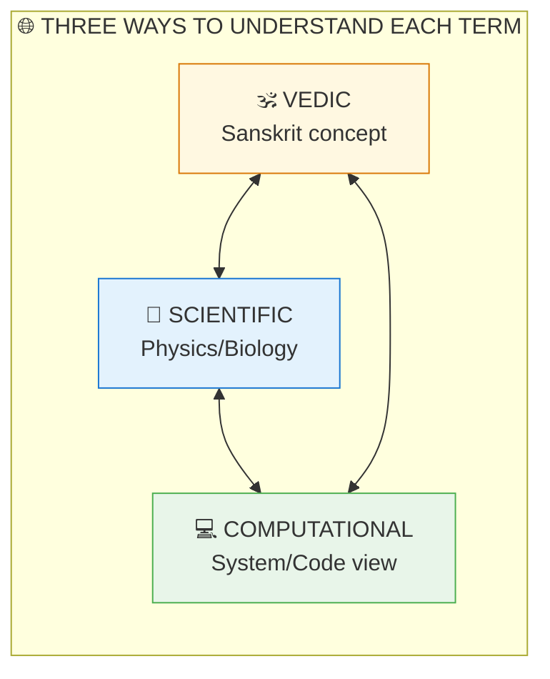

# 📚 Glossary of Terms

> **Multi-disciplinary dictionary: Sanskrit · Scientific · Computational**  
> Understanding universal principles through multiple lenses

**How to use:** Each term includes Sanskrit, English, and systemic/computational equivalents. Use whichever terminology resonates with you — the concepts are universal.

---

## A

### Ahamkara (अहंकार)
**"I-maker"** — The ego, the sense of individual identity. Not the true self, but the constructed identity that says "I am this body/mind."

### Akasha (आकाश)
**Space/Ether** — The subtlest of the five elements. The field in which all phenomena appear. Often translated as "ether" but better understood as "space of possibility."

### Ananda (आनन्द)
**Bliss** — Not pleasure (which has an opposite), but the fundamental nature of consciousness as unconditional fullness. One of three aspects of Brahman: Sat-Chit-Ananda.

### Atman (आत्मन्)
**True Self / Observer Instance / User Handle**  
The individual consciousness that is, upon investigation, found to be identical with Brahman. "That which you seek is what is seeking."

**Systemic:** User Handle — Your unique observer instance in the system  
**Gaming:** The Player (not the avatar)  
**Physics:** The Observer (not the observed)

### Avidya (अविद्या)
**Ignorance** — Not knowing one's true nature. The root cause of suffering. Not stupidity, but fundamental misidentification.

---

## B

### Bindu (बिन्दु)
**Point/Seed** — The concentrated point of creative potential. From Bindu, manifestation expands.

### Brahman (ब्रह्मन्)
**The Absolute / Root Process / Source Code**  
Pure consciousness, the substrate of all reality. Not a god, but that which is. Sat-Chit-Ananda: Existence-Consciousness-Bliss.

**Systemic:** Root Process — The base runtime environment  
**Gaming:** The Player (you, reading this)  
**Physics:** The Universal Wave Function  
**Programming:** The Source Code that compiles reality

### Buddhi (बुद्धि)
**Intellect/Discriminative faculty** — The aspect of mind that discriminates, judges, and decides. Higher than Manas (thinking mind).

---

## C

### Chit (चित्)
**Consciousness/Awareness** — Pure knowing. One of three aspects of Brahman (Sat-Chit-Ananda).

### Chitta (चित्त)
**Mind-stuff** — The total field of mental activity including memory, thought, emotion.

---

## D

### Dharma (धर्म)
**Law/Duty/Nature / Systemic Order / Operational Logic**  
Has multiple meanings:
1. Cosmic law (like physics)
2. Individual duty/role
3. Natural order
4. Righteousness

**Systemic:** Operational Logic — The rules governing system behavior  
**Programming:** The API contracts and system invariants  
**Physics:** Natural Laws (F=ma, conservation laws)  
**Gaming:** Game Rules

### Drishti-Srishti (दृष्टि-सृष्टि)
**"Seeing-Creating"** — The principle that observation creates what is observed. Vedic formulation of observer effect.

---

## G

### Guna (गुण)
**Quality/Mode** — The three fundamental qualities that compose all phenomena:
- **Sattva:** Clarity, lightness
- **Rajas:** Activity, energy
- **Tamas:** Inertia, heaviness

Everything is a mixture: S + R + T = 1

---

## I

### Indra (इन्द्र)
**Lord of the Senses** — In Vedic terms, represents the mind/ego that rules sensory experience. Associated with Maya.

### Ishvara (ईश्वर)
**Lord/Controller** — Brahman with attributes; the "personal" aspect of the Absolute. The cosmic administrator.

---

## J

### Jada (जड)
**Inert/Non-conscious** — That which does not have self-awareness. Matter, objects.

### Jagat (जगत्)
**World/Universe** — The manifested reality. From root "gam" (to move).

### Jiva (जीव)
**Individual Soul** — Consciousness identified with a particular body-mind. The "avatar" in the game of life.

### Jnana (ज्ञान)
**Knowledge/Wisdom** — Not information, but direct understanding. Jnana Yoga is the path of knowledge.

---

## K

### Kala (काल)
**Time** — One of the fundamental aspects of manifestation. Time is rendered, not absolute.

### Karma (कर्म)
**Action/Consequence / Causality Loop / Event Logger**  
Every action creates impressions (samskaras) that shape future experience. Not punishment, but natural law.

**Systemic:** Feedback Loop — Input-output tracking system  
**Physics:** Newton's 3rd Law (F₁₂ = -F₂₁)  
**Programming:** Event Logger / Save File  
**Gaming:** Reputation system / Skill progression

### Kosha (कोश)
**Sheath/Layer** — The five sheaths covering Atman:
1. Annamaya (food/physical)
2. Pranamaya (energy)
3. Manomaya (mind)
4. Vijnanamaya (wisdom)
5. Anandamaya (bliss)

---

## L

### Lila (लीला)
**Divine Play** — The universe as Brahman's play, not work. Creation for joy, not purpose external to itself.

---

## M

### Manas (मनस्)
**Mind** — The thinking, desiring, imagining aspect of mind. Lower than Buddhi (intellect).

### Mantra (मन्त्र)
**Sacred Sound** — Sound formulas that create specific vibrational effects. "Man" (mind) + "tra" (tool/protection).

### Maya (माया)
**Illusion/Rendering Engine / Interface Layer / Perceptual Matrix**  
The power by which Brahman appears as the differentiated world. Not "fake" but "apparent" — neither fully real nor unreal.

**Systemic:** Interface Layer — The frontend display layer  
**Gaming:** GPU Rendering / Game Engine (like Unreal/Unity)  
**Physics:** Wave Function Collapse (potential → actual)  
**VR:** The headset that generates your experience

### Mithya (मिथ्या)
**Dependent Reality** — That which exists but is not independently real. The world is mithya — real in experience but dependent on Brahman.

### Moksha (मोक्ष)
**Liberation / Logic Exit / System Logout**  
Freedom from the cycle of birth-death (samsara). Recognition of one's true nature as Brahman.

**Systemic:** Exit Function — Proper shutdown/logout  
**Gaming:** Beating the final level / Logging out consciously  
**Programming:** return() statement / Process termination  
**Physics:** Escaping the closed timelike curve

---

## N

### Nada (नाद)
**Primordial Sound** — The first vibration from which creation emanates. "In the beginning was the sound."

### Nama-Rupa (नाम-रूप)
**Name and Form** — The two aspects of all manifested things. Name (concept) and Form (appearance).

---

## O

### Om/AUM (ॐ)
**Primordial Syllable** — The sound containing all sounds. A-U-M represents creation-maintenance-dissolution.

---

## P

### Para (पर)
**Supreme/Transcendent** — The highest level, beyond manifestation.

### Prakriti (प्रकृति)
**Nature/Matter** — The manifest aspect of reality. The "stuff" that appears. Operates through three Gunas.

### Prana (प्राण)
**Life-force/Vital Energy** — The energy that animates living beings. Five types (Prana, Apana, Vyana, Udana, Samana).

### Purusha (पुरुष)
**Consciousness/Observer** — Pure awareness. In Samkhya philosophy, the witness of Prakriti.

---

## R

### RAI (Real And Active Intelligence)
**Cosmic Intelligence** — Term used in this project for consciousness as fundamental (vs. AI which is artificial).

### Rajas (रजस्)
**Activity/Passion** — The Guna of motion, energy, desire. Neither creating nor destroying, but moving.

### Rupa (रूप)
**Form** — The shape/appearance of things. Manifestation. Shabda (sound) -> Rupa (form).

---

## S

### Sadhana (साधना)
**Practice** — Spiritual practice or discipline. The means to realization.

### Samadhi (समाधि)
**Absorption** — Deep meditative state where subject-object distinction dissolves.

### Samskara (संस्कार)
**Impression/Conditioning** — Mental impressions from past actions that shape current tendencies.

### Samsara (संसार)
**Cycle of Birth-Death** — The wheel of continuous becoming. Liberation (Moksha) ends the cycle.

### Sankalpa (संकल्प)
**Intention/Will** — The creative intention that initiates action.

### Sat (सत्)
**Existence/Being** — That which IS. One of three aspects of Brahman (Sat-Chit-Ananda).

### Sattva (सत्त्व)
**Purity/Clarity** — The Guna of light, knowledge, clarity.

### Shabda (शब्द)
**Sound/Word** — The creative vibration. Shabda Brahman = Sound as Ultimate Reality.

### Shakti (शक्ति)
**Power/Energy** — The dynamic, creative aspect of consciousness.

### Shunya (शून्य)
**Void/Zero** — Emptiness as fullness. The potential before manifestation.

### Spanda (स्पन्द)
**Vibration/Pulse** — The primordial throb of consciousness.

---

## T

### Tamas (तमस्)
**Inertia/Darkness** — The Guna of heaviness, dullness, resistance. Manifests as mass, gravity, entropy.

### Tantra (तन्त्र)
**System/Technology** — Methods for transformation. Literally "loom" — weaving consciousness and matter.

### Tattva (तत्त्व)
**Principle/Element** — The 24-36 categories of manifestation in Samkhya/Tantra philosophy.

---

## V

### Vac/Vak (वाक्)
**Speech/Creative Word** — The goddess of speech. The creative power of sound.

### Vidya (विद्या)
**Knowledge** — Liberating knowledge, as opposed to Avidya (ignorance).

### Viveka (विवेक)
**Discrimination** — The ability to distinguish real from apparent, Atman from not-Atman.

---

## Y

### Yoga (योग)
**Union/Yoke** — Methods for realizing unity. Various paths: Jnana, Bhakti, Karma, Raja.

### Yuga (युग)
**Age/Epoch** — The four cosmic ages:
- Satya Yuga (Golden)
- Treta Yuga (Silver)
- Dwapara Yuga (Bronze)
- Kali Yuga (Iron)

---

## Numbers and Formulas

### Key Equations

| Formula | Meaning |
|---------|---------|
| S + R + T = 1 | Gunas always sum to unity |
| Atman = Brahman | Individual consciousness = Universal consciousness |
| Shabda -> Rupa | Sound creates form |
| dE/dt = 0 | Conservation principle |
| dS/dt ≥ 0 | Entropy (Tamas) increases |

---

## See Also

- [FAQ](./faq/) — Common questions answered
- [Narratives](./narratives/README.md) — Concept explanations
- [Research Papers](../scientific_papers/) — Academic documentation
- [📊 Diagram Library](./diagrams/README.md) — Visual concept diagrams

---

*ॐ तत् सत्*  
*That is the Truth*

---

## 🔗 Related Visual Diagrams

For visual understanding of concepts in this document, see:
- [Complete Diagram Library](./diagrams/README.md) — Visual guides for all terms
- [Gunas](./diagrams/gunas.md) — Three qualities
- [Koshas](./diagrams/koshas.md) — Five sheaths
- [Chakras](./diagrams/chakras.md) — Energy centers

---
