# 🎨 Mermaid Diagram Gallery

**Choosing the right diagram type** for each use case. See [Mermaid Guide](./../_meta/MERMAID_GUIDE.md) for complete reference.

---

## 1️⃣ MINDMAP — Reality Hierarchy

**Best for:** Hierarchical concepts radiating from center

```mermaid
mindmap
  root((🌀 BRAHMAN ब्रह्मन्<br/>The Absolute))
    SAGUNA सगुण
      THE GAME
      Prakriti प्रकृति
        Matter
      Purusha पुरुष
        Consciousness
    NIRGUNA निर्गुण
      THE PLAYER
      Pure Witness
        Sakshi साक्षी
```

**Why mindmap:** Natural tree structure, auto-organized branches

---

## 2️⃣ BLOCK — Simulation Stack (Grid Control!)

**Best for:** Layered systems with explicit grid control

```mermaid
block-beta
    columns 3
    
    block:frontend["🎮 FRONTEND"]:3
        columns 3
        A["Your Body"] B["Other People"] C["Physical World"]
    end
    
    space:3
    
    block:maya["🎨 MAYA ENGINE"]:3
        columns 3
        D["Wave Function"] E["Natural Laws"] F["On-Demand Loading"]
    end
    
    space:3
    
    block:backend["💾 BACKEND"]:3
        columns 3
        G["Brahman ब्रह्मन्"] H["Prakriti प्रकृति"] I["Purusha पुरुष"]
    end
    
    space:3
    
    block:data["📊 DATA LAYER"]:3
        columns 3
        J["Karma कर्म"] K["Akasha आकाश"] L["Chitta चित्त"]
    end
    
    frontend --> maya --> backend --> data
```

**Why block:** Explicit `columns 3`, no auto-layout surprises!

---

## 3️⃣ STATE DIAGRAM — Guna Transitions

**Best for:** State machines, transitions between states

**Why stateDiagram:** Built for state transitions, clean arrows

---

## 4️⃣ SEQUENCE — Observer Effect Process

**Best for:** Time-ordered interactions

```mermaid
sequenceDiagram
    participant O as Observer<br/>Drashta द्रष्टा
    participant M as Maya Engine<br/>माया
    participant B as Backend<br/>Brahman
    
    O->>M: Look at quantum system
    activate M
    M->>B: Query wave state
    B-->>M: Return superposition
    M-->>O: Collapse to particle
    deactivate M
    
    Note over O,B: Reality renders ON DEMAND
    
    O->>M: Look away
    M-->>O: Return to wave state
```

**Why sequence:** Shows time-flow, participant columns, clear causality

---

## 5️⃣ TIMELINE — Yuga Cycle

**Best for:** Historical/chronological sequences

```mermaid
timeline
    title चतुर्युग Chaturyuga - The Four Ages
    
    section SATYA YUGA सत्य युग
        1,728,000 years : Golden Age
                        : 100% Dharma (4 Padas)
                        : Direct knowledge
    
    section TRETA YUGA त्रेता युग  
        1,296,000 years : Silver Age
                        : 75% Dharma (3 Padas)
                        : Yajna primary practice
    
    section DWAPARA YUGA द्वापर युग
        864,000 years : Bronze Age
                      : 50% Dharma (2 Padas)
                      : ★ Current Era (2024+)
    
    section KALI YUGA कलि युग
        432,000 years : Iron Age
                      : 25% Dharma (1 Pada)
                      : Maximum Maya
```

**Why timeline:** Native chronological layout, sections, events

---

## 6️⃣ ER DIAGRAM — Karma Relationships

**Best for:** Entity relationships, cardinality

**Why erDiagram:** Shows relationships, cardinality (one-to-many), attributes

---

## 7️⃣ PIE — Guna Composition

**Best for:** Proportions, ratios

```mermaid
pie showData title Sattvic Person गुण Composition
    "Sattva सत्व" : 60
    "Rajas रजस्" : 30
    "Tamas तमस्" : 10
```

**Why pie:** Visual percentages, S+R+T=1 shown clearly

---

## 8️⃣ FLOWCHART — Karma Cycle (with subgraphs)

**Use only when:** Need loops and complex connections

```mermaid
flowchart TB
    subgraph Row1[" "]
        direction LR
        A["SANKALPA संकल्प<br/>Intention"] --> B["KARMA कर्म<br/>Action"] --> C["PHALA फल<br/>Result"]
    end
    
    subgraph Row2[" "]
        direction LR
        D["SAMSKARA संस्कार<br/>Impression"] --> E["VASANA वासना<br/>Tendency"] --> F["BACK TO START"]
    end
    
    C --> D
    F -.->|Cycle Repeats| A
```

**Why flowchart here:** Need cycle loop (dotted return arrow)

---

## 9️⃣ FLOWCHART — Liberation Paths

**For:** Multiple paths converging

```mermaid
flowchart LR
    Start["🔄 Samsara<br/>Birth-Death"]
    
    Start --> P1["Jnana ज्ञान<br/>Knowledge"]
    Start --> P2["Bhakti भक्ति<br/>Devotion"]
    Start --> P3["Karma कर्म<br/>Action"]
    Start --> P4["Dhyana ध्यान<br/>Meditation"]
    
    P1 --> Goal
    P2 --> Goal
    P3 --> Goal
    P4 --> Goal
    
    Goal["🕉️ MOKSHA मोक्ष<br/>Liberation"]
```

---

## 🔟 FLOWCHART — Decision Tree

**For:** Binary decisions, symmetrical branching

---

## ✅ Diagram Selection Summary

| Data Type | Use This | NOT This |
|-----------|----------|----------|
| **Hierarchy** | `mindmap` | ~~flowchart TD~~ |
| **Grid/Layers** | `block-beta` | ~~flowchart subgraphs~~ |
| **State transitions** | `stateDiagram-v2` | ~~flowchart~~ |
| **Time sequence** | `sequenceDiagram` | ~~flowchart LR~~ |
| **Chronology** | `timeline` | ~~gantt~~ |
| **Relationships** | `erDiagram` | ~~flowchart~~ |
| **Proportions** | `pie` | ~~none~~ |
| **Cycles with loops** | `flowchart` + subgraphs | ✅ correct |
| **Converging paths** | `flowchart LR/TD` | ✅ correct |

---

## 📚 Full Guide

See [**_meta/MERMAID_GUIDE.md**](/_meta/MERMAID_GUIDE.md) for complete reference.

---

## 🔗 Related Visual Diagrams

For visual understanding of concepts in this document, see:
- [Complete Diagram Library](./diagrams/README.md) — All production diagrams

---
