# 🧘 Meditation Guide — Dhyana Practical

> **"ध्यानं निर्विषयं मनः"**  
> "Dhyanam nirvishayam manah"  
> "Meditation is the mind free of objects."  
> — Patanjali

---

## 📋 Table of Contents

1. [What Is Meditation?](#1-what)
2. [Preparation](#2-prep)
3. [Basic Techniques](#3-basic)
4. [Intermediate Practices](#4-intermediate)
5. [Advanced Methods](#5-advanced)
6. [Troubleshooting](#6-troubleshoot)
7. [Daily Schedule](#7-schedule)
8. [Quick Reference](#8-quick)

---

## 1. What Is Meditation? {#1-what}

### 1.1 Not What You Think

Meditation is NOT:
- ❌ Stopping thoughts (impossible and not the goal)
- ❌ Going into trance (that's something else)
- ❌ Escaping reality (that's escapism)
- ❌ Just relaxation (relaxation is side effect)

Meditation IS:
- ✅ Training attention
- ✅ Observing without reacting
- ✅ Becoming familiar with your mind
- ✅ Resting in awareness itself

### 1.2 The Stages

```mermaid
flowchart TD
    subgraph Stages["🧘 MEDITATION PROGRESSION"]
        D["🎯 DHARANA धारणा<br/>Concentration<br/>Holding attention on one object"]
        DH["🌊 DHYANA ध्यान<br/>Meditation<br/>Sustained flow of attention"]
        S["✨ SAMADHI समाधि<br/>Absorption<br/>Subject-object dissolves"]
    end
    
    D -->|"Years of practice"| DH -->|"Spontaneous"| S
    
    Note["📝 Most people work on Dharana<br/>True Dhyana comes after years<br/>Samadhi comes when conditions are right"]
    
    S --> Note
    
    style D fill:#E3F2FD,stroke:#1976D2
    style DH fill:#FFF8E1,stroke:#D97706
    style S fill:#E8F5E9,stroke:#4CAF50
```



---

## 2. Preparation {#2-prep}

### 2.1 Physical Setup

| Element | Recommendation |
|---------|----------------|
| **Time** | Same time daily (morning best) |
| **Place** | Clean, quiet, dedicated space |
| **Direction** | Face East or North |
| **Seat** | Cushion, mat, or chair (spine straight) |
| **Clothing** | Loose, comfortable, clean |
| **Stomach** | Empty or light (no heavy meals) |

### 2.2 Body Preparation

**Before sitting:**
1. **Shower/wash** (or at least hands, face)
2. **Use bathroom** (no pressure)
3. **Light stretching** (5 minutes)
4. **3-5 deep breaths**

### 2.3 The Seat

```
POSTURES (Choose One):
=======================

PADMASANA (Lotus)
• Cross-legged, feet on opposite thighs
• Advanced, requires flexibility

SIDDHASANA (Accomplished)
• One heel at perineum, other ankle above
• Classic meditation posture

SUKHASANA (Easy Pose)
• Simple cross-legged
• Use cushion for comfort

VAJRASANA (Thunderbolt)
• Kneeling, sitting on heels
• Good for digestion issues

CHAIR
• Feet flat, spine away from back
• Perfectly valid for beginners/elderly

KEY: Spine straight, body comfortable, no strain
```

### 2.4 Hand Position (Mudra)

| Mudra | How | Effect |
|-------|-----|--------|
| **Chin Mudra** | Index + thumb touch, palms down | Grounding |
| **Jnana Mudra** | Index + thumb touch, palms up | Receptive |
| **Dhyana Mudra** | Hands in lap, right on left, thumbs touch | Deep meditation |

---

## 3. Basic Techniques {#3-basic}

### 3.1 Breath Awareness (For Everyone)

**The simplest and most powerful:**

```
PRACTICE:
1. Sit comfortably
2. Close eyes
3. Breathe naturally (don't control)
4. Notice the breath:
   • At nostrils (cool in, warm out)
   • Or chest rising/falling
   • Or belly expanding/contracting
5. When mind wanders -> gently return to breath
6. No judgment for wandering (this IS the practice)

DURATION: Start with 5-10 minutes
```

### 3.2 Counting Breaths

**For restless minds:**

```
PRACTICE:
1. Inhale — count "1"
2. Exhale — count "2"
3. Continue to "10"
4. Return to "1"
5. If you lose count -> start at "1"

VARIATION:
• Count only exhales (1-10)
• Count mentally with "Om" instead of numbers
```

### 3.3 Body Scan

**For physical tension:**

```
PRACTICE:
1. Start at crown of head
2. Slowly move attention through body:
   • Forehead, eyes, jaw
   • Neck, shoulders, arms, hands
   • Chest, belly, back
   • Hips, legs, feet
3. Notice sensations without changing them
4. If tension found, breathe into it
5. End at feet (or reverse direction)

DURATION: 15-20 minutes
```

---

## 4. Intermediate Practices {#4-intermediate}

### 4.1 Mantra Meditation

**For focusing the mind:**

| Mantra | Meaning | Use |
|--------|---------|-----|
| **OM (ॐ)** | Cosmic sound | Universal |
| **So Hum (सोऽहम्)** | "I am That" | Breath sync |
| **Om Namah Shivaya** | "Salutations to Shiva" | Transformation |
| **Gayatri** | Light of consciousness | Illumination |

```
PRACTICE:
1. Sit in posture
2. Begin with 3 OMs aloud
3. Start mantra:
   • Aloud (vaikhari) — 5 minutes
   • Whispered (upamshu) — 5 minutes
   • Mental only (manasika) — 10+ minutes
4. If using mala, move one bead per repetition
5. When mind wanders, return to mantra
```

### 4.2 Trataka (Gazing)

**For concentration:**

```
PRACTICE:
1. Set a candle at eye level, arm's length away
2. Darken the room
3. Gaze at flame without blinking (as long as comfortable)
4. When eyes water, close them
5. See the afterimage at the third eye
6. When image fades, open eyes and repeat
7. Duration: 10-15 minutes

BENEFITS: Sharpens concentration, purifies eyes, develops will
```

### 4.3 Visualization

**For subtle body work:**

```
PRACTICE (Chakra Light):
1. Sit quietly, establish breath awareness
2. Visualize root chakra (base of spine) — red light
3. Move up:
   • Sacral (orange)
   • Solar plexus (yellow)
   • Heart (green)
   • Throat (blue)
   • Third eye (indigo)
   • Crown (violet/white)
4. Rest at crown
5. Let light flow back down
```

---

## 5. Advanced Methods {#5-advanced}

### 5.1 Self-Inquiry (Atma Vichara)

**For direct realization:**

```
PRACTICE:
1. Sit in stillness
2. Ask: "Who am I?"
3. Don't answer intellectually
4. Look for the "I" — who is asking?
5. Thoughts arise — who is thinking them?
6. Feelings arise — who is feeling them?
7. Keep turning attention to the source
8. Rest in the awareness that remains

THIS IS THE DIRECT PATH (Ramana Maharshi's teaching)
```

### 5.2 Witness Meditation

**For dis-identification:**

```
PRACTICE:
1. Sit and observe whatever arises
2. Label gently:
   • "Thinking" (for thoughts)
   • "Feeling" (for emotions)
   • "Hearing" (for sounds)
   • "Sensing" (for body)
3. Notice: You are the one labeling
4. Rest as the witness
5. Don't follow or push away anything
```

### 5.3 Yoga Nidra

**For deep relaxation and subtle work:**

```
STAGES:
1. Lie in Shavasana
2. Set Sankalpa (intention)
3. Rotate awareness through body
4. Observe breath
5. Experience opposites (heavy/light, hot/cold)
6. Visualization
7. Repeat Sankalpa
8. Return to waking

BEST: Use guided recordings initially
```

---

## 6. Troubleshooting {#6-troubleshoot}

### 6.1 Common Problems

| Problem | Cause | Solution |
|---------|-------|----------|
| **Mind won't stop** | Normal | Don't try to stop; just observe |
| **Falling asleep** | Tamas | Open eyes slightly, sit more upright |
| **Restlessness** | Rajas | More pranayama before sitting |
| **Physical pain** | Wrong posture | Adjust, use props, or use chair |
| **Seeing visions** | Mind playing | Ignore them, return to practice |
| **Boredom** | Expectations | Boredom is a sensation; observe it |
| **"Nothing happening"** | Expectations | Let go of results; keep practicing |

### 6.2 When to Push vs. Rest

```
PUSH THROUGH:
• Normal resistance
• Mild boredom
• Wandering thoughts

STOP AND REST:
• Sharp physical pain
• Emotional overwhelm
• Extreme fatigue
• Dissociation
```

---

## 7. Daily Schedule {#7-schedule}

### 7.1 Minimum (15 min/day)

```
MORNING (10 min):
• 2 min: Settle, 3 deep breaths
• 5 min: Breath awareness
• 3 min: Mantra (Om × 21)

EVENING (5 min):
• Review day briefly
• 3 min breath awareness
• Set sleep intention
```

### 7.2 Optimal (45 min/day)

```
MORNING (30 min):
• 5 min: Pranayama
• 20 min: Main practice (mantra/breath/inquiry)
• 5 min: Silence, gratitude

EVENING (15 min):
• 5 min: Body scan
• 10 min: Meditation
```

### 7.3 Intensive (2+ hours/day)

```
BRAHMA MUHURTA (4-5 AM): 1 hour
MIDDAY: 20 min
EVENING: 30 min
BEFORE SLEEP: 20 min
```

---

## 8. Quick Reference {#8-quick}

### Card 1: Emergency Meditation (2 min)

```
+=======================================+
|         2-MINUTE RESET                |
+=======================================+
| 1. Stop what you're doing             |
| 2. Close eyes                         |
| 3. Take 5 slow deep breaths           |
| 4. Feel your body in the chair        |
| 5. Open eyes                          |
|                                       |
| Do this ANYTIME, ANYWHERE.            |
+=======================================+
```

### Card 2: Breath Technique

```
+=======================================+
|         4-7-8 BREATHING               |
+=======================================+
| • Inhale: 4 counts                    |
| • Hold: 7 counts                      |
| • Exhale: 8 counts                    |
|                                       |
| Repeat 3-4 cycles.                    |
| Calms nervous system instantly.       |
+=======================================+
```

### Card 3: Mantra Quick Start

```
+=======================================+
|         MANTRA ESSENTIALS             |
+=======================================+
| UNIVERSAL: OM (ॐ)                     |
| BREATH: So (in) Hum (out)             |
| PROTECTION: Om Namah Shivaya          |
| PEACE: Om Shanti Shanti Shanti        |
|                                       |
| Repeat mentally or aloud.             |
| 108 times (one mala) = one round      |
+=======================================+
```

---

## 🎯 Progress Markers

| Stage | Sign |
|-------|------|
| **Beginner** | Can sit for 10 min without major agitation |
| **Establishing** | Daily practice is habit |
| **Progressing** | Periods of stillness between thoughts |
| **Deepening** | Can observe emotions without being swept away |
| **Advancing** | Witness awareness stabilizing |
| **Maturing** | Peace continues off the cushion |

---

> **"अभ्यासेन तु कौन्तेय वैराग्येण च गृह्यते"**  
> "Abhyasena tu kaunteya vairagyena cha grihyate"  
> "By practice and detachment, O Arjuna, it is attained."  
> — Bhagavad Gita 6.35

---

**[<- Back to Practical Guides](./README.md)**


---

## 🔗 Related Visual Diagrams

For visual understanding of concepts in this document, see:
- [Chakras](../diagrams/chakras.md) — Energy centers for meditation
- [Consciousness](../diagrams/consciousness.md) — States of awareness
- [Koshas](../diagrams/koshas.md) — Layers to transcend
- [15th Axis](../diagrams/15th_axis.md) — Sushumna path

---
