# ⚖️ Guna Management — Practical Balance

> **"सत्त्वं सुखे सञ्जयति रजः कर्मणि भारत"**  
> "Sattvam sukhe sanjayati rajah karmani Bharata"  
> "Sattva binds to happiness, Rajas to action."  
> — Bhagavad Gita 14.9

---

## 📋 Table of Contents

1. [Understanding Your Gunas](#1-understand)
2. [Self-Assessment](#2-assess)
3. [Increasing Sattva](#3-sattva)
4. [Reducing Rajas](#4-rajas)
5. [Transforming Tamas](#5-tamas)
6. [Daily Guna Protocol](#6-daily)
7. [Quick Reference](#7-quick)

---

## 1. Understanding Your Gunas {#1-understand}

### 1.1 The Three Forces

Everything in nature (including you) is made of three qualities:

| Guna | Quality | Feeling | Energy |
|------|---------|---------|--------|
| **Sattva** | Harmony | Peace, clarity | Light, upward |
| **Rajas** | Activity | Restless, driven | Heat, outward |
| **Tamas** | Inertia | Dull, stuck | Heavy, downward |

### 1.2 They're Always Mixed

```mermaid
pie title YOUR GUNA MIX RIGHT NOW (Example)
    "Sattva ☀️" : 25
    "Rajas ⚡" : 55
    "Tamas 🌑" : 20
```

```mermaid
flowchart LR
    subgraph Mix["⚖️ GUNA BALANCE"]
        S["☀️ SATTVA<br/>Clarity, Peace"]
        R["⚡ RAJAS<br/>Activity, Drive"]
        T["🌑 TAMAS<br/>Inertia, Rest"]
    end
    
    S --> R --> T --> S
    
    Goal["🎯 GOAL:<br/>Increase Sattva<br/>Then transcend all three"]
    
    style S fill:#E8F5E9,stroke:#4CAF50
    style R fill:#FFF8E1,stroke:#D97706
    style T fill:#ECEFF1,stroke:#607D8B
```





**S + R + T = 100% (always).** Your mix varies moment to moment based on food, sleep, media, and actions.

### 1.3 They Change Constantly

- Morning: Higher Sattva (naturally)
- Afternoon: Higher Rajas (activity peak)
- Night: Higher Tamas (sleep preparation)
- After food: Depends on what you ate
- After media: Depends on what you consumed

---

## 2. Self-Assessment {#2-assess}

### 2.1 Quick Check

**How do you feel RIGHT NOW?**

| If You Feel... | Dominant Guna |
|----------------|---------------|
| Clear, peaceful, insightful | Sattva |
| Driven, restless, competitive | Rajas |
| Foggy, lazy, unmotivated | Tamas |

### 2.2 Detailed Assessment

**Rate yourself 1-10 on these today:**

**Sattva indicators:**
- [ ] Woke up refreshed
- [ ] Mind is clear
- [ ] Feeling content without reason
- [ ] Kind thoughts toward others
- [ ] Interested in learning/growing

**Rajas indicators:**
- [ ] Feel rushed/hurried
- [ ] Multiple desires/wants
- [ ] Comparing to others
- [ ] Irritated/impatient
- [ ] Can't sit still

**Tamas indicators:**
- [ ] Hard to get out of bed
- [ ] Brain fog
- [ ] Eating unconsciously
- [ ] Avoiding responsibilities
- [ ] Depressed/hopeless feeling

### 2.3 Long-term Pattern

| Your General Tendency | Meaning |
|-----------------------|---------|
| **Sattvic person** | Naturally calm, seeks truth, moderate |
| **Rajasic person** | Ambitious, restless, achieving |
| **Tamasic person** | Resistant, avoidant, stuck |

Most modern people: **Rajasic-Tamasic** (busy but exhausted)

Goal: Become **Sattvic**, then transcend all.

---

## 3. Increasing Sattva {#3-sattva}

### 3.1 Sattvic Food

**Eat more:**
| Food | Examples |
|------|----------|
| Fresh fruits | Apples, mangoes, berries |
| Fresh vegetables | Leafy greens, squash |
| Whole grains | Rice, oats, quinoa |
| Legumes | Mung beans, lentils |
| Nuts/Seeds | Almonds, sunflower |
| Dairy (pure) | Fresh milk, ghee |
| Natural sweets | Honey, dates |

**How:**
- Freshly prepared
- Eaten peacefully
- With gratitude
- Moderate quantity

### 3.2 Sattvic Environment

| Domain | Sattvic Choice |
|--------|----------------|
| **Home** | Clean, organized, plants, natural light |
| **Sound** | Silence, mantras, classical music |
| **Visual** | Nature, sacred art, minimal screens |
| **Company** | Wise, peaceful, truthful people |
| **Work** | Ethical, meaningful, not excessive |

### 3.3 Sattvic Practices

```
DAILY SATTVA BUILDERS:
======================
• Wake before sunrise
• Cold water on face
• Meditation (even 10 min)
• Mantra/Prayer
• Reading spiritual texts
• Time in nature
• Service to others
• Early, light dinner
• Screen-free evenings
• Sleep by 10 PM
```

### 3.4 Sattvic Mind

- **Think** before speaking
- **Listen** more than talk
- **Forgive** quickly
- **Appreciate** genuinely
- **Question** yourself
- **Accept** what is

---

## 4. Reducing Rajas {#4-rajas}

### 4.1 Rajasic Triggers

| Trigger | Effect |
|---------|--------|
| Stimulants | Coffee, tea, energy drinks |
| Hot/spicy food | Increases agitation |
| Competition | Comparison, envy |
| Excessive exercise | Depletes and agitates |
| News/social media | Creates urgency/anxiety |
| Rushing | Perpetuates restlessness |

### 4.2 Reducing Rajas

**Don't try to stop — redirect:**

| Instead of... | Do This... |
|---------------|------------|
| Rushing | Pause, breathe, then proceed |
| Multitasking | One thing at a time |
| Checking phone constantly | Designated times only |
| Overscheduling | Build in empty space |
| Competitive exercise | Yoga, walking, swimming |
| Stimulants | Herbal teas, warm water |

### 4.3 Rajas-to-Sattva Conversion

```
PRACTICAL TECHNIQUE:
====================
When you feel Rajasic (restless, driven, agitated):

1. PAUSE (physically stop)
2. BREATHE (5 slow breaths)
3. FEEL (body sensations, not thoughts)
4. ASK: "What is essential right now?"
5. PROCEED (with presence, not urgency)

This converts Rajas -> Sattva
```

---

## 5. Transforming Tamas {#5-tamas}

### 5.1 Tamasic Triggers

| Trigger | Effect |
|---------|--------|
| Oversleeping | Creates more Tamas |
| Heavy food | Meat, fried, old food |
| Intoxicants | Alcohol, drugs |
| Isolation | Depression, inertia |
| Darkness | Physical and mental |
| Inactivity | Body becomes tamasic |

### 5.2 Breaking Tamas

**You need Rajas first!**

```
TAMAS -> RAJAS -> SATTVA
(Can't skip steps)

When deep in Tamas:
1. MOVE — Any movement (walk, stretch)
2. LIGHT — Open curtains, go outside
3. WATER — Splash cold water, drink water
4. SOUND — Upbeat music, mantras
5. COMPANY — Be around active people
6. ACCOMPLISH — One small task (makes momentum)
```

### 5.3 Tamasic Patterns

| Pattern | Breaking Point |
|---------|----------------|
| Can't get out of bed | Count 5-4-3-2-1, swing legs over |
| Procrastination | Do the smallest piece only |
| Overeating | Stop mid-bite, drink water |
| Binge watching | Set timer, honor it |
| Depression | Move first, think later |

---

## 6. Daily Guna Protocol {#6-daily}

### 6.1 Morning (High Sattva Window)

```
4:00-6:00 AM: BRAHMA MUHURTA (Purest Sattva)
==============================================
• Wake without hitting snooze
• Sit in silence before any stimulation
• Meditation/Japa
• No screens for first hour
• Light Sattvic breakfast

This sets the tone for the entire day.
```

### 6.2 Daytime (Manage Rajas)

```
6:00 AM - 6:00 PM: ACTIVITY TIME
=================================
• Work with focus (not frenzy)
• Lunch as biggest meal
• Afternoon: short meditation break
• Avoid stimulants after noon
• Exercise in moderation
• Process-oriented, not just results
```

### 6.3 Evening (Prevent Tamas)

```
6:00 PM - 10:00 PM: WIND DOWN
==============================
• Light dinner before 7 PM
• Screen curfew by 8 PM
• Dim lights
• Evening meditation/japa
• Sattvic reading
• Sleep by 10 PM
```

### 6.4 Weekly Reset

**Sunday or chosen day:**
- Extra morning practice
- Lighter eating (or fast)
- Time in nature
- Minimal screens
- Satsang (spiritual company)
- Early sleep

---

## 7. Quick Reference {#7-quick}

### Card 1: Quick Assessment

```
+===============================================================+
|                    GUNA QUICK CHECK                           |
+===============================================================+
|                                                               |
|   SATTVA (I feel...):                                         |
|   ✓ Peaceful  ✓ Clear  ✓ Kind  ✓ Content                      |
|                                                               |
|   RAJAS (I feel...):                                          |
|   ✓ Rushed  ✓ Wanting  ✓ Competitive  ✓ Irritable             |
|                                                               |
|   TAMAS (I feel...):                                          |
|   ✓ Foggy  ✓ Lazy  ✓ Stuck  ✓ Numb                            |
|                                                               |
|   What do you feel most right now?                            |
|   That's your dominant Guna at this moment.                   |
|                                                               |
+===============================================================+
```

### Card 2: Quick Fixes

```
+===============================================================+
|                    GUNA QUICK FIXES                           |
+===============================================================+
|                                                               |
|   TOO TAMASIC? -> Add Rajas                                    |
|   • Move (walk, dance)                                        |
|   • Cold water                                                |
|   • Upbeat music                                              |
|                                                               |
|   TOO RAJASIC? -> Add Sattva                                   |
|   • Pause and breathe                                         |
|   • Go slower                                                 |
|   • Mantra/meditation                                         |
|                                                               |
|   MAINTAIN SATTVA:                                            |
|   • Sattvic food                                              |
|   • Nature/silence                                            |
|   • Good company                                              |
|                                                               |
+===============================================================+
```

### Card 3: Food Guide

```
+===============================================================+
|                    FOOD & GUNAS                               |
+===============================================================+
|                                                               |
|   SATTVIC (eat more):                                         |
|   Fruits, vegetables, grains, legumes, ghee, honey            |
|                                                               |
|   RAJASIC (moderate):                                         |
|   Spicy, salty, sour, coffee, tea                             |
|                                                               |
|   TAMASIC (avoid):                                            |
|   Meat, alcohol, old/stale, processed, overeating             |
|                                                               |
|   HOW you eat matters as much as WHAT:                        |
|   • Peaceful environment                                      |
|   • With gratitude                                            |
|   • Moderate quantity                                         |
|   • Chewed well                                               |
|                                                               |
+===============================================================+
```

---

## 🎯 Progress Markers

| Stage | Sign |
|-------|------|
| **Awareness** | Can recognize which Guna is dominant |
| **Beginning** | Making conscious food/environment choices |
| **Developing** | Regular practice, increasing Sattva |
| **Stabilizing** | Sattva dominates most of the time |
| **Transcending** | Witness all three without identification |

---

> **"निर्द्वंद्वो नित्यसत्त्वस्थो"**  
> "Nirdvandvo nityasattvastho"  
> "Free from pairs of opposites, ever established in Sattva."  
> — Bhagavad Gita 2.45

---

**[<- Back to Practical Guides](./README.md)**


---

## 🔗 Related Visual Diagrams

For visual understanding of concepts in this document, see:
- [Gunas](../diagrams/gunas.md) — Sattva, Rajas, Tamas
- [Shadripu](../diagrams/shadripu.md) — Six enemies
- [Ayurveda](../diagrams/ayurveda.md) — Dosha balance

---
