# 🔥 Karma Clearing — Practical Liberation

> **"गहना कर्मणो गतिः"**  
> "Gahana karmano gatih"  
> "Deep and difficult to understand is the way of karma."  
> — Bhagavad Gita 4.17

---

## 📋 Table of Contents

1. [Understanding Your Karma](#1-understand)
2. [The Three Types](#2-types)
3. [Stop Creating New Karma](#3-stop)
4. [Exhausting Current Karma](#4-exhaust)
5. [Burning Stored Karma](#5-burn)
6. [Daily Karma Practice](#6-daily)
7. [Quick Reference](#7-quick)

---

## 1. Understanding Your Karma {#1-understand}

### 1.1 What Karma Really Is

Karma is NOT:
- ❌ Punishment from God
- ❌ Fatalistic destiny
- ❌ Random bad luck
- ❌ Someone else's fault

Karma IS:
- ✅ Action-consequence mechanics
- ✅ Your own choices returning
- ✅ A learning system
- ✅ Completely transformable

### 1.2 The Simple Formula

```mermaid
flowchart TD
    subgraph Cycle["🔄 KARMA CYCLE — Until Broken"]
        A["🎯 ACTION<br/>+ INTENTION"]
        S["🧠 SAMSKARA<br/>Impression stored"]
        V["🌀 VASANA<br/>Tendency forms"]
        N["⚡ NEW ACTION<br/>Tendency drives"]
    end
    
    A --> S --> V --> N
    N -.->|"Cycle repeats"| A
    
    Break["✂️ BREAK POINT<br/>Nishkama Karma<br/>(Action without attachment)"]
    
    N --> Break
    Break -.->|"Liberation"| Free["✨ FREEDOM<br/>No new karma"]
    
    style A fill:#E3F2FD,stroke:#1976D2
    style S fill:#FFF8E1,stroke:#D97706
    style V fill:#F3E5F5,stroke:#7B1FA2
    style Break fill:#E8F5E9,stroke:#4CAF50,stroke-width:2px
```



**ACTION + INTENTION = CONSEQUENCE.** The cycle continues until broken through conscious awareness.

### 1.3 Why It Matters

| With Heavy Karma | With Light Karma |
|------------------|------------------|
| Life feels like struggle | Life flows more easily |
| Same patterns repeat | Freedom to choose |
| Compulsive reactions | Conscious responses |
| Past controls future | Present shapes future |
| Stuck in cycle | Moving toward liberation |

---

## 2. The Three Types {#2-types}

### 2.1 Sanchita Karma (Accumulated)

```
SANCHITA (सञ्चित) — The Storehouse
===================================

All karma from all lifetimes
+-- Too vast to count
+-- Most is dormant (not yet activated)
+-- Some will activate (become Prarabdha)
+-- Some can be burned (through practice)

Think of it as: Your total karma savings account
```

### 2.2 Prarabdha Karma (Current)

```
PRARABDHA (प्रारब्ध) — The Fruit
=================================

Karma playing out in this life
+-- Your birth circumstances
+-- Your body type
+-- Your life events
+-- Already in motion (arrow shot)
+-- Must be experienced (can't avoid)

Think of it as: The karma you're paying off now
```

### 2.3 Kriyamana Karma (Being Created)

```
KRIYAMANA (क्रियमाण) — The Seed
================================

Karma you're creating right now
+-- Every action, word, thought
+-- Adding to Sanchita for future
+-- Or can be neutralized immediately
+-- THIS is where you have power

Think of it as: Karma being written right now
```

---

## 3. Stop Creating New Karma {#3-stop}

### 3.1 The Key: Attachment

**Actions don't create karma. Attachment does.**

| Action with Attachment | Creates Karma |
|-----------------------|---------------|
| Working for money FOR yourself | Yes |
| Working for money AS service | Less |
| Helping someone expecting gratitude | Yes |
| Helping someone unconditionally | No |

### 3.2 Nishkama Karma (Desireless Action)

```
THE METHOD:
===========
1. ACT fully (don't be passive)
2. OFFER the results (to Divine, to the world)
3. ACCEPT whatever comes (without preference)

This is Karma Yoga from Bhagavad Gita.
Actions flow through you, not from you.
```

### 3.3 Practical Tips

| Instead of... | Do This... |
|---------------|------------|
| "I'm doing this" | "This is being done through me" |
| "I want X result" | "May the best outcome occur" |
| "I succeeded/failed" | "An outcome happened" |
| Attachment to praise | Offer praise received to Divine |
| Blaming others | Own your part, release theirs |

### 3.4 The Witness Practice

Before each action:
1. **Pause** — Take one breath
2. **Ask** — "Am I attached to the outcome?"
3. **Offer** — "I offer this action and its results"
4. **Act** — Then proceed with full engagement
5. **Release** — Let go of results when done

---

## 4. Exhausting Current Karma {#4-exhaust}

### 4.1 Prarabdha Must Be Lived

```
WHAT YOU CAN'T AVOID:
=======================
• The body you were born with
• Your family circumstances
• Major life events already triggered
• Certain people you'll meet
• Certain challenges you'll face

WHAT YOU CAN CHANGE:
====================
• Your RESPONSE to all of the above
• The MEANING you give to events
• The NEW karma you create from events
```

### 4.2 Transforming Experience

**Same event, different karma creation:**

| Event | Reactive Response (Creates Karma) | Conscious Response (Exhausts Karma) |
|-------|-----------------------------------|-------------------------------------|
| Insult | Anger, revenge | Understanding, forgiveness |
| Loss | Bitterness, clinging | Grief, release, growth |
| Success | Pride, attachment | Gratitude, sharing |
| Illness | Self-pity, blaming | Acceptance, learning |

### 4.3 Titiksha (Forbearance)

```
TITIKSHA (तितिक्षा):
======================
The ability to endure life's challenges
without creating new karma in response.

NOT: Suppression or denial
IS: Experiencing fully without reactivity

Practice:
• Feel the discomfort completely
• Don't add mental story
• Know: "This is karma exhausting"
• Remain stable as the witness
```

---

## 5. Burning Stored Karma {#5-burn}

### 5.1 The Four Methods

| Method | How It Works |
|--------|--------------|
| **Tapas** (Austerity) | Heat/discipline burns samskaras |
| **Jnana** (Knowledge) | Understanding dissolves roots |
| **Bhakti** (Devotion) | Grace consumes karma |
| **Sadhana** (Practice) | Systematic purification |

### 5.2 Tapas (Austerity)

```
PRACTICAL TAPAS:
================
• Fasting (one day per week/month)
• Silence (one hour/day minimum)
• Cold water (morning shower)
• Sleep reduction (moderate, not extreme)
• Giving up comforts temporarily
• Doing what you don't want to do

The discomfort BURNS karma when done consciously.
```

### 5.3 Jnana (Knowledge)

```
HOW KNOWLEDGE BURNS KARMA:
===========================
When you deeply understand:
• "I am not the doer"
• "I am the witness"
• "Events are karma exhausting"
• "The 'I' that suffers is not real"

...the karma loses its power.
Like waking from a dream — the dream events no longer affect you.
```

### 5.4 Bhakti (Devotion)

```
SURRENDER TO THE DIVINE:
========================
"Whatever karma exists, I offer to You.
Whatever comes, is Your will.
I am only an instrument.
You are the doer."

When surrender is complete,
Divine Grace burns karma directly.
This is why devotees can transcend karma
that would take lifetimes otherwise.
```

### 5.5 Sadhana (Practice)

```
SYSTEMATIC PRACTICE:
====================
• Regular meditation (burns subtle samskaras)
• Pranayama (purifies energy body)
• Mantra japa (creates positive samskaras, burns negative)
• Seva (selfless service)
• Satsang (association with wisdom)
```

---

## 6. Daily Karma Practice {#6-daily}

### 6.1 Morning Practice

```
SETTING THE DAY:
================
1. Upon waking:
   "Today I witness all that arises.
    I act but do not claim doership.
    I offer all actions and results."

2. Morning meditation:
   • Observe thoughts (karma arising)
   • Don't engage (don't create new)
   • Rest as witness (burn existing)

3. Set intention:
   "May I create only auspicious karma today."
```

### 6.2 During the Day

```
IN EVERY ACTION:
================
Before: "I offer this action"
During: Stay present, fully engaged
After: "I release this result"

AT DIFFICULT MOMENTS:
=====================
• Pause before reacting
• Ask: "What karma am I about to create?"
• Choose conscious response
• Accept what already happened
```

### 6.3 Evening Practice

```
KARMA REVIEW:
=============
1. Review the day:
   • What actions did I take?
   • Was I attached to results?
   • Did I react or respond?
   • What karma might I have created?

2. Forgiveness practice:
   • Forgive others (releases your karma with them)
   • Forgive yourself (releases self-karma)
   • Ask forgiveness from those you harmed

3. Surrender:
   "Whatever karma I created today,
    knowingly or unknowingly,
    I offer it to the Divine fire.
    May it be purified."
```

### 6.4 Special Practices

**Monthly:**
- One day of fasting (burns karma)
- Extra japa (108 minimum)
- Charitable giving (Dana)

**Annually:**
- Pitru Tarpan (ancestor offerings)
- Intense retreat periods
- Pilgrimage (burns karma associated with place)

---

## 7. Quick Reference {#7-quick}

### Card 1: Three Types

```
+===============================================================+
|                    THREE KARMAS                               |
+===============================================================+
|                                                               |
|   SANCHITA (Stored)                                           |
|   +-- All karma from all lives. Mostly dormant.               |
|       CAN BE BURNED through practice.                         |
|                                                               |
|   PRARABDHA (Current)                                         |
|   +-- Active karma for this life. Already playing.            |
|       MUST BE EXPERIENCED. Attitude changes impact.           |
|                                                               |
|   KRIYAMANA (Creating)                                        |
|   +-- Karma being made now. THIS you control.                 |
|       ACT WITHOUT ATTACHMENT.                                 |
|                                                               |
+===============================================================+
```

### Card 2: Daily Protocol

```
+===============================================================+
|                    DAILY KARMA PROTOCOL                       |
+===============================================================+
|                                                               |
|   MORNING:                                                    |
|   "I offer all actions and their results today."              |
|                                                               |
|   BEFORE EACH ACTION:                                         |
|   Pause -> Check attachment -> Offer -> Act                      |
|                                                               |
|   WHEN REACTIVE:                                              |
|   Stop -> Breathe -> Choose response -> Release                  |
|                                                               |
|   EVENING:                                                    |
|   Review -> Forgive -> Offer all to Divine                      |
|                                                               |
+===============================================================+
```

### Card 3: Burning Methods

```
+===============================================================+
|                    KARMA BURNING METHODS                      |
+===============================================================+
|                                                               |
|   TAPAS: Fasting, silence, discipline, discomfort             |
|   JNANA: Deep understanding, self-inquiry                     |
|   BHAKTI: Surrender, devotion, grace                          |
|   SADHANA: Meditation, japa, pranayama                        |
|   SEVA: Selfless service without expectation                  |
|   DANA: Charitable giving                                     |
|   TIRTHAS: Pilgrimage, sacred waters                          |
|   FORGIVENESS: Release karmic ties                            |
|                                                               |
+===============================================================+
```

---

## 🎯 Progress Markers

| Stage | Sign |
|-------|------|
| **Awareness** | Recognize karma in action |
| **Beginning** | Pausing before reacting |
| **Developing** | Acting without attachment more often |
| **Deepening** | Old patterns not triggering |
| **Maturing** | Life flows more easily |
| **Transcending** | Karma arises but doesn't bind |

---

> **"कर्मण्येवाधिकारस्ते मा फलेषु कदाचन"**  
> "Karmanyevadhikaraste ma phaleshu kadachana"  
> "You have the right to action, never to its fruits."  
> — Bhagavad Gita 2.47

---

**[<- Back to Practical Guides](./README.md)**


---

## 🔗 Related Visual Diagrams

For visual understanding of concepts in this document, see:
- [Karma](../diagrams/karma.md) — Complete karma system
- [Rina](../diagrams/rina.md) — Debt system
- [Samskaras & Vasanas](../diagrams/samskaras_vasanas.md) — Clearing patterns
- [Sankalpa](../diagrams/sankalpa.md) — Intention mechanism

---
