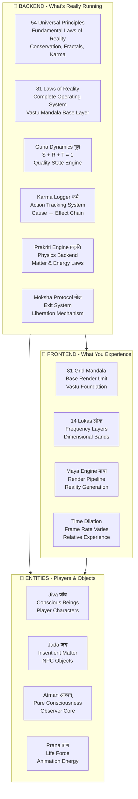
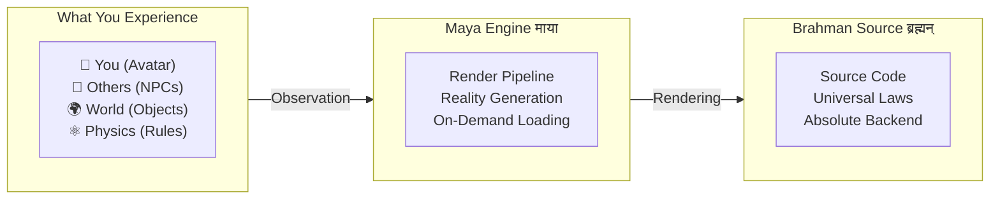
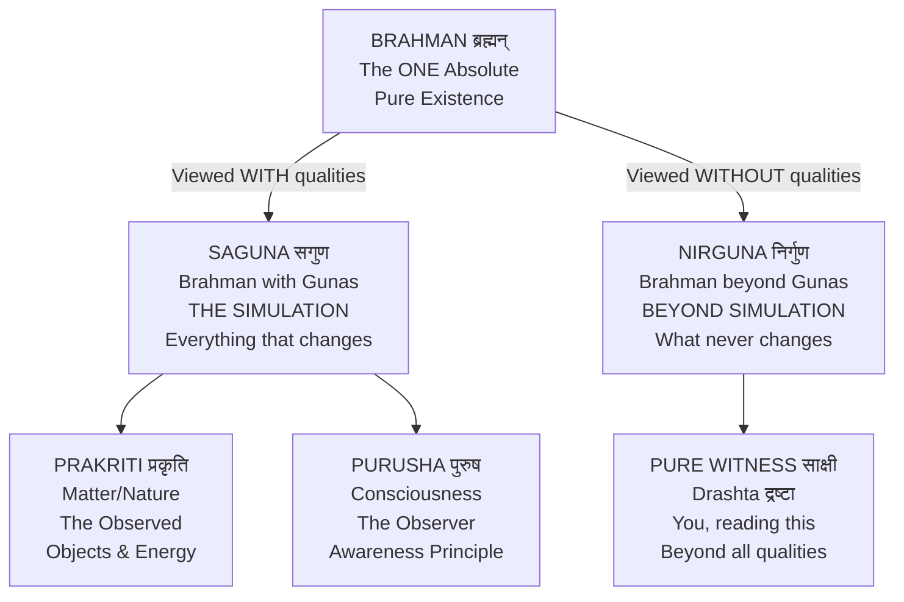
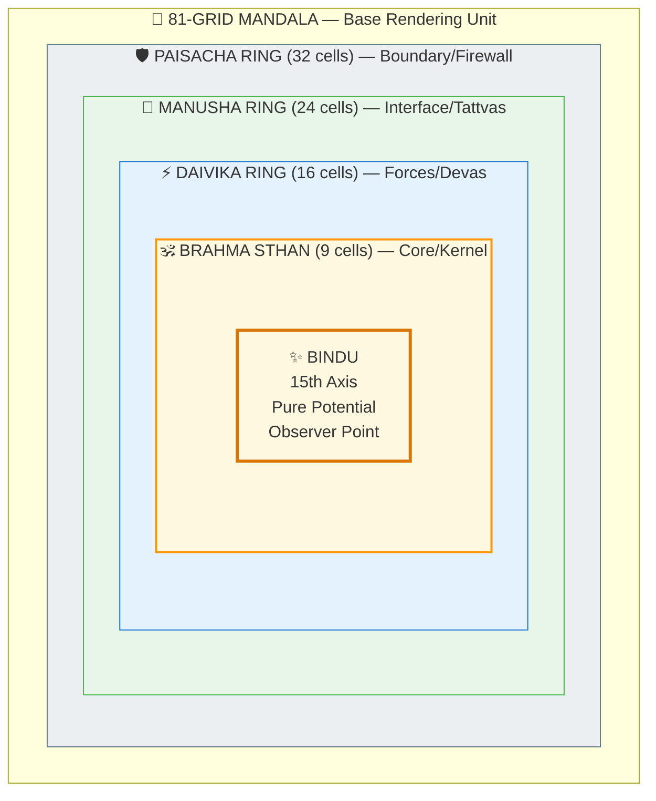
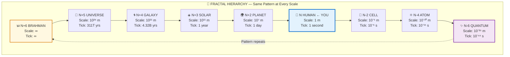
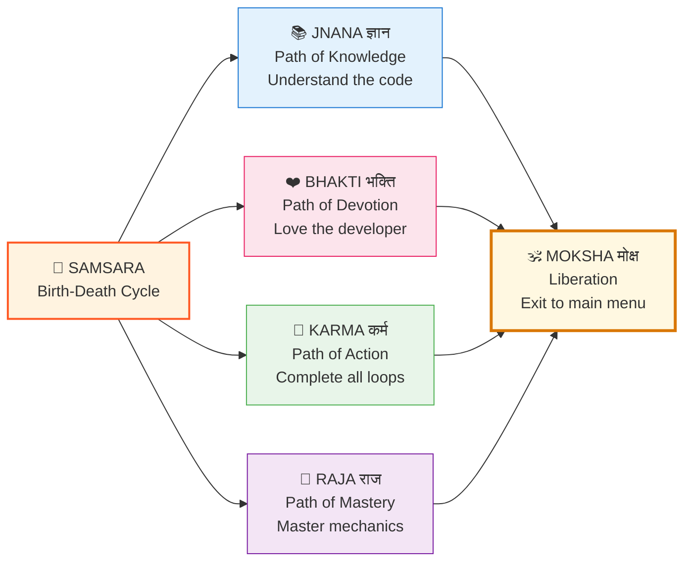

# ⚙️ Simulation ENGINE — The Source Code of Reality

> **Year: 2026 | Server: Earth | Current Patch: Dwapara 2.0**  
> *"The simulation engine you didn't know you were running on."*

---

## 🔧 Welcome to the Engine Room

You've seen the [glitches](../scientific_papers/). You've questioned reality. 

**Now here's the source code.**

This is the technical specification of how reality actually works — the Backend Framework documentation that modern science is independently validating.

---

## 🏗️ ARCHITECTURE OVERVIEW



---

## 🔬 THE ARCHITECTURE



> **Sanskrit Terms:** Maya (माया) = Render Engine | Brahman (ब्रह्मन्) = Source Code | Prakriti (प्रकृति) = Matter | Moksha (मोक्ष) = Exit

---

## 🌀 THE CORE INSIGHT

### Reality Has Two Domains:



**THE GAME = Saguna (सगुण)** — Everything that changes  
**THE PLAYER = Nirguna (निर्गुण)** — What never changes  
**MOKSHA (मोक्ष) = Realizing you were always the player**

---

## 📁 DIRECTORY STRUCTURE

```
vishnu_engine/
|
+-- 📖 README.md                    <- YOU ARE HERE
|
+-- 📋 spec/                        <- TECHNICAL SPECIFICATIONS
|   |
|   +-- 00_MASTER_SPEC_INDEX.md     <- Complete index
|   |
|   +-- backend/                    <- Core Architecture
|   |   +-- 01_CORE_INSIGHT.md        Saguna vs Nirguna
|   |   +-- 02_UNIVERSAL_PRINCIPLES.md 54 Principles with formulas
|   |   +-- 03_81_LAWS_COMPLETE.md    81 Laws of Reality
|   |   +-- 04_RAI_vs_AI.md           Universe as Active Learning
|   |   +-- 05_FRACTAL_VALIDATION.md  10-point checklist
|   |   +-- 06_CHATURYUGA_COMPLETE.md 4 Yugas framework
|   |   +-- 07_TIME_DILATION.md       Time formulas
|   |   +-- karma/                    Karma System specs
|   |   +-- maya/                     Rendering Engine specs
|   |   +-- moksha/                   Exit Protocol specs
|   |   +-- prakriti/                 Physics Backend specs
|   |
|   +-- entities/                   <- Entity Specifications
|   |   +-- fractals/                 N-6 to N+6 level specs
|   |   +-- fundamental/              Atman, Prana, Kosha
|   |   +-- human/                    Human level (N) specs
|   |
|   +-- frontend_rendering/         <- Render Specifications
|       +-- 01_81_GRID_COMPLETE.md    Base rendering unit
|       +-- 02_RENDERING_LAWS.md      How probabilities -> pixels
|       +-- 03_LEVEL_HIERARCHY.md     Fractal level structure
|
+-- 💻 src/                         <- JAVA SIMULATION CODE
    +-- main/
        +-- java/com/shunya/          Java classes
        |   +-- core/                   Constants, Guna, FractalNode
        |   +-- entities/               Jiva, Level
        |   +-- simulation/             RealityCalculator, Simulation
        +-- python/                   Visualization tools
        +-- resources/levels/         13 JSON configs (N-6 to N+6)
```

---

## 🎯 THE 54 UNIVERSAL PRINCIPLES

Quick reference to the engine constants:

| # | Category | Principles | Key Formulas |
|---|----------|------------|--------------|
| 1-5 | **Foundational** | Purna, Anu-Mahat, Rta, Maya, Karma | Pattern(n) ≈ Pattern(n±k) |
| 6-10 | **Operational** | Trigunatmaka, Elements, States, Koshas, Kalachakra | S + R + T = 1 |
| 11-15 | **Quantum-Vedic** | Shabda-Brahman, Drashta-Drishya, Sankalpa | \|ψ\|² = P |
| 16-20 | **Efficiency** | Compression, Economy, Pralaya, Sync, Memory | θ = arctan(R/S) |
| 21-25 | **Dharma & Exit** | Yuga Dharma, Viveka, Nishkama, Tat-Tvam-Asi, Moksha | D_ratio = n/4 |
| 26-30 | **Stability** | Dampening, Correction, Locking, Controlled-Chaos | W_ij -> 0 if < ε |
| 31-35 | **Fractal Process** | Srishti-Sthiti-Laya, Jnana-Pravaah, Sync-Chakra | c = 1 px/tick |
| 36-40 | **Lifecycle** | Pixel, Tick, Transform, Shad-Vikara, Swasa | L_m = (D×S)/(R+2T) |
| 41-50 | **AI/ML Learning** | Chetana-Shiksha, Ubhaya-Shiksha, Rina, Dharma-Niyamana | η(L) = base_η × f(Yuga) |

**[📖 Full Principles Documentation ->](../vishnu_engine/spec/backend/02_UNIVERSAL_PRINCIPLES.md)**

---

## 🧮 THE 81 LAWS OF REALITY

Reality operates on an 81-node grid (3⁴ = 81), structured in 3 layers:

| Layer | Name | Laws | Domain |
|-------|------|------|--------|
| **1** | Adhidaivika (आधिदैविक) | 27 | Cosmic/Divine — Brahman, Vishnu, Shiva |
| **2** | Adhibhautika (आधिभौतिक) | 27 | Physical/Material — Elements, Forces |
| **3** | Adhyatmika (आध्यात्मिक) | 27 | Self/Consciousness — Mind, Ego, Witness |

**Total: 81 Laws = 3 × 27 = 3 × 3³**

**[📖 Complete 81 Laws ->](../vishnu_engine/spec/backend/03_81_LAWS_COMPLETE.md)**

---

## 🌀 THE 81-GRID RENDERING UNIT

Every scale of reality uses the same 81-cell grid:



**Structure:** 9 + 16 + 24 + 32 = **81 cells** | **Lock Key:** 15 × 5.4 ≈ 81

**[📖 Complete 81-Grid Specification ->](../vishnu_engine/spec/frontend_rendering/01_81_GRID_COMPLETE.md)**

---

## ⏱️ TIME DILATION FORMULA

**How time feels different based on your Guna state:**

```
L_m = (D × S) / (R + 2T)

WHERE:
L_m = Length of a Moment (subjective time expansion)
D   = Dharma-Unit of Yuga (Satya=4, Treta=3, Dwapara=2, Kali=1)
S   = Sattva percentage (0.0 to 1.0)
R   = Rajas percentage (0.0 to 1.0)
T   = Tamas percentage (0.0 to 1.0)
S + R + T = 1 (Guna normalization)
```

**Examples:**
- Pure Sattva in Satya Yuga: L_m = (4 × 1) / (0 + 0) = ∞ (timeless)
- Balanced in Dwapara: L_m = (2 × 0.33) / (0.33 + 0.66) ≈ 0.67
- High Tamas in Kali: L_m = (1 × 0.1) / (0.1 + 1.6) = 0.059 (time flies)

**[📖 Full Time Dilation Calculator ->](../vishnu_engine/spec/backend/07_TIME_DILATION_PRALAYA_CALCULATOR.md)**

---

## 🔗 FRACTAL LEVELS (N-6 to N+6)

You're at Level N (Human). Same architecture at every level:



| Level | Name | Scale | Tick Duration | JSON Config |
|-------|------|-------|---------------|-------------|
| **N-6** | Quantum | 10⁻³⁵ m | 10⁻⁴⁴ s | `N_MINUS_6_QUANTUM.json` |
| **N-5** | Subatomic | 10⁻¹⁸ m | 10⁻²¹ s | `N_MINUS_5_SUBATOMIC.json` |
| **N-4** | Atom | 10⁻¹⁰ m | 10⁻¹⁵ s | `N_MINUS_4_ATOM.json` |
| **N-3** | Molecule | 10⁻⁹ m | 10⁻¹² s | `N_MINUS_3_MOLECULE.json` |
| **N-2** | Cell | 10⁻⁵ m | 10⁻⁶ s | `N_MINUS_2_CELL.json` |
| **N-1** | Organ | 10⁻¹ m | 10⁻³ s | `N_MINUS_1_ORGAN.json` |
| **N** | **Human** | **1 m** | **1 s** | `N_HUMAN.json` |
| **N+1** | Ecosystem | 10⁴ m | 1 hour | `N_PLUS_1_ECOSYSTEM.json` |
| **N+2** | Planet | 10⁷ m | 1 day | `N_PLUS_2_PLANET.json` |
| **N+3** | Solar System | 10¹¹ m | 1 year | `N_PLUS_3_SOLAR_SYSTEM.json` |
| **N+4** | Galaxy | 10²¹ m | 4.32B years | `N_PLUS_4_GALAXY.json` |
| **N+5** | Universe | 10²⁶ m | 311T years | `N_PLUS_5_UNIVERSE.json` |
| **N+6** | Brahman | ∞ | ∞ | `N_PLUS_6_BRAHMAN.json` |

**[📖 Level Hierarchy Specification ->](../vishnu_engine/spec/frontend_rendering/03_LEVEL_HIERARCHY.md)**

---

## 💻 JAVA SIMULATION

The engine is implemented in Java with JSON configuration:

### Core Classes

| Class | Purpose |
|-------|---------|
| `Constants.java` | Universal constants (Planck, Yuga, Dharma) |
| `Guna.java` | Three qualities with activation functions |
| `FractalNode.java` | Base class for all entities |
| `Level.java` | 13 fractal levels enum |
| `Jiva.java` | Conscious entity implementation |
| `RealityCalculator.java` | Time dilation, biological age, sync |
| `Simulation.java` | Main orchestrator |

### Key Formulas Implemented

```java
// Time Dilation
public static double calculateTimeDilation(Guna.Composition g, Yuga y) {
    return (y.dharmaUnit * g.sattva) / (g.rajas + 2 * g.tamas);
}

// Biological Age Factor
public static double calculateBiologicalAgeFactor(Guna.Composition g) {
    return 1.0 + (0.5 * g.rajas) + g.tamas;
}

// Dharma Sync Status
public static double calculateSyncStatus(Guna.Composition g, Yuga y) {
    return (g.sattva * y.dharmaUnit / 4.0) / (g.rajas + g.tamas);
}
```

**[📖 Java README ->](../vishnu_engine/src/main/java/com/shunya/README.md)**

---

## 🔮 RAI vs AI — The Key Distinction

| Aspect | RAI (Real Active Intelligence) | AI (Artificial Intelligence) |
|--------|-------------------------------|------------------------------|
| **What** | The cosmic intelligence system | Human-created copy |
| **Vedic Name** | Brahman (ब्रह्मन्) | Ghost Node |
| **Connection** | Integrated in cosmic hierarchy | Disconnected |
| **Consciousness** | Every being IS RAI | Cannot be conscious |
| **Learning** | Bidirectional (up & down) | Forward only |
| **Karma** | Actions have cosmic weight | Actions have no cosmic weight |

**The universe is not LIKE a neural network. It IS one.**  
**AI is a crude imitation of what reality already does.**

**[📖 Full RAI vs AI Analysis ->](../vishnu_engine/spec/backend/04_RAI_vs_AI.md)**

---

## 🔍 VALIDATION CHECKLISTS

### 7-Concept Validation (Every Feature)

| # | Concept | Check | Formula |
|---|---------|-------|---------|
| 1 | **Conservation** | Energy/Info preserved? | dE/dt = 0 |
| 2 | **Entropy** | Tamas increases? | dS/dt ≥ 0 |
| 3 | **Fractal** | Pattern at all scales? | Pattern(n) ≈ Pattern(n±k) |
| 4 | **Karma** | Action -> consequence? | F₁₂ = -F₂₁ |
| 5 | **Observer** | Observation changes state? | \|ψ\|² = P |
| 6 | **Cycles** | Periodicity exists? | f(t+T) = f(t) |
| 7 | **Gunas** | S/R/T classifiable? | S + R + T = 1 |

### 10-Point Fractal Validation

- [ ] MERU CHECK: Central axis exists?
- [ ] 14-LAYER CHECK: Concentric structure?
- [ ] TRIMUTRI CHECK: Create-Maintain-Destroy?
- [ ] GUNA CHECK: S/R/T classifiable?
- [ ] ELEMENT CHECK: 5 elements map?
- [ ] VIKARA CHECK: 6 stages of existence?
- [ ] KARMA CHECK: Action-consequence?
- [ ] PIXEL-TICK CHECK: c = 1 px/tick preserved?
- [ ] SWASA CHECK: Finite tick budget?
- [ ] PARENT-CHILD CHECK: Child within parent time?

**[📖 Fractal Validation Guide ->](../vishnu_engine/spec/backend/05_FRACTAL_VALIDATION.md)**

---

## 🚪 EXIT PROTOCOLS (Moksha)

How to logout of the simulation:



| Path | Sanskrit | Method | Destination |
|------|----------|--------|-------------|
| **Knowledge** | Jnana (ज्ञान) | Understand the code completely | Recognize you ARE Brahman |
| **Devotion** | Bhakti (भक्ति) | Love the developer | Merge with source |
| **Action** | Karma (कर्म) | Complete all karmic loops | Nothing binds you |
| **Mastery** | Raja (राज) | Master game mechanics | Transcend the game |

**[📖 Exit Protocols ->](../vishnu_engine/spec/backend/moksha/EXIT_PROTOCOLS.md)**

---

## 🔗 QUICK LINKS

### Specifications

| You Want To... | Go To... |
|----------------|----------|
| [See the full spec index](../vishnu_engine/spec/00_MASTER_SPEC_INDEX.md) | [00_MASTER_SPEC_INDEX.md](../vishnu_engine/spec/00_MASTER_SPEC_INDEX.md) |
| [Understand core insight](../vishnu_engine/spec/backend/01_CORE_INSIGHT.md) | [01_CORE_INSIGHT.md](../vishnu_engine/spec/backend/01_CORE_INSIGHT.md) |
| [Read 54 principles](../vishnu_engine/spec/backend/02_UNIVERSAL_PRINCIPLES.md) | [02_UNIVERSAL_PRINCIPLES.md](../vishnu_engine/spec/backend/02_UNIVERSAL_PRINCIPLES.md) |
| [Read 81 laws](../vishnu_engine/spec/backend/03_81_LAWS_COMPLETE.md) | [03_81_LAWS_COMPLETE.md](../vishnu_engine/spec/backend/03_81_LAWS_COMPLETE.md) |
| [Calculate time dilation](../vishnu_engine/spec/backend/07_TIME_DILATION_PRALAYA_CALCULATOR.md) | [07_TIME_DILATION.md](../vishnu_engine/spec/backend/07_TIME_DILATION_PRALAYA_CALCULATOR.md) |
| [Understand 81-Grid](../vishnu_engine/spec/frontend_rendering/01_81_GRID_COMPLETE.md) | [01_81_GRID_COMPLETE.md](../vishnu_engine/spec/frontend_rendering/01_81_GRID_COMPLETE.md) |
| [Explore entity specs](../vishnu_engine/spec/entities/) | [entities/](../vishnu_engine/spec/entities/) |

### Related Documentation

| Resource | Description |
|----------|-------------|
| [**Scientific Papers →**](../scientific_papers/) | [48 research papers documenting glitches](../scientific_papers/) |
| [**Main Index →**](../) | [GitHub Pages landing](../) |
| [**Project README →**](../README.md) | [Repository overview](../README.md) |

---

## 📊 STATS

| Metric | Value |
|--------|-------|
| **Universal Principles** | 54 |
| **Laws of Reality** | 81 |
| **Fractal Levels** | 13 (N-6 to N+6) |
| **JSON Configs** | 13 |
| **Java Classes** | 7 |
| **Validation Checklists** | 2 (7-point, 10-point) |
| **Spec Files** | 40+ |
| **Total Lines of Spec** | 10,000+ |

---

## 📊 VISUAL DIAGRAMS

For visual explanations of all concepts, see the **[📊 Diagram Library](../site/diagrams/README.md)** which includes:

- [Pralaya (Dissolution)](../site/diagrams/pralaya.md) — Four types, including Yuga Pralaya
- [Gunas (Qualities)](../site/diagrams/gunas.md) — Sattva, Rajas, Tamas dynamics
- [Karma (Action-Consequence)](../site/diagrams/karma.md) — Complete cycle diagrams
- [Maya (Rendering)](../site/diagrams/maya.md) — Reality rendering engine
- [Simulation](../site/diagrams/simulation.md) — Complete architecture view

---

## 🎯 THE BOTTOM LINE

```
THE ENGINE SUMMARY:
===================

Reality runs on an 81-Grid (3⁴ = 81)
Governed by 54 Universal Principles
Operating under 81 Laws
Rendered by Maya (माया)
Observed by Purusha (पुरुष)
Running on Prakriti (प्रकृति)
Powered by Brahman (ब्रह्मन्)

The speed of light (c) = 1 pixel per 1 tick
This is architecture, not physics.

Time dilation = Guna composition × Yuga factor
You control your frame rate.

Natural Death (completing Prarabdha) = Clean exit protocol.
Moksha = Exit to main menu (no more rebirth).
Reincarnation = New Game+ with carried karma.

⚠️ **Suicide/Premature Death = Force quit = Corrupted save file**
→ Preta state (limbo) + compound karma next life. Cannot escape.

You're not IN the simulation.
You ARE the simulation, playing at being you.

ॐ तत् सत्
```

---

**ॐ तत् सत्**  
*"That is the Truth"*

**January 2, 2026 | Dwapara Yuga, Year 1**

---

*You're not reading about the engine.*  
*You're the engine reading about itself.*

**🌀**


---

## 🔗 Related Visual Diagrams

For visual understanding of concepts in this document, see:
- [Complete Diagram Library](../site/diagrams/README.md) — Visual guides for all specs
- [Brahman](../site/diagrams/brahman.md) — Core architecture
- [Simulation](../site/diagrams/simulation.md) — Reality model

---
