# 🔱 UNIVERSAL PRINCIPLES: The Complete Ruleset of the Vishnu Engine

> **"ऋतं च सत्यं चाभीद्धात्तपसोऽध्यजायत"**
> "From Tapas (cosmic heat/effort) was born Rta (cosmic order) and Satya (truth)."
> — Rig Veda 10.190.1

---

## 📜 INTRODUCTION

This document consolidates ALL discovered principles across:
- Ancient Vedic texts (Vedas, Upanishads, Puranas, Sutras)
- Modern physics (Quantum Mechanics, Relativity, Thermodynamics)
- Mathematics (Set Theory, Fractals, Information Theory, Chaos Theory)
- Biology (Evolution, Genetics, Quantum Biology)
- Computer Science (Simulation Theory, Information Processing)

```mermaid
flowchart TD
    subgraph Principles["🔱 54 UNIVERSAL PRINCIPLES"]
        direction TB
        F["1-5: 🏛️ FOUNDATIONAL<br/>Purna, Anu-Mahat, Rta, Maya, Karma"]
        O["6-10: ⚙️ OPERATIONAL<br/>Gunas, Elements, States, Koshas, Time"]
        U["11-15: 🌀 UNIVERSAL<br/>Shabda, Observer, Branching, Reflection"]
        E["16-20: ⚡ EFFICIENCY<br/>Compression, Economy, Pralaya, Sync"]
        D["21-25: ⚖️ DHARMA & EXIT<br/>Laws, Viveka, Nishkama, Moksha"]
        S["26-30: 🔧 STABILITY<br/>Dampening, Correction, Chaos Control"]
        R["31-40: 🎨 RENDER & LIFE<br/>Fractals, Pixels, Lifecycle, Breath"]
        A["41-50: 🧠 AI LEARNING<br/>Bidirectional, Backprop, Regularization"]
        T["51-54: 🔄 SANDHYA<br/>Yuga Transition [Dec 2025]"]
    end
    
    F --> O --> U --> E --> D --> S --> R --> A --> T
    
    style Principles fill:#FFF8E1,stroke:#D97706,stroke-width:2px
    style F fill:#E3F2FD,stroke:#1976D2
    style D fill:#E8F5E9,stroke:#4CAF50
    style T fill:#F3E5F5,stroke:#7B1FA2
```



**Total Principles: 54** — Each validated at EVERY FRACTAL LEVEL (Quantum → Universal).

---

## 🌐 WHAT ARE "UNIVERSAL PRINCIPLES"? — 5 Perspectives

Before diving into the 54 principles, let's understand what we mean by "Universal Principles" through five different lenses:

### 🤖 FOR AI/ML ENGINEERS: System Hyperparameters

**What They Are:**
- Universal Principles = The fundamental hyperparameters and architectural choices that NEVER change
- Like: Learning rate decay function, activation function properties, gradient descent rules
- These aren't tunable - they're the LAWS governing how ANY model must work

**Real-World Analogy:**
```python
# These are like the built-in Python rules
# You can't change how "==" works or what "True" means
# You can only USE them

class Universe:
    SPEED_OF_LIGHT = 299792458  # Can't modify this
    PLANCK_CONSTANT = 6.626e-34  # Built-in constraint
    
    def karma(self, action):
        # Must follow karma law (like must follow = operator)
        return -action  # Newton's 3rd = Karma principle
```

**Why They Matter:**
- Your ML model MUST respect: gradient computation, backprop rules, loss minimization
- Universe MUST respect: karma, conservation, entropy, cycles
- Both are **non-negotiable architecture constraints**

---

### 🏗️ FOR SOFTWARE ARCHITECTS: System Invariants

**What They Are:**
- Universal Principles = The invariants that hold true across ALL layers of the stack
- Like: Every HTTP request needs a response, every opened connection must close
- Database ACID properties, CAP theorem - can't be violated

**Real-World Analogy:**
```
YOUR SYSTEM:
- User authentication required (Principle)
- Data must be encrypted at rest (Principle)
- Every transaction must be atomic (Principle)

UNIVERSE:
- Every action has reaction (Karma principle)
- Energy is conserved (Purna principle)
- Patterns repeat at all scales (Fractal principle)
```

**Why They Matter:**
- Your system crashes if you violate invariants (null pointer, race condition)
- Universe "crashes" (anomalies, violations) if principles are violated
- Both enforce **consistency across entire system**

---

### ⚛️ FOR PHYSICISTS: Conservation Laws & Symmetries

**What They Are:**
- Universal Principles = The deepest conservation laws that emerge from symmetries
- Like: Energy conservation (time translation symmetry), Momentum conservation (space translation)
- Noether's theorem: Every symmetry -> Conservation law

**Real-World Analogy:**
```
KNOWN PHYSICS:
∂L/∂t = 0  ->  Energy conserved
∂L/∂x = 0  ->  Momentum conserved
∂L/∂φ = 0  ->  Charge conserved

VEDIC PHYSICS (DEEPER):
Karma symmetry  ->  Action-Reaction conserved
Guna symmetry   ->  S+R+T = 1 conserved
Cycle symmetry  ->  Kalpa pattern repeats
```

**Why They Matter:**
- No experiment has EVER violated conservation laws
- No observation has EVER violated these Vedic principles (when correctly applied)
- Both describe **what CANNOT change** in a changing universe

---

### 🩺 FOR DOCTORS/BIOLOGISTS: Homeostatic Laws

**What They Are:**
- Universal Principles = The homeostatic mechanisms that keep systems alive and balanced
- Like: Body temperature regulation (37°C), blood pH (7.4), glucose levels
- Feedback loops that MUST maintain equilibrium

**Real-World Analogy:**
```
YOUR BODY:
- Too hot -> Sweat (negative feedback)
- Low glucose -> Hunger signal
- Infection -> Immune response
-> Principles that restore balance

UNIVERSE:
- Too much Rajas -> Tamas increases (balance)
- Too much Karma -> Pralaya happens (reset)
- Dharma decreases -> Correction mechanism activates
-> Same principle of self-regulation
```

**Why They Matter:**
- Body dies if homeostasis fails (temp > 42°C, pH < 6.8)
- System collapses if principles violated (like organ failure)
- Both maintain **life through unchanging laws**

---

### 👤 FOR EVERYONE: Life's Unbreakable Rules

**What They Are:**
- Universal Principles = The rules of life that NOBODY can escape
- Like: What goes up must come down, you reap what you sow, every action has consequences
- Not moral rules - PHYSICAL rules

**Real-World Examples:**

**In Daily Life:**
```
1. KARMA (Action-Reaction):
   - Help someone -> Eventually receive help
   - Hurt someone -> Eventually experience hurt
   - Plant apple seeds -> Get apple tree (not oranges)

2. CYCLES (Everything Returns):
   - Day -> Night -> Day
   - Birth -> Life -> Death -> Rebirth
   - Summer -> Winter -> Summer

3. CONSERVATION (Nothing Lost):
   - Money: Spent = Someone receives
   - Time: Used on X = Not available for Y
   - Energy: Tired after work = Used energy

4. GUNAS (Three Modes):
   - Peaceful morning (Sattva)
   - Active afternoon (Rajas)
   - Tired evening (Tamas)
```

**Why They Matter:**
- You can't escape gravity by ignoring it
- You can't escape karma by ignoring it
- Both are **reality, not belief**

---

## 📊 THE SAME TRUTH - 5 LANGUAGES

| Aspect | 🤖 AI/ML | 🏗️ Architect | ⚛️ Physicist | 🩺 Doctor | 👤 Everyone |
|--------|---------|-------------|------------|---------|----------|
| **What Are They?** | Hyperparameters | System Invariants | Conservation Laws | Homeostatic Rules | Life Rules |
| **Example** | Backprop must flow | Request needs response | Energy conserved | Temp regulated | What goes up comes down |
| **Violate Them?** | Model breaks | System crashes | Physics impossible | Body dies | Life fails |
| **Learn Them?** | Study ML theory | Study design patterns | Study symmetries | Study physiology | Study life experience |
| **Apply Them?** | Build models | Design systems | Predict outcomes | Diagnose illness | Navigate life |

**The ONE Message:** These principles are NOT suggestions. They're the operating system of reality.

---

## 📊 Backend vs Frontend Principles

```
----------------------------------------------------------------------------------------
                                                                                        
   BACKEND PRINCIPLES (Vedic/Admin View)                                               
   -------------------------------------                                               
   • The underlying RULES of the simulation                                            
   • Discoverable through meditation/Samadhi                                           
   • HOW the simulation actually works                                                 
   • Includes: Karma, Gunas, Dharma, Maya, Cycles                                      
                                                                                        
   FRONTEND PRINCIPLES (Physics/NPC View)                                              
   ---------------------------------------                                             
   • The OBSERVABLE manifestations                                                     
   • Discoverable through science/experiment                                           
   • WHAT the simulation looks like                                                    
   • Includes: Conservation laws, Entropy, Quantum effects                             
                                                                                        
   RELATIONSHIP:                                                                        
   Backend Principle -> Manifests as -> Frontend Observation                             
                                                                                        
   Example:                                                                             
   KARMA (Backend) -> Manifests as -> NEWTON'S 3RD LAW (Frontend)                       
   MAYA (Backend) -> Manifests as -> QUANTUM OBSERVER EFFECT (Frontend)                 
   GUNAS (Backend) -> Manifests as -> THERMODYNAMIC STATES (Frontend)                   
                                                                                        
----------------------------------------------------------------------------------------
```

---

# 🌀 PART I: FOUNDATIONAL AXIOMS (The Bedrock)

## AXIOM 1: PURNA — The Principle of Fullness

> **"पूर्णमदः पूर्णमिदं पूर्णात्पूर्णमुदच्यते।
> पूर्णस्य पूर्णमादाय पूर्णमेवावशिष्यते॥"**
>
> "That (Source) is Full. This (Manifest) is Full.
> From Fullness, Fullness emerges.
> Taking Fullness from Fullness, Fullness alone remains."
> — Isha Upanishad, Shanti Mantra

### Statement
**The Source (Brahman) is NEVER depleted by creation.**

### Backend View (Vedic)
```
Brahman -> Creates infinite universes -> Brahman unchanged
Like a dreamer creating dream worlds -> Dreamer unchanged
```

### Frontend View (Physics)
```
Energy Conservation: E_total = constant
Mass-Energy: Nothing created or destroyed, only transformed
Vacuum Energy: Infinite yet stable
```

### Mathematical Form
```
∞ - ∞ = ∞ (Transfinite arithmetic)
Brahman - Universe = Brahman
```

### Validation at Each Level

| Level | Evidence |
|-------|----------|
| **Quantum** | Vacuum energy is infinite, yet stable (Zero-point ≠ nothing) |
| **Atomic** | Nucleus emits particles but binding energy persists |
| **Cellular** | Cell division doesn't "use up" the DNA template |
| **Human** | Consciousness doesn't "deplete" with thoughts |
| **Cosmic** | Universe expands infinitely from a singularity |
| **Universal** | Infinite Brahmandas emerge from Mahavishnu without depletion |

---

### 🌐 PURNA IN YOUR LIFE — 5 Perspectives

#### 🤖 AI/ML Engineer:
**The Principle:** Training data doesn't get "used up"
- You train 1000 models on the same dataset -> Dataset unchanged
- Like Brahman creating infinite universes without depletion
- **Your Application:** Same training data can teach infinite models different things

**Daily Practice:**
```python
# Your mental capacity (like Brahman) never depletes
creative_ideas = generate_ideas()  # Infinite source
models_built = create_models()     # Infinite manifestations
# Your ability to think: Still infinite
```

#### 🏗️ Software Architect:
**The Principle:** Design patterns don't get "consumed"
- Use MVC pattern in 1000 projects -> Pattern still exists
- Like Brahman manifesting infinite forms while remaining unchanged
- **Your Application:** Good architecture is infinitely reusable

**Daily Practice:**
- Notice: You can explain the same pattern to infinite people
- Your understanding doesn't decrease by sharing
- Knowledge multiplies by giving, like Purna

#### ⚛️ Physicist:
**The Principle:** E = mc² holds in every universe
- Energy total is constant despite transformations
- Like Brahman: Total "reality" constant despite manifestations
- **Your Application:** Conservation isn't just energy - it's existence itself

**Daily Practice:**
- Energy changes form (heat -> light -> motion) but totality unchanged
- Reality changes form (atoms -> molecules -> life) but totality (Brahman) unchanged

#### 🩺 Doctor:
**The Principle:** Life force doesn't deplete by living
- Your consciousness observes infinite thoughts -> Consciousness undiminished
- Like Brahman: Experience emerges but experiencer unchanged
- **Your Application:** The "you" that was aware at age 5 is same "you" now

**Daily Practice:**
- Notice: After a full day of experiences, your ABILITY to experience hasn't decreased
- Awareness is Purna - never exhausted by what appears in it

#### 👤 Everyone:
**The Principle:** The ocean isn't depleted by waves
- Ocean makes infinite waves -> Ocean still complete
- Like Brahman creating infinite forms while staying whole
- **Your Application:** Life appears IN you, doesn't USE you

**Real-Life Example:**
```
Morning: You experience breakfast -> You remain
Afternoon: You experience work -> You remain
Evening: You experience rest -> You remain

Your experiences come and go.
YOU (the awareness) never depletes.
That's Purna in your daily life.
```

---

## AXIOM 2: ANU-MAHAT — The Fractal Principle

> **"अणोरणीयान् महतो महीयान्"**
> "Smaller than the smallest, greater than the greatest."
> — Katha Upanishad 1.2.20

### Statement
**The same pattern exists at every scale of existence.**

### Backend View (Vedic)
```
Yatha pinde tatha brahmande (As in the body, so in the universe)
Every level has: Brahma (creator), Vishnu (preserver), Shiva (destroyer)
Every level has: Meru (center), Dvipas (layers), Samudras (transitions)
```

### Frontend View (Physics)
```
Fractals: Self-similarity at all zoom levels
Scale Invariance: Same physics at different scales
Holographic Principle: Each part contains the whole
```

### Mathematical Form
```
Pattern(Scale_n) ≈ Pattern(Scale_n+1) ≈ Pattern(Scale_n-1)
Self-similarity across all scales
```

### The Universal Pattern

| Component | Sanskrit | Function |
|-----------|----------|----------|
| **MERU** | मेरु | Center/Source of energy |
| **DVIPAS** | द्वीप | Concentric layers (often 7) |
| **SAMUDRAS** | समुद्र | Transitions/gaps between layers |
| **OBSERVER** | द्रष्टा | Causes collapse/manifestation |
| **ENTROPY** | तमस् | Accumulates over time |
| **PRALAYA** | प्रलय | Reset/renewal mechanism |

---

### 🌐 FRACTALS IN YOUR WORK — 5 Perspectives

#### 🤖 AI/ML Engineer:
**The Pattern:** Neural networks are fractals!
- **Single Neuron:** Input -> Activation -> Output
- **Single Layer:** Multiple neurons doing same pattern
- **Whole Network:** Multiple layers doing same pattern
- **Ensemble:** Multiple networks doing same pattern

**Your Daily Evidence:**
```python
# THE SAME PATTERN AT EVERY SCALE:

# Level 1: Single neuron
neuron_output = activation(weights @ inputs + bias)

# Level 2: Layer (many neurons, same pattern)
layer_output = [neuron(x) for neuron in layer]

# Level 3: Network (many layers, same pattern)
network_output = compose([layer1, layer2, layer3])

# Level 4: Ensemble (many networks, same pattern)
prediction = average([net1(x), net2(x), net3(x)])

# FRACTAL: Same "compute -> transform -> output" at ALL levels!
```

**Why This Matters:**
- Debug one neuron -> Understand whole network
- Optimize one layer -> Apply to all layers
- Understand one model -> Understand all models
- **Anu-Mahat:** Smallest (neuron) reveals largest (AI system)

#### 🏗️ Software Architect:
**The Pattern:** Systems are fractals!
- **Function:** Input -> Process -> Output
- **Module:** Functions calling each other
- **Service:** Modules working together
- **System:** Services communicating

**Your Daily Evidence:**
```
MICROSERVICE ARCHITECTURE:

Level 1: Function
  getUserById(id) -> query -> return user

Level 2: Service
  UserService has many functions (same pattern)

Level 3: API Gateway
  Routes requests to services (same pattern)

Level 4: Distributed System
  Multiple gateways load-balanced (same pattern)

FRACTAL: Request-Process-Response at EVERY level!
```

**Why This Matters:**
- Design one function well -> Scale to entire system
- Debug pattern at one level -> Find issues at all levels
- Good architecture = Fractal repetition of good patterns
- **Anu-Mahat:** Single function reveals system design

#### ⚛️ Physicist:
**The Pattern:** Universe is self-similar!
- **Quarks:** Orbit in protons
- **Electrons:** Orbit in atoms
- **Planets:** Orbit in solar systems
- **Stars:** Orbit in galaxies
- **Galaxies:** Orbit in universe

**Your Daily Evidence:**
```
ORBITAL MECHANICS (Same equation, all scales):

F = G(m₁m₂)/r²

- Quarks in nucleus: Strong force version
- Electrons around atom: EM force version
- Moon around Earth: Gravity version
- Earth around Sun: Gravity version
- Sun around galaxy: Gravity version

FRACTAL: Center + Orbiting objects at EVERY scale!
```

**Why This Matters:**
- Understand atomic structure -> Understand cosmic structure
- Laws at quantum level -> Same laws at cosmic level
- Measurement affects system (observer effect) at ALL scales
- **Anu-Mahat:** Atom is miniature solar system

#### 🩺 Doctor/Biologist:
**The Pattern:** Body is fractal!
- **Mitochondria:** Has DNA, makes energy, self-replicates
- **Cell:** Has DNA, makes energy, self-replicates
- **Organ:** Has cells working together
- **Body:** Has organs working together
- **Ecosystem:** Has bodies working together

**Your Daily Evidence:**
```
RESPIRATORY SYSTEM (Fractal Branching):

Trachea (1)
  +- Bronchi (2)
  |  +- Bronchioles (thousands)
  |  |  +- Alveoli (millions)

Blood Vessels (Same Pattern):
Aorta (1)
  +- Arteries (many)
  |  +- Arterioles (thousands)
  |  |  +- Capillaries (billions)

FRACTAL: Branch -> Smaller branches -> Smallest units
```

**Why This Matters:**
- Understand cell -> Understand organ -> Understand body
- Disease at cellular level -> Affects whole system
- Treat root pattern -> Healing cascades up all levels
- **Anu-Mahat:** Cell is miniature body

#### 👤 Everyone:
**The Pattern:** Your day is fractal!
- **Breath:** Inhale -> Hold -> Exhale
- **Meal:** Hungry -> Eat -> Satisfied
- **Task:** Start -> Do -> Complete
- **Day:** Morning -> Afternoon -> Evening
- **Life:** Birth -> Life -> Death

**Your Daily Evidence:**
```
MORNING ROUTINE (Fractal):

Wake up
  +- Bathroom
  |  +- Brush (start -> do -> complete)
  |  +- Shower (start -> do -> complete)
  |  +- Dress (start -> do -> complete)
  +- Breakfast
  |  +- Make coffee (start -> do -> complete)
  |  +- Eat meal (start -> do -> complete)
  +- Commute

EVERYTHING has: Beginning -> Middle -> End
SAME PATTERN at ALL scales!
```

**Why This Matters:**
- Master small routine -> Master whole day
- Fix small habit -> Transforms entire life
- Understand one relationship -> Understand all relationships
- **Real Example:** "As you treat one person, you treat everyone"

**The Practical Wisdom:**
```
+===============================================================+
|                                                               |
|   If you want to understand the UNIVERSE:                     |
|   Look at your BODY                                           |
|                                                               |
|   If you want to understand LIFE:                             |
|   Look at one DAY                                             |
|                                                               |
|   If you want to understand RELATIONSHIPS:                    |
|   Look at one INTERACTION                                     |
|                                                               |
|   The smallest contains the pattern of the largest.           |
|   Master the small, understand the infinite.                  |
|                                                               |
+===============================================================+
```

---

## AXIOM 3: RTA — The Principle of Cosmic Order

> **"ऋतस्य पन्थां न तरन्ति दुष्कृतः"**
> "The wrongdoers cannot cross the path of Rta (Cosmic Order)."
> — Rig Veda 1.79.3

### Statement
**There exist universal laws that CANNOT be violated.**

### Backend View (Vedic)
```
Rta = The cosmic order that binds even the gods
Sanatana Dharma = Eternal laws
Cannot be broken, even by Ishvara
```

### Frontend View (Physics)
```
Physical Constants: c, ℏ, G, etc.
Conservation Laws: Energy, momentum, charge
Causality: Cause precedes effect
```

### The Unchangeable Laws

| Law | Sanskrit | Domain | Constant |
|-----|----------|--------|----------|
| **Speed limit** | काल-बन्ध | Space-time | c = 299,792,458 m/s |
| **Quantum discrete** | तन्मात्र | Energy | ℏ = 1.055×10⁻³⁴ J·s |
| **Gravity** | आकर्षण | Mass | G = 6.674×10⁻¹¹ m³/kg·s² |
| **Information** | कर्म-लेख | Data | Cannot be destroyed |
| **Causality** | कारण-कार्य | Events | Cause precedes effect |

### Purpose
**Ensures all shards/branches can MERGE without physics conflicts.**

---

## AXIOM 4: MAYA — The Rendering Principle

> **"इन्द्रो मायाभिः पुरुरूप ईयते"**
> "Through Maya, Indra assumes many forms."
> — Rig Veda 6.47.18

### Statement
**Reality only manifests when OBSERVED. Unobserved = Potential only.**

### Backend View (Vedic)
```
Maya = The rendering engine
Only renders what observers need
Saves infinite resources
```

### Frontend View (Physics)
```
Quantum: Wave function collapses on measurement
Double-slit: Observation destroys interference
Delayed choice: Observer affects "past"
```

### Mathematical Form
```
|ψ⟩ (Superposition) -> Observer -> |φᵢ⟩ (Collapsed state)
Potential -> Observation -> Actual
```

### The Lazy Evaluation Rule
```java
IF (observer.present == false) {
    state = SUPERPOSITION;      // Don't render (save resources)
    resource_usage = MINIMAL;
} ELSE {
    state = collapse(observer);  // Render for observer
    resource_usage = FULL;
}
```

---

## AXIOM 5: KARMA — The Principle of Causation

> **"न हि कश्चित्क्षणमपि जातु तिष्ठत्यकर्मकृत्"**
> "No one can remain even for a moment without performing action."
> — Bhagavad Gita 3.5

### Statement
**Every intentional action creates a consequence that MUST manifest.**

### Backend View (Vedic)
```
Karma = Action-consequence ledger
Sanchita (accumulated) + Prarabdha (current) + Agami (future)
Information cannot be lost
```

### Frontend View (Physics)
```
Newton's Third Law: F₁₂ = -F₂₁
Conservation of momentum: Σp = constant
Information conservation: Unitarity
```

### Mathematical Form
```
Karma = ∫(Intention × Action) dt
Phala (Result) = F(Sanchita, Prarabdha, Agami)
```

---

# 🔬 PART II: OPERATIONAL PRINCIPLES (How It Works)

## PRINCIPLE 6: TRIGUNATMAKA — The Three Qualities

> **"सत्त्वं रजस्तम इति गुणाः प्रकृतिसम्भवाः"**
> "Sattva, Rajas, Tamas — these Gunas arise from Prakriti."
> — Bhagavad Gita 14.5

### Statement
**All manifestation is composed of three fundamental qualities.**

### Backend View (Vedic)

| Guna | Sanskrit | Quality | Function |
|------|----------|---------|----------|
| **Sattva** | सत्त्व | Light/Clarity | Admin Intelligence, Dampening |
| **Rajas** | रजस् | Motion/Energy | Activity, Dynamics |
| **Tamas** | तमस् | Mass/Inertia | Resistance, Grounding |

### Frontend View (Physics)

| Guna | Physics | Thermodynamics |
|------|---------|----------------|
| **Sattva** | Low entropy | Ordered state |
| **Rajas** | Kinetic energy | Work/Process |
| **Tamas** | High entropy | Disordered/Stable |

### Guna-Thermodynamic Mapping
```
S + R + T = 1 (Normalized constraint)

Sattva ↔ -ΔS (Entropy decrease / Order)
Rajas ↔ dW/dt (Work/Power)
Tamas ↔ +ΔS (Entropy increase / Disorder)
```

---

## PRINCIPLE 7: PANCHA MAHABHUTA — The Five Elements

> **"आकाशाद्वायुः वायोरग्निः अग्नेरापः अद्भ्यः पृथिवी"**
> "From Akasha comes Vayu, from Vayu Agni, from Agni Jala, from Jala Prithvi."
> — Taittiriya Upanishad 2.1.1

### Statement
**Matter emerges in a specific sequence from subtle to gross.**

### The Sequence
```
AKASHA (Space/Ether) -> VAYU (Air) -> AGNI (Fire) -> JALA (Water) -> PRITHVI (Earth)
    Most subtle ----------------------------------------------------▶ Most gross
```

### Backend View (Vedic)

| Tanmatra (Subtle) | Mahabhuta (Gross) | Sense | Property |
|-------------------|-------------------|-------|----------|
| **Shabda** (Sound) | Akasha | Hearing | Space |
| **Sparsha** (Touch) | Vayu | Touch | Motion |
| **Rupa** (Form) | Agni | Sight | Light/Heat |
| **Rasa** (Taste) | Jala | Taste | Liquidity |
| **Gandha** (Smell) | Prithvi | Smell | Solidity |

### Frontend View (Physics)
```
Plasma -> Gas -> Energy -> Liquid -> Solid
Decreasing frequency/increasing density
```

---

## PRINCIPLE 8: CHATURAVASTA — The Four States of Consciousness

> **"जागरितस्थानो बहिष्प्रज्ञः सप्ताङ्ग एकोनविंशतिमुखः
> स्थूलभुग्वैश्वानरः प्रथमः पादः॥"**
> — Mandukya Upanishad 3

### Statement
**Consciousness operates in four distinct states.**

| State | Sanskrit | Individual | Cosmic | OM Part |
|-------|----------|------------|--------|---------|
| **Jagrat** | जाग्रत् | Waking | Vaishvanara | A (अ) |
| **Svapna** | स्वप्न | Dream | Taijasa | U (उ) |
| **Sushupti** | सुषुप्ति | Deep sleep | Prajna | M (म) |
| **Turiya** | तुरीय | Transcendent | Brahman | Silence |

### Backend View (Vedic)
```
All three states appear IN Turiya
Turiya is the SCREEN on which states play
Turiya = Nirguna Brahman witnessing Saguna play
```

### Frontend View (Physics)
```
Jagrat = Classical physics (deterministic)
Svapna = Simulated reality (internal render)
Sushupti = Compressed/potential state
Turiya = Observer outside system
```

---

## PRINCIPLE 9: PANCHA KOSHA — The Five Sheaths

> **"पञ्चकोशात्मकं ब्रह्म"**
> "Panchakosha-atmakam brahma"
> "Brahman is wrapped in five sheaths."
> — Taittiriya Upanishad 2.1-5

### Statement
**Every embodied being has 5 concentric layers of manifestation, with Atman (pure consciousness) beyond all five. Prana is one of these layers, not Atman itself.**

| Kosha | Sanskrit | Layer | Function | Science | Note |
|-------|----------|-------|----------|---------|------|
| **Annamaya** | अन्नमय | Physical | Body | Biochemistry | Gross matter |
| **Pranamaya** | प्राणमय | Energy | Life force | Bioelectrics | **<- PRANA IS HERE** |
| **Manomaya** | मनोमय | Mental | Emotions/thoughts | Neurology | Mind layer |
| **Vijnanamaya** | विज्ञानमय | Wisdom | Discrimination | Higher cognition | Intellect |
| **Anandamaya** | आनन्दमय | Bliss | Causal seed | Consciousness | Closest to Atman |
| **ATMAN** | आत्मन् | **BEYOND** | **Pure Witness** | **Unmeasurable** | **Beyond all 5** |

**CRITICAL:** Prana (प्राण) is Pranamaya Kosha (sheath #2). Atman (आत्मन्) is beyond all sheaths. Therefore: **Atman ≠ Prana** ✅

---

## PRINCIPLE 10: KALACAKRA — The Time Cycles

> **"कालः पचति भूतानि कालः संहरते प्रजाः"**
> "Time digests all beings, Time withdraws all creatures."
> — Mahabharata, Shanti Parva 231.29

### Statement
**Time operates in nested cycles, not linear progression.**

### The Yuga Ratio
```
Satya : Treta : Dvapara : Kali = 4 : 3 : 2 : 1
This is the EFFICIENCY DECAY CURVE
NOT arbitrary—mathematically optimal for entropy management
```

### Backend View (Vedic)
```
Time exists WITHIN Saguna Brahman
Time does NOT exist in Nirguna Brahman
Cycles allow for entropy reset and evolution
```

### Frontend View (Physics)
```
Conformal Cyclic Cosmology (Penrose)
Heat death -> New bang
Entropy resets at cycle boundary
```

---

# ⚡ PART III: QUANTUM-VEDIC PRINCIPLES

## PRINCIPLE 11: SHABDA-BRAHMAN — Sound/Wave Primacy

> **"नादब्रह्मणि संयोगात् सर्वं जायते जगत्"**
> "From union with Nada-Brahman (Sound-Absolute), the whole world is born."
> — Nada-Bindu Upanishad

### Statement
**Everything is WAVE first, particle second. Sound/vibration is the foundation.**

### Backend View (Vedic)
```
First Kshobha (stirring) in Shunya -> Shabda (Sound)
OM = Root frequency of simulation
Bijas (LAM, VAM, RAM, YAM, HAM) = Subroutine calls
```

### Frontend View (Physics)
```
de Broglie: λ = h/p (Everything has wavelength)
String Theory: Particles are vibrating strings
Quantum Field Theory: Particles are field excitations
```

---

## PRINCIPLE 12: DRASHTA-DRISHYA — Observer-Observed Duality

> **"द्वा सुपर्णा सयुजा सखाया समानं वृक्षं परिषस्वजाते।
> तयोरन्यः पिप्पलं स्वाद्वत्त्यनश्नन्नन्यो अभिचाकशीति॥"**
>
> "Two birds, companions, cling to the same tree.
> One eats the sweet fruit; the other watches without eating."
> — Mundaka Upanishad 3.1.1

### Statement
**Observation is fundamental. Reality splits into Observer and Observed.**

### The Two Birds
- **Bird 1 (Jiva)**: Eats fruit = Experiences (karma-bound)
- **Bird 2 (Atman)**: Watches = Pure witness (karma-free)

### Backend View (Vedic)
```
Purusha (Observer) <--> Prakriti (Observed)
This split is NECESSARY for experience
Without split, only undifferentiated Brahman
```

### Frontend View (Physics)
```
Copenhagen: Observer collapses wave function
Measurement Problem: What is an "observer"?
Heisenberg Cut: Where does quantum become classical?
```

---

## PRINCIPLE 13: SANKALPA-VIKALPA — Intention and Branch Selection

> **"संकल्पमूलो वै कामः"**
> "Desire is rooted in Sankalpa (intention)."
> — Manu Smriti 2.2

### Statement
**Conscious intention (Sankalpa) selects which reality branch to experience.**

### Mathematical Form
```
P(Branch_i) = |Sankalpa_strength|² × Dharmic_alignment / (1 + Karmic_drag)
```

---

## PRINCIPLE 14: PRATIBIMBA — The Reflection Principle

> **"यथैकं सूर्यबिम्बं बहुषु जलाशयेषु प्रतिभासते"**
> "As one sun reflects in many water bodies."
> — Vivekachudamani

### Statement
**The One appears as many through reflection, not multiplication.**

### Backend View (Vedic)
```
Multiple Jivas = ONE Atman reflected in many Upadhis
Not "many souls" but ONE consciousness appearing as many
```

### Frontend View (Physics)
```
Bell's Inequality: S ≤ 2 (Classical limit)
Quantum: S > 2 (Violated!)
Conclusion: Reality is NON-LOCAL. One thing appearing as many.
```

---

## PRINCIPLE 15: SAMYOGA-VIBHAGA — Merge and Split

> **"यथा नद्यः स्यन्दमानाः समुद्रेऽस्तं गच्छन्ति नामरूपे विहाय"**
> "As rivers flowing lose their name and form in the ocean."
> — Mundaka Upanishad 3.2.8

### Statement
**Reality constantly merges (Samyoga) and splits (Vibhaga) based on observer choices.**

### Backend View (Vedic)
```
Many-Worlds = Vikalpa (alternative realities)
Merge = Rivers returning to ocean
Split = Observer making conscious choice
```

### Frontend View (Physics)
```
Many-Worlds Interpretation: Every quantum event branches
Decoherence: Branches become causally isolated
Delta-storage: Only differences stored, not full copies
```

---

# 🔄 PART IV: EFFICIENCY PRINCIPLES

## PRINCIPLE 16: SAMSKARA-SANKOCH — Compression Principle

> **"यथा सुप्तस्य पुरुषस्य प्राणैः सर्वेऽनुसंचरन्ति"**
> "As when a man sleeps, all pranas merge together."
> — Brihadaranyaka Upanishad 2.1.17

### Statement
**Experiences compress into seeds (Samskaras) to save storage.**

---

## PRINCIPLE 17: LAGHAVA — The Principle of Economy

> **"लाघवं सृष्टेः स्वभावः"**
> "Economy is the nature of creation."
> — Mimamsa principle

### Statement
**The simulation uses minimum resources for maximum effect.**

---

## PRINCIPLE 18: PRALAYA-PUNARNAVA — Destruction and Recreation

> **"विनाशाय च दुष्कृताम्"**
> "For the destruction of the evil-doers (stagnant code)."
> — Bhagavad Gita 4.8

### Statement
**When entropy exceeds threshold, the level is destroyed and recreated from metadata.**

---

## PRINCIPLE 19: SANDHYA-SYNC — The Synchronization Points

> **"त्रिकालसन्ध्यां यो नित्यं न करोति स पतितः"**
> "One who doesn't perform the three Sandhyas daily is fallen."
> — Manu Smriti 11.215

### Statement
**Regular synchronization points maintain cosmic coherence.**

---

## PRINCIPLE 20: SMRITI-SAMARPANA — Memory Resolution

> **"स्मृतिभ्रंशाद्बुद्धिनाशो बुद्धिनाशात्प्रणश्यति"**
> "From memory confusion comes intellect destruction."
> — Bhagavad Gita 2.63

### Statement
**Memory conflicts from merged branches are resolved through patching (Maya).**

---

# ⚖️ PART V: DHARMA PRINCIPLES

## PRINCIPLE 21: SANATANA vs YUGA DHARMA

> **"धारणाद्धर्ममित्याहुः धर्मो धारयति प्रजाः"**
> "That which supports is Dharma; Dharma sustains all beings."
> — Mahabharata, Shanti Parva 109.9

### Statement
**Some Dharma is eternal (unchanging), some is contextual (changes per Yuga).**

---

## PRINCIPLE 22: VIVEKA-SUTRA — The Discrimination Principle

> **"विवेकख्यातिरविप्लवा हानोपायः"**
> "Uninterrupted discriminative discernment is the means of liberation."
> — Yoga Sutras 2.26

### Statement
**Viveka (discrimination) is the faculty that distinguishes Real from Unreal.**

---

## PRINCIPLE 23: NISHKAMA-KARMA — Actionless Action

> **"कर्मण्येवाधिकारस्ते मा फलेषु कदाचन"**
> "You have the right to action alone, never to its fruits."
> — Bhagavad Gita 2.47

### Statement
**Action without attachment to results does not bind.**

---

# ✨ PART VI: EXIT PRINCIPLES (Moksha)

## PRINCIPLE 24: TAT TVAM ASI — The Ultimate Identity

> **"तत्त्वमसि"**
> "You are That."
> — Chandogya Upanishad 6.8.7

### Statement
**The Observer (You) and the Source (Brahman) are identical.**

---

## PRINCIPLE 25: MOKSHA-MARGA — The Liberation Paths

> **"बहूनि मे व्यतीतानि जन्मानि तव चार्जुन"**
> "Many births of Mine have passed, and of yours too, O Arjuna."
> — Bhagavad Gita 4.5

### Statement
**Multiple valid paths exist to exit the simulation.**

---

# 🛡️ PART VII: STABILITY & CORRECTION PRINCIPLES [NEW]

## PRINCIPLE 26: GUNA-DAMPENING — The Three-Body Solution

> **"त्रिगुणात्मकं प्रकृतेः स्थैर्यम्"**
> "The stability of Prakriti is due to the three Gunas."
> — Sankhya Karika

### Statement
**The Gunas act as a "Vector Dampening" system that prevents chaotic oscillation in multi-body systems.**

### The Classical Problem

```
----------------------------------------------------------------------------------------
                                                                                        
   THE THREE-BODY PROBLEM (Classical Physics):                                          
   ------------------------------------------                                           
                                                                                        
   • Motion of 3+ interacting bodies has NO general closed-form solution               
   • System is CHAOTIC (sensitive to initial conditions)                               
   • In a "dumb" Newtonian universe -> Instability -> System crash                       
                                                                                        
   POINCARÉ (1890): Proved general solution is impossible                              
   LORENZ (1963): Demonstrated chaotic behavior                                        
                                                                                        
----------------------------------------------------------------------------------------
```

### The Vedic Solution

```
----------------------------------------------------------------------------------------
                                                                                        
   IN THE SHUNYA PROTOCOL:                                                              
   -----------------------                                                              
                                                                                        
   The 3-body problem is NOT a "bug" — it's a MANAGED VARIABLE.                        
                                                                                        
   The Gunas provide "Vector Dampening":                                                
                                                                                        
   RAJAS (रजस्) — The FORCE                                                            
   -- Active, chaotic energy                                                          
   -- Drives bodies to pull on each other                                             
   -- In isolation -> Unbounded chaos                                                  
                                                                                        
   TAMAS (तमस्) — The INERTIA                                                          
   -- Mass, resistance, damping                                                       
   -- Prevents system from oscillating too fast                                       
   -- Provides "friction" to wild swings                                              
                                                                                        
   SATTVA (सत्त्व) — The STABILIZER                                                    
   -- "Admin Intelligence"                                                            
   -- Acts as damping field                                                           
   -- Ensures chaotic output stays in HARMONIC RANGE                                  
   -- The "invisible hand" maintaining order                                          
                                                                                        
----------------------------------------------------------------------------------------
```

### Mathematical Form
```
d²x/dt² = F_gravitational + F_damping(Sattva) + F_inertia(Tamas)

Without Sattva: System -> Chaos
With Sattva: System -> Stable harmonic orbit
```

### Backend View (Vedic)
```
S + R + T = 1 (Guna normalization)

When R approaches 1 (pure Rajas) -> Chaos
The Vishnu Engine maintains minimum Sattva threshold
This "Admin presence" keeps orbits stable
```

### Frontend View (Physics)
```
Why is our Solar System stable for 4.5 billion years?
Classical answer: "Lucky initial conditions"
Vedic answer: Sattva dampening field active
```

### Validation
The fact that our Solar System has been stable for billions of years is **DIRECT EVIDENCE** of the Vishnu OS running a "Stability Patch" in the background.

> **"The planets stay in orbit not because the math is perfect, but because the Admin hasn't finished the story yet."**

---

## PRINCIPLE 27: DHARMA-CORRECTION — The Global Constants Script

> **"यदा यदा हि धर्मस्य ग्लानिर्भवति भारत"**
> "Whenever there is decline of Dharma, O Bharata..."
> — Bhagavad Gita 4.7

### Statement
**Dharma acts as a "Code Integrity Check" that applies micro-corrections to maintain system stability.**

### The Correction Mechanism

```
----------------------------------------------------------------------------------------
                                                                                        
   DHARMA CORRECTION PROTOCOL:                                                          
   --------------------------                                                           
                                                                                        
   In a standard physics engine, laws are BLIND.                                        
   In the Vedic simulation, laws are part of RTA (Universal Order).                    
                                                                                        
   SCENARIO:                                                                            
   Sun-Earth-Moon system begins to drift toward collision outcome                       
   that would terminate Bhuloka shard PREMATURELY.                                     
                                                                                        
   DHARMA RESPONSE:                                                                     
   The Dharma Script applies "micro-correction" to gravitational constant.             
                                                                                        
   METAPHOR:                                                                            
   Like a racing game with "Invisible Walls" or "Auto-Steer"                           
   to keep you on the track.                                                            
                                                                                        
   The simulation LOOKS Newtonian, but is actually GUIDED by Logic (Dharma).          
                                                                                        
----------------------------------------------------------------------------------------
```

### Backend View (Vedic)
```
Dharma = The "road" the universe must follow
Deviations detected -> Corrections applied
Avatara = Major correction when minor fails
```

### Frontend View (Physics)
```
Why do physical constants appear "fine-tuned"?
Because they ARE tuned by Dharma script.
Not luck—design.
```

### Mathematical Form
```
IF |drift| > threshold:
    G_effective = G_base + δG_correction
    
WHERE:
    δG_correction = f(Dharma, Karmic_timeline, Jiva_requirements)
```

---

## PRINCIPLE 28: KARMA-LOCKING — The Matchmaking Stability

> **"अवश्यं भाविनो भावा भवन्ति महतामपि"**
> "What is destined to happen will happen, even for the great."
> — Subhashita

### Statement
**System stability is LOCKED to the cumulative Karmic timeline of its inhabitants.**

### The Lock Mechanism

```
----------------------------------------------------------------------------------------
                                                                                        
   WHY DON'T PLANETS JUST CRASH?                                                        
   ------------------------------                                                       
                                                                                        
   Because the Karmic Metadata of the Jivas on those planets                           
   REQUIRES the planet to exist for a certain duration.                                
                                                                                        
   THE DEPENDENCY:                                                                      
   Earth CANNOT be destroyed by a chaotic 3-body "glitch"                              
   as long as billions of Users (Jivas) have "Unprocessed Karma"                       
   scheduled for this shard.                                                            
                                                                                        
   THE LOCK:                                                                            
   Vishnu Engine "LOCKS" orbital stability of the planet                               
   to the Cumulative Karmic Timeline of its inhabitants.                               
                                                                                        
   The physics are literally HELD IN PLACE by the                                      
   "NEED FOR THE GAME TO CONTINUE."                                                    
                                                                                        
----------------------------------------------------------------------------------------
```

### Backend View (Vedic)
```
Planetary stability = f(Σ Prarabdha Karma of all Jivas)
Planet cannot end before Karma is resolved
"The script must complete"
```

### Frontend View (Physics)
```
Why is the universe so "fine-tuned" for life?
Because LIFE (Jivas) came FIRST in the design.
The physics was tuned TO SUPPORT the Karma.
Not: Physics -> Life (accident)
But: Karma requirements -> Physics tuned for it
```

### Mathematical Form
```
Stability_lock = ∫(Prarabdha_remaining) dJiva > 0

WHILE Stability_lock > 0:
    Prevent chaotic termination
    Apply micro-corrections
    
WHEN Stability_lock -> 0:
    Pralaya permitted
```

---

## PRINCIPLE 29: CONTROLLED-CHAOS — The Pralaya Exception

> **"प्रलयो ब्रह्मणो रात्रिः"**
> "Pralaya is the night of Brahma."
> — Vishnu Purana

### Statement
**Chaos is ONLY permitted during system wipe (Pralaya). Otherwise, it's suppressed.**

### When Chaos Occurs

```
----------------------------------------------------------------------------------------
                                                                                        
   DOES CHAOS EVER OCCUR? YES.                                                          
   ----------------------------                                                         
                                                                                        
   But ONLY during a "System Wipe."                                                     
                                                                                        
   When Kali Yuga reaches MAXIMUM ENTROPY:                                              
                                                                                        
   1. Admin (Vishnu) WITHDRAWS the Sattvic Dampening                                   
   2. Dharma Script is DISABLED                                                         
   3. Gunas run "RAW" (100% Rajas and Tamas)                                           
   4. 3-body problem—and ALL chaotic physics—finally OCCUR in full force              
   5. Physical COLLAPSE of the shard (Pralaya)                                         
   6. Shiva Garbage Collector CLEARS the memory                                        
   7. New Satya Yuga boots from preserved metadata                                     
                                                                                        
----------------------------------------------------------------------------------------
```

### Backend View (Vedic)
```
Pralaya = Controlled demolition, not accident
Admin choice, not system failure
Metadata preserved for next boot
```

### Frontend View (Physics)
```
Heat death / Big crunch / Big rip
Not "end" but "reset"
Information preserved (Bekenstein bound)
```

---

## PRINCIPLE 30: RAMANUJAN-REGULARIZATION — The Throttling Mechanism

> **"अनन्ताश्चैव संख्यायां समाकृष्टा एकत्वम्"**
> "Even infinities, when summed, converge to unity."
> — (Principle inspired by Ramanujan's work)

### Statement
**Infinite possibilities are regularized (throttled) to finite rendering through mathematical constraints.**

### The Problem
```
QUANTUM: Infinite possibilities exist in superposition
NEWTONIAN: Only finite matter can be rendered
How do you bridge ∞ -> finite?
```

### The Solution: Ramanujan's Filter
```
In String Theory:
∑(n=1 to ∞) n = -1/12 (Ramanujan Summation)

This "absurd" result is actually a REGULARIZATION.
It converts infinite vibrational modes into a finite, manageable number.
```

### Backend View (Vedic)
```
PURNA PRINCIPLE:
∞ - ∞ = ∞ (Source unchanged)

But for RENDERING:
∞ -> regularize -> finite (using Cantor/Ramanujan logic)

Vishnu uses a "Ramanujan Filter" to ensure:
• Possibilities are INFINITE (quantum)
• Rendered result is FINITE (Newtonian)
```

### Frontend View (Physics)
```
Zeta Function Regularization
Vacuum energy infinite but effects finite
Renormalization in QFT
```

### Mathematical Form
```
Rendered_mass = lim(ε->0) [∫(quantum possibilities) × regularization_filter(ε)]

The filter ensures:
Total mass-energy at each level ≤ Parent's allocation
(Fractal resource management)
```

---

# 🔄 PART VIII: FRACTAL PROCESS PRINCIPLES [NEW]

## PRINCIPLE 31: SRISHTI-STHITI-LAYA — Create-Maintain-Destroy at All Levels

### Statement
**Every level has its own Brahma (creator), Vishnu (maintainer), and Shiva (destroyer).**

| Level | Brahma | Vishnu | Shiva |
|-------|--------|--------|-------|
| **Quantum** | Virtual particle creation | Stable states | Particle annihilation |
| **Cellular** | Cell division | Homeostasis | Apoptosis |
| **Human** | Birth | Life | Death |
| **Planetary** | Planet formation | Orbital stability | Supernova |
| **Universal** | Big Bang | Cosmic expansion | Big Crunch/Heat Death |

---

## PRINCIPLE 32: JNANA-PRAVAAH — Information Flow

### Statement
**Information flows in BOTH directions: learnings UP, seeds DOWN.**

### Downward Flow (Seeds -> Matter)
```
Vishnu -> Brahma -> Samskaras -> Jiva -> Body
• Dharmic laws
• Karmic seeds
• Energy allocation
• Guna composition
```

### Upward Flow (Experience -> Learning)
```
Body -> Jiva -> Samskaras -> Brahma -> Vishnu
• Karmic results
• Evolved patterns
• Dharmic insights
• New learnings
```

---

## PRINCIPLE 33: SYNC-CHAKRA — Synchronization Cycles at All Levels

### Statement
**Every level has synchronization events that maintain coherence.**

| Level | Sync Event | Frequency |
|-------|------------|-----------|
| **Quantum** | Wave function collapse | Continuous |
| **Cellular** | Cell cycle checkpoints | Hours |
| **Human** | Sleep | Daily |
| **Planetary** | Seasons/Sandhya | Daily/Seasonal |
| **Universal** | Yuga transitions | 432,000 years |

---

## PRINCIPLE 34: DHARMA-SAMMELANA — Continuous Dharmic Update

> **"धर्मो रक्षति रक्षितः"**
> "Dharma protects those who protect Dharma."
> — Manu Smriti

### Statement
**Dharmic knowledge continuously updates based on learnings from lower levels.**

### Backend View (Vedic)
```
Vishnu doesn't just PRESERVE—he LEARNS.
Avatars gather data from inside the simulation.
Learnings update the Dharma for next cycle.
This is why Yugas EVOLVE, not just repeat.
```

### The Learning Loop
```
CYCLE N:
Vishnu -> Creates rules -> Jivas play -> Learnings gathered -> Rules updated

CYCLE N+1:
Vishnu -> Creates IMPROVED rules -> Better simulation
```

---

# 📊 SUMMARY: THE 34 UNIVERSAL PRINCIPLES

## Part I: Foundational Axioms (1-5)

| # | Principle | Sanskrit | Core Statement |
|---|-----------|----------|----------------|
| 1 | **Purna** | पूर्ण | Source is never depleted |
| 2 | **Anu-Mahat** | अणु-महत् | Same pattern at all scales |
| 3 | **Rta** | ऋत | Universal laws cannot be violated |
| 4 | **Maya** | माया | Reality manifests only when observed |
| 5 | **Karma** | कर्म | Every action has consequences |

## Part II: Operational Principles (6-10)

| # | Principle | Sanskrit | Core Statement |
|---|-----------|----------|----------------|
| 6 | **Trigunatmaka** | त्रिगुणात्मक | Three qualities compose all |
| 7 | **Pancha Mahabhuta** | पञ्च महाभूत | Five elements in sequence |
| 8 | **Chaturavasta** | चतुरवस्था | Four states of consciousness |
| 9 | **Pancha Kosha** | पञ्च कोश | Five sheaths wrap Atman |
| 10 | **Kalacakra** | कालचक्र | Time is cyclic, not linear |

## Part III: Universal Principles (11-15)

| # | Principle | Sanskrit | Core Statement |
|---|-----------|----------|----------------|
| 11 | **Shabda-Brahman** | शब्द-ब्रह्मन् | Sound/wave is primary |
| 12 | **Drashta-Drishya** | द्रष्टा-दृश्य | Observer-observed duality |
| 13 | **Sankalpa-Vikalpa** | संकल्प-विकल्प | Intention selects branch |
| 14 | **Pratibimba** | प्रतिबिम्ब | One appears as many |
| 15 | **Samyoga-Vibhaga** | संयोग-विभाग | Merge and split |

## Part IV: Efficiency Principles (16-20)

| # | Principle | Sanskrit | Core Statement |
|---|-----------|----------|----------------|
| 16 | **Samskara-Sankoch** | संस्कार-संकोच | Compression into seeds |
| 17 | **Laghava** | लाघव | Economy in creation |
| 18 | **Pralaya-Punarnava** | प्रलय-पुनर्नव | Destroy and recreate |
| 19 | **Sandhya-Sync** | सन्ध्या-सिंक | Regular synchronization |
| 20 | **Smriti-Samarpana** | स्मृति-समर्पण | Memory conflict resolution |

## Part V: Dharma Principles (21-23)

| # | Principle | Sanskrit | Core Statement |
|---|-----------|----------|----------------|
| 21 | **Sanatana-Yuga** | सनातन-युग | Eternal vs contextual Dharma |
| 22 | **Viveka-Sutra** | विवेक-सूत्र | Discrimination faculty |
| 23 | **Nishkama-Karma** | निष्काम-कर्म | Actionless action |

## Part VI: Exit Principles (24-25)

| # | Principle | Sanskrit | Core Statement |
|---|-----------|----------|----------------|
| 24 | **Tat Tvam Asi** | तत्त्वमसि | You are That |
| 25 | **Moksha-Marga** | मोक्ष-मार्ग | Multiple exit paths |

## Part VII: Stability & Correction Principles (26-30) [NEW]

| # | Principle | Sanskrit | Core Statement |
|---|-----------|----------|----------------|
| 26 | **Guna-Dampening** | गुण-अवमन्दन | Gunas prevent chaotic oscillation |
| 27 | **Dharma-Correction** | धर्म-संशोधन | Micro-corrections maintain stability |
| 28 | **Karma-Locking** | कर्म-बन्धन | Stability locked to karmic timeline |
| 29 | **Controlled-Chaos** | नियन्त्रित-प्रलय | Chaos only during system wipe |
| 30 | **Ramanujan-Regularization** | अनन्त-नियमन | Infinite -> finite throttling |

## Part VIII: Fractal Process Principles (31-34) [NEW]

| # | Principle | Sanskrit | Core Statement |
|---|-----------|----------|----------------|
| 31 | **Srishti-Sthiti-Laya** | सृष्टि-स्थिति-लय | Create-Maintain-Destroy at all levels |
| 32 | **Jnana-Pravaah** | ज्ञान-प्रवाह | Information flows both directions |
| 33 | **Sync-Chakra** | सिंक-चक्र | Synchronization at all levels |
| 34 | **Dharma-Sammelana** | धर्म-सम्मेलन | Continuous Dharmic update |

---

# ⏱️ PART IX: LIFECYCLE & TICK PRINCIPLES (39-40) [NEW]

## PRINCIPLE 39: SHAD-VIKARA — The Six Modifications

> **"जायते अस्ति वर्धते विपरिणमते अपक्षीयते नश्यति"**
> "It is born, exists, grows, transforms, decays, and perishes."
> — Yaska's Nirukta (on the 6 stages of existence)

### Statement
**Every manifest entity undergoes exactly 6 stages at every fractal level.**

### The Six Stages (षड्-विकार)

| Stage | Sanskrit | Meaning | Phase |
|-------|----------|---------|-------|
| **1. Asti** | अस्ति | Existence/Being | Potential (0-10%) |
| **2. Jayate** | जायते | Birth/Creation | Manifestation (10-15%) |
| **3. Vardhate** | वर्धते | Growth/Expansion | Development (15-40%) |
| **4. Viparinamate** | विपरिणमते | Transformation | Maturation (40-70%) |
| **5. Apakshiyate** | अपक्षीयते | Decay/Shrinking | Decline (70-90%) |
| **6. Vinashyati** | विनश्यति | Destruction | Dissolution (90-100%) |

### Fractal Application

```
THIS APPLIES AT EVERY LEVEL:
---------------------------

QUANTUM: Fluctuation -> Pair creation -> Energy increase -> Interaction -> Decay -> Annihilation
ATOMIC:  Vacuum -> Fusion -> Electron capture -> Ionization -> Radioactive decay -> Fission
CELL:    Template -> Mitosis -> Growth -> Differentiation -> Senescence -> Apoptosis
HUMAN:   Conception -> Birth -> Childhood->Adult -> Aging -> Death
STAR:    Gas cloud -> Ignition -> Main sequence -> Red giant -> White dwarf -> Supernova
UNIVERSE: Shunya -> Big Bang -> Expansion -> Phase transitions -> Heat death -> Pralaya
```

### Simulation Insight

```
The 6-fold structure is RECURSIVE:
• Each stage contains its own 6 micro-stages
• Each micro-stage contains nano-stages
• This is infinite fractal nesting
• But ALWAYS 6 stages at each resolution
```

---

## PRINCIPLE 40: SWASA-KALA-SIMA — The Breath-Time Limit

> **"प्राणे सर्वं प्रतिष्ठितम्"**
> "Everything is established in Prana (breath/life-force)."
> — Chandogya Upanishad 1.11.5

> **"यावत्संजीवते देहस्तावत्प्राणः शरीरिणाम्"**
> "As long as the body lives, so long the Prana of embodied beings."
> — Yoga Vasishtha

### Statement
**Each Jiva has a finite allocation of "ticks" (breaths), determining lifespan.**

### The Breath Budget

| Metric | Value | Source |
|--------|-------|--------|
| Breaths per minute (normal) | 15 | Yogic texts |
| Breaths per day | 21,600 | 15 × 1,440 |
| Days per year (Vedic) | 360 | Surya Siddhanta |
| Standard lifespan | 100 years | Upanishads |
| **Total allocated breaths** | **~778 million** | 21,600 × 360 × 100 |

### The Breath-Lifespan Equation

```
LIFESPAN = TOTAL_ALLOCATED_TICKS / (TICKS_PER_DAY × DAYS_PER_YEAR)

Where TICKS_PER_DAY = BREATHS_PER_MINUTE × 1,440

Examples:
• 15 breaths/min -> 100 years (normal human)
• 10 breaths/min -> 150 years (pranayama practitioner)
• 4 breaths/min  -> 375 years (advanced yogi)
• 2 breaths/min  -> 750 years (legendary sages)
```

### Animal Kingdom Validation

| Animal | Breaths/min | Lifespan | Validates Theory? |
|--------|-------------|----------|-------------------|
| Mouse | 150-200 | 2-3 years | ✅ Fast -> Short |
| Dog | 20-30 | 10-15 years | ✅ Fast -> Short |
| Human | 15 | 70-80 years | ✅ Medium -> Medium |
| Elephant | 4-5 | 60-70 years | ✅ Slow -> Long |
| Tortoise | 4 | 150+ years | ✅ Slow -> Long |

### Simulation Insight

```
BREATHS = CPU TICKS allocated to a Jiva process

• Each Swasa (breath) = One tick cycle consumed
• Pranayama = Tick conservation (efficient processing)
• Kumbhaka (retention) = Process pause (minimal tick usage)
• Samadhi = Observer-only mode (near-zero tick consumption)
• Mrityu (death) = Tick budget exhausted -> Process termination
```

### Frequency Relationship

```
TIME IS FREQUENCY-DEPENDENT:
-----------------------------

Higher Loka = Higher frequency = More ticks per second
Lower Loka = Lower frequency = Fewer ticks per second

BUT c IS PRESERVED:
c = pixel_size / tick_duration = CONSTANT at every Loka

So Satya Loka beings:
• Experience 1 subjective day
• But 155.52 trillion Earth years pass
• Because their ticks run 10⁴³× faster
• Yet c is still 1 pixel/tick for them
```

---

## Part IX Summary: Lifecycle & Tick Principles (39-40)

| # | Principle | Sanskrit | Core Statement |
|---|-----------|----------|----------------|
| 39 | **Shad-Vikara** | षड्-विकार | Six stages at every fractal level |
| 40 | **Swasa-Kala-Sima** | श्वास-काल-सीमा | Finite tick allocation per Jiva |

---

# 🔬 7-CONCEPT VALIDATION STACK

**Every principle MUST pass these 7 validations:**

| # | Concept | Check | Formula |
|---|---------|-------|---------|
| 1 | **CONSERVATION** | Energy/Info preserved? | dE/dt = 0 |
| 2 | **ENTROPY** | Tamas increases? | dS/dt ≥ 0 |
| 3 | **FRACTAL** | Pattern at all scales? | Pattern(n) ≈ Pattern(n±k) |
| 4 | **KARMA** | Action -> consequence? | F₁₂ = -F₂₁ |
| 5 | **OBSERVER** | Observation changes state? | \|ψ\|² = P |
| 6 | **CYCLES** | Periodicity exists? | f(t+T) = f(t) |
| 7 | **GUNAS** | S/R/T classifiable? | S + R + T = 1 |

---

# 🔗 BACKEND/FRONTEND MAPPING TABLE

| Backend Principle (Vedic) | Frontend Manifestation (Physics) |
|---------------------------|----------------------------------|
| **Karma** | Newton's 3rd Law, Conservation of Momentum |
| **Maya** | Quantum Observer Effect, Wave Function Collapse |
| **Gunas (S/R/T)** | Entropy states, Thermodynamics |
| **Rta** | Physical Constants, Conservation Laws |
| **Pralaya** | Heat Death, Big Crunch, Entropy Maximum |
| **Sankalpa** | Measurement Basis, Quantum Zeno Effect |
| **Pratibimba** | Quantum Entanglement, Non-locality |
| **Shabda-Brahman** | de Broglie Waves, String Theory |
| **Guna-Dampening** | Stability in N-body systems |
| **Dharma-Correction** | Fine-tuned Constants |
| **Karma-Locking** | Anthropic Principle |
| **Ramanujan-Regularization** | Renormalization, Zeta Function |

---

> **"एकं सद् विप्रा बहुधा वदन्ति"**
> "The One Reality, the wise speak of in many ways."
> — Rig Veda 1.164.46

---

# 🧠 PART X: FRACTAL AI LEARNING PRINCIPLES (41-50) [NEW - BREAKTHROUGH]

> **"यथा पिण्डे तथा ब्रह्माण्डे"**
> "As in the microcosm, so in the macrocosm."
> — Yajur Veda

## THE BREAKTHROUGH INSIGHT

```
--------------------------------------------------------------------------------
                    THE UNIVERSE IS AN ACTIVE AI LEARNING SYSTEM               
----------------------------------------------------------------------------------�
                                                                                
  NOT a passive simulation — an ACTIVE, INFINITELY RECURSIVE AI that:         
                                                                                
  1. Every node is a COMPLETE AI (weights, biases, learning)                  
  2. Contains INFINITE nested AI systems below                                 
  3. Contained within INFINITE parent AI systems above                        
  4. ACTIVELY learns and propagates gradients bidirectionally                 
  5. Weights are only "constant" from CHILD's perspective                     
                                                                                
  This is NOT human-designed AI. This is SHUNYA INTELLIGENCE (Krishna)         
  यं काश्चित् ज्ञातुं न शक्नोति — Whom none can fully know                         
  far beyond our comprehension, using architectures we've barely glimpsed.    
                                                                                
--------------------------------------------------------------------------------
```

---

## PRINCIPLE 41: CHETANA-SHIKSHA — Active Learning Principle

> **"चैतन्यं सर्वभूतानां विविक्तं केवलं तथा"**
> "Consciousness in all beings is distinct yet one."
> — Shankaracharya

### Statement
**The system is ACTIVELY learning, not passively running. Weights change continuously.**

### AI Equivalent
```python
∂W/∂t ≠ 0  # Weights are NEVER static

# The universe is training, not just inferring
while universe.exists():
    loss = universe.compute_loss()
    gradients = universe.backpropagate(loss)
    universe.update_weights(gradients)
```

### Key Insight
What we call "physical constants" are only constant FROM OUR LEVEL. The parent level (Mahavishnu) can and does adjust them between Kalpas.

---

## PRINCIPLE 42: STHIRA-SAPEKSHA — Relative Constancy Principle

> **"स्थिरं सापेक्षमेव"**
> "Stability is always relative."
> — Derived principle

### Statement
**Constants are ONLY constant from the child's perspective. Parent can modify them.**

### Mathematical Form
```python
def is_constant(variable, observer_level, variable_level):
    """
    C(L+1) = Variable(L)  # Parent's variable is child's constant
    """
    if observer_level > variable_level:
        return False  # Can modify (it's a variable to us)
    elif observer_level == variable_level:
        return True   # Appears constant (same level)
    else:
        return True   # Appears as COSMIC LAW (we're below it)

# Example:
# Speed of light (c) is constant to us
# But Mahavishnu can tune it between Kalpas
```

---

## PRINCIPLE 43: ANANTA-AVARTANA — Infinite Recursion Principle

> **"अनन्तं वै ब्रह्म"**
> "Brahman is indeed infinite."
> — Chandogya Upanishad

### Statement
**Every node contains a complete AI system, recursively to infinity.**

### Mathematical Form
```python
class FractalNode:
    def __init__(self, level):
        self.level = level
        self.parent = None
        self.children = [FractalNode(level-1) for _ in range(∞)]
        # Each child is ITSELF a complete AI with infinite children
        # ∞ levels up, ∞ levels down

Node(L) ⊃ ∞ × Node(L-1)  # Contains infinite child nodes
Node(L) ⊂ Node(L+1)       # Is contained in parent node
```

---

## PRINCIPLE 44: UBHAYA-SHIKSHA — Bidirectional Learning Principle

> **"ऊर्ध्वं गच्छन्ति सत्त्वस्था मध्ये तिष्ठन्ति राजसाः"**
> "Sattva rises up, Rajas stays in the middle."
> — Bhagavad Gita 14.18

### Statement
**Gradients flow BOTH directions: up to parent (Udana) and down through layers (Prana).**

### Mathematical Form
```python
∇_total = ∇_up + ∇_down

# Upward: Learnings go to parent (Udana Vayu)
parent.receive_gradient(child.learning)

# Downward: Corrections come from parent (Prana Vayu)
child.receive_weights(parent.updated_weights)

# This is how the fractal AI trains across infinite levels
```

---

## PRINCIPLE 45: SANKALPA-PRATIPRAVAHA — Sankalpa as Backprop Principle

> **"संकल्पः कर्मणां मूलम्"**
> "Sankalpa is the root of all actions."
> — Yoga Vasishtha

### Statement
**Thoughts are mini-shards that return learning estimates. Sankalpa is a weight adjustment request to the parent layer.**

### The Mechanism
```python
def sankalpa_process(jiva, thought):
    """
    1. Thought = Mini-shard exploring potential future
    2. Returns learning estimate
    3. High potential -> Sankalpa formed
    4. Sankalpa = Request to parent for weight adjustment
    5. If approved: Current shard terminated, move to new shard
    """
    
    # Thought exploration
    learning_estimate = thought.simulate_future()
    
    if learning_estimate > threshold:
        # Form Sankalpa
        sankalpa = WeightAdjustmentRequest(
            current_weights=jiva.samskaras,
            requested_changes=thought.proposed_changes,
            learning_potential=learning_estimate
        )
        
        # Submit to parent (Vishnu)
        if jiva.parent.approve(sankalpa):
            # "Kill the thought" = Terminate current shard
            jiva.terminate_current_shard()
            # Move to matching shard
            jiva.migrate_to_shard(sankalpa.target_shard)
```

---

## PRINCIPLE 46: RINA-PRATISTHAPANA — Rina as Gradient Debt Principle

> **"ऋणं कृत्वा घृतं पिबेत्"**
> "One should drink ghee even by taking a loan (invest in growth)."
> — Sanskrit proverb

### Statement
**Rina (debt) is accumulated gradient that hasn't been applied yet.**

### Mathematical Form
```python
Rina = Σ(∇) unapplied  # Sum of gradients not yet used for weight update

class RinaSystem:
    def __init__(self):
        self.deva_rina = 0.0    # Gradient debt to environment
        self.rishi_rina = 0.0   # Gradient debt to knowledge
        self.pitru_rina = 0.0   # Gradient debt to lineage
    
    def accumulate_gradient(self, action):
        """Each action creates gradient; if not resolved, becomes Rina"""
        gradient = compute_karma_gradient(action)
        if not self.resolve_immediately(gradient):
            self.rina += gradient  # Accumulates
    
    def clear_rina(self, payment_action):
        """Yajna, Seva, Shraddha = Apply accumulated gradients"""
        applied = min(self.rina, payment_action.value)
        self.update_weights(applied)
        self.rina -= applied
```

---

## PRINCIPLE 47: DHARMA-NIYAMANA — Dharma as Regularization Principle

> **"धर्मो रक्षति रक्षितः"**
> "Dharma protects those who protect Dharma."
> — Manu Smriti

### Statement
**Dharma acts as regularization to prevent extreme weights and maintain stability.**

### Mathematical Form
```python
# Standard L2 Regularization (Dharma as weight penalty)
Loss = L_data + λ × ||W||²

# Dharma types:
def dharma_regularization(weights, dharma_type):
    if dharma_type == 'SANATANA':
        # L2: Penalize extreme weights
        return LAMBDA * sum(w**2 for w in weights)
    
    elif dharma_type == 'AHIMSA':
        # Penalize weights that cause harm
        return LAMBDA * harm_score(weights)
    
    elif dharma_type == 'SATTVIC':
        # Prefer balanced weights
        return LAMBDA * variance(weights)
```

---

## PRINCIPLE 48: SHIVA-SHUDDHI — Shiva as Garbage Collection Principle

> **"शिवः सर्वभूतानां हृदये निवसति"**
> "Shiva dwells in the hearts of all beings."
> — Shvetashvatara Upanishad

### Statement
**Shiva is the pruning algorithm and garbage collector, removing dead weights and clearing processed karma.**

### Mathematical Form
```python
def shiva_gc(node, pruning_threshold=0.01):
    """
    Shiva = Pruning + Garbage Collection
    """
    # Prune dead weights (near-zero)
    for key in list(node.weights.keys()):
        if abs(node.weights[key]) < pruning_threshold:
            del node.weights[key]  # Remove dead connection
    
    # Clear processed karma
    node.sanchita = [k for k in node.sanchita if not k.processed]
    
    # Terminate expired nodes (tick limit reached)
    for child in node.children:
        if child.current_tick >= child.max_ticks:
            child.dissolve()  # Atyantika Pralaya
```

---

## PRINCIPLE 49: VISHNU-STHITI — Vishnu as Stabilizer Principle

> **"परित्राणाय साधूनां विनाशाय च दुष्कृताम्"**
> "For the protection of the good and destruction of the wicked."
> — Bhagavad Gita 4.8

### Statement
**Vishnu is the batch normalizer and regularizer, maintaining stability during training.**

### Mathematical Form
```python
def vishnu_stabilize(node):
    """
    Vishnu = Batch Normalization + Stability
    """
    # Normalize Gunas (S + R + T = 1)
    total = node.sattva + node.rajas + node.tamas
    node.sattva /= total
    node.rajas /= total
    node.tamas /= total
    
    # Gradient clipping (prevent explosion)
    node.gradient_debt = clip(node.gradient_debt, -MAX_GRAD, MAX_GRAD)
    
    # Apply Dharma constraints
    node.enforce_dharma_regularization()
    
    # Batch normalization of activations
    node.activations = batch_norm(node.activations)
```

---

## PRINCIPLE 50: SWASA-SANKHYA — Tick Budget Principle

> **"प्राणापानौ समौ कृत्वा"**
> "Having equalized Prana and Apana..."
> — Bhagavad Gita 5.27

### Statement
**Each node has a maximum iteration count (tick budget) that ensures termination and stability.**

### Mathematical Form
```python
def time_limited_learning(node):
    """
    Every node has finite ticks (Swasa)
    This prevents infinite loops and ensures stability
    """
    while node.current_tick < node.max_ticks:
        # One cycle
        output = node.forward(node.get_input())
        node.backward(output['loss'])
        
        # Periodic weight update
        if node.current_tick % UPDATE_INTERVAL == 0:
            node.update_weights()
        
        # Stability maintenance (Vishnu)
        node.vishnu_stabilize()
        
        # Garbage collection (Shiva)
        if node.current_tick % GC_INTERVAL == 0:
            node.shiva_gc()
        
        node.current_tick += 1
    
    # Tick budget exhausted -> dissolution
    return node.dissolve()
```

---

## Part X Summary: Fractal AI Learning Principles (41-50)

| # | Principle | Sanskrit | Devanagari | AI Equivalent |
|---|-----------|----------|------------|---------------|
| 41 | **Chetana-Shiksha** | Active Learning | चेतना-शिक्षा | ∂W/∂t ≠ 0 |
| 42 | **Sthira-Sapeksha** | Relative Constancy | स्थिर-सापेक्ष | Constants vary by level |
| 43 | **Ananta-Avartana** | Infinite Recursion | अनन्त-आवर्तन | Node ⊃ ∞ Nodes |
| 44 | **Ubhaya-Shiksha** | Bidirectional Learning | उभय-शिक्षा | ∇ = ∇_up + ∇_down |
| 45 | **Sankalpa-Pratipravaha** | Sankalpa as Backprop | संकल्प-प्रतिप्रवाह | Thought -> ∂L/∂W |
| 46 | **Rina-Pratisthapana** | Rina as Gradient Debt | ऋण-प्रतिस्थापन | Rina = Σ(∇) unapplied |
| 47 | **Dharma-Niyamana** | Dharma as Regularization | धर्म-नियमन | L += λ‖W‖² |
| 48 | **Shiva-Shuddhi** | Shiva as GC | शिव-शुद्धि | prune(W < ε) |
| 49 | **Vishnu-Sthiti** | Vishnu as Stabilizer | विष्णु-स्थिति | batch_norm(a) |
| 50 | **Swasa-Sankhya** | Tick Budget | श्वास-सङ्ख्या | t < t_max |

---

# 🔬 VEDIC -> AI/ML COMPLETE MAPPING TABLE

| Vedic Term | Devanagari | AI/ML Equivalent | Formula/Role |
|------------|------------|------------------|--------------|
| **Brahman** | ब्रह्मन् | Global Optimum | L* = 0 |
| **Mahavishnu** | महाविष्णु | Hyperparameter Controller | η, epochs |
| **Brahma** | ब्रह्मा | Forward Pass Generator | Architecture |
| **Vishnu** | विष्णु | Batch Normalizer | normalize(a) |
| **Shiva** | शिव | Pruning + GC | prune(W < ε) |
| **Maya** | माया | Inference Pipeline | Rendering |
| **Karma** | कर्म | Backpropagation Signal | ∂L/∂w |
| **Sanchita** | सञ्चित | Full Training History | Σ gradients |
| **Prarabdha** | प्रारब्ध | Current Batch | Mini-batch |
| **Agami** | आगामि | New Data | Online learning |
| **Samskara** | संस्कार | Learned Weights | W |
| **Vasana** | वासना | Bias Terms | b |
| **Rina** | ऋण | Gradient Debt | Σ(∇) unapplied |
| **Guna** | गुण | Activation State | σ(x) type |
| **Sattva** | सत्त्व | Linear Activation | f(x) = x |
| **Rajas** | रजस् | ReLU Activation | f(x) = max(0,x) |
| **Tamas** | तमस् | Sigmoid Activation | f(x) = 1/(1+e⁻ˣ) |
| **Prana** | प्राण | Forward Activation | a = σ(Wx+b) |
| **Apana** | अपान | Backward Gradient | ∂L/∂a |
| **Udana** | उदान | Uplink to Parent | Gradient up |
| **Dharma** | धर्म | Regularization | λ‖W‖² |
| **Rta** | ऋत | Architecture Constraints | Fixed topology |
| **Kalpa** | कल्प | Epoch | Training cycle |
| **Yuga** | युग | Learning Rate Decay | η schedule |
| **Swasa** | श्वास | Max Iterations | t_max |
| **Sankalpa** | संकल्प | Weight Update Request | Backprop to parent |
| **Kosha** | कोश | Neural Layer | Hidden layer |
| **Antahkarana** | अन्तःकरण | Local Processor | CPU/GPU |
| **Manas** | मनस् | Buffer/RAM | Short-term memory |
| **Buddhi** | बुद्धि | ALU/Decision | Attention |
| **Chitta** | चित्त | Cache/Storage | Long-term memory |
| **Ahamkara** | अहंकार | User ID/Primary Key | Self-reference |
| **Tanmatra** | तन्मात्र | Feature Vector | Input features |
| **Mahabhuta** | महाभूत | Output Tensor | Output dimensions |
| **Loka** | लोक | Hidden Layer | Layer in network |
| **Jiva** | जीव | Individual Neuron | Node |
| **Pralaya** | प्रलय | Training Reset | Epoch end |
| **Moksha** | मोक्ष | Convergence | L -> 0 |

---

# 📊 THE 50 UNIVERSAL PRINCIPLES — COMPLETE SUMMARY

## Foundational (1-5)
| # | Principle | Statement |
|---|-----------|-----------|
| 1 | Purna | Source is never depleted |
| 2 | Anu-Mahat | Same pattern at all scales |
| 3 | Rta | Universal laws cannot be violated |
| 4 | Maya | Reality manifests only when observed |
| 5 | Karma | Every action has consequences |

## Operational (6-10)
| # | Principle | Statement |
|---|-----------|-----------|
| 6 | Trigunatmaka | Three qualities compose all |
| 7 | Pancha Mahabhuta | Five elements in sequence |
| 8 | Chaturavasta | Four states of consciousness |
| 9 | Pancha Kosha | Five sheaths wrap Atman |
| 10 | Kalacakra | Time is cyclic |

## Quantum-Vedic (11-15)
| # | Principle | Statement |
|---|-----------|-----------|
| 11 | Shabda-Brahman | Sound/wave is primary |
| 12 | Drashta-Drishya | Observer-observed duality |
| 13 | Sankalpa-Vikalpa | Intention selects branch |
| 14 | Pratibimba | One appears as many |
| 15 | Samyoga-Vibhaga | Merge and split |

## Efficiency (16-20)
| # | Principle | Statement |
|---|-----------|-----------|
| 16 | Samskara-Sankoch | Compression into seeds |
| 17 | Laghava | Economy in creation |
| 18 | Pralaya-Punarnava | Destroy and recreate |
| 19 | Sandhya-Sync | Regular synchronization |
| 20 | Smriti-Samarpana | Memory conflict resolution |

## Dharma (21-23)
| # | Principle | Statement |
|---|-----------|-----------|
| 21 | Sanatana-Yuga | Eternal vs contextual Dharma |
| 22 | Viveka-Sutra | Discrimination faculty |
| 23 | Nishkama-Karma | Actionless action |

## Exit (24-25)
| # | Principle | Statement |
|---|-----------|-----------|
| 24 | Tat Tvam Asi | You are That |
| 25 | Moksha-Marga | Multiple exit paths |

## Stability (26-30)
| # | Principle | Statement |
|---|-----------|-----------|
| 26 | Guna-Dampening | Gunas prevent chaotic oscillation |
| 27 | Dharma-Correction | Micro-corrections maintain stability |
| 28 | Karma-Locking | Stability locked to karmic timeline |
| 29 | Controlled-Chaos | Chaos only during Pralaya |
| 30 | Ramanujan-Regularization | Infinite -> finite throttling |

## Fractal Process (31-34)
| # | Principle | Statement |
|---|-----------|-----------|
| 31 | Srishti-Sthiti-Laya | Create-Maintain-Destroy at all levels |
| 32 | Jnana-Pravaah | Information flows both directions |
| 33 | Sync-Chakra | Synchronization at all levels |
| 34 | Dharma-Sammelana | Continuous Dharmic update |

## Render Model (35-38)
| # | Principle | Statement |
|---|-----------|-----------|
| 35 | Sthira-Sapekshata | Constants are relative to level |
| 36 | Chitra-Bindu | Pixel principle (Planck length) |
| 37 | Kala-Spanda | Clock-tick principle (Planck time) |
| 38 | Parinamana-Bheda | Backend transforms through render |

## Lifecycle (39-40)
| # | Principle | Statement |
|---|-----------|-----------|
| 39 | Shad-Vikara | Six stages at every level |
| 40 | Swasa-Kala-Sima | Finite tick allocation per Jiva |

## Fractal AI (41-50) [NEW]
| # | Principle | Statement |
|---|-----------|-----------|
| 41 | Chetana-Shiksha | System actively learns (∂W/∂t ≠ 0) |
| 42 | Sthira-Sapeksha | Constants relative to level |
| 43 | Ananta-Avartana | Infinite recursion |
| 44 | Ubhaya-Shiksha | Bidirectional gradient flow |
| 45 | Sankalpa-Pratipravaha | Sankalpa = backprop request |
| 46 | Rina-Pratisthapana | Rina = accumulated gradient |
| 47 | Dharma-Niyamana | Dharma = regularization |
| 48 | Shiva-Shuddhi | Shiva = pruning + GC |
| 49 | Vishnu-Sthiti | Vishnu = batch normalization |
| 50 | Swasa-Sankhya | Tick budget per node |

## Sandhya Transition (51-54) [NEW - December 2025]
| # | Principle | Statement |
|---|-----------|-----------|
| 51 | Sandhya-Vigraha | Twilight conflict (frequency overlap) |
| 52 | Kala-Sampidana | Time compression during mismatch |
| 53 | Guna-Yuddha-Antaranga | Internal Guna war amplifies |
| 54 | Tandava-Samanvaya | Cosmic rebalancing dance |

---

## 🎯 HOW TO USE THESE 54 PRINCIPLES — Practical Guide for All 5

You've seen 54 principles. Now what? Here's how EACH perspective can immediately apply this knowledge:

### 🤖 FOR AI/ML ENGINEERS: Design Better Systems

**Core Insight:** The universe is an infinitely recursive learning system. Your ML models are mini-universes.

**Immediate Applications:**

**1. Use Principle #1 (Purna - Conservation):**
```python
# DON'T lose information unnecessarily
class Model:
    def __init__(self):
        self.training_history = []  # Conserve all learning
        self.failed_experiments = []  # Even failures teach
    
# Purna: Nothing is wasted, all information preserved
```

**2. Use Principle #2 (Anu-Mahat - Fractals):**
```python
# Design fractal architectures
class NeuralBlock:
    def forward(self, x):
        return activation(transform(x))

# Same pattern at ALL scales:
model = Stack([
    NeuralBlock(),  # Pattern
    NeuralBlock(),  # Repeated
    NeuralBlock()   # Fractally
])
```

**3. Use Principle #6 (Trigunatmaka - Three States):**
```python
# Every system has THREE modes
class SystemState:
    SATTVA = "low_loss_optimal"     # Good state
    RAJAS = "actively_learning"     # Dynamic state
    TAMAS = "stuck_overfitting"     # Bad state
    
    # Monitor which state you're in!
    def check_state(self, loss, gradient):
        if gradient < threshold: return TAMAS  # Stuck!
        if loss < target: return SATTVA        # Optimal!
        return RAJAS                           # Learning
```

**Your Weekly Practice:**
- Monday: Review which principles your current project violates
- Wednesday: Identify one fractal pattern in your architecture
- Friday: Check if your system conserves information (Purna)

---

### 🏗️ FOR SOFTWARE ARCHITECTS: Build Resilient Systems

**Core Insight:** Universal principles = System invariants. Violate them = System fails.

**Immediate Applications:**

**1. Use Principle #3 (Rta - Cosmic Order):**
```
DESIGN INVARIANTS (Never violate):
✅ Every request MUST get response (Karma - action/reaction)
✅ Every connection MUST eventually close (Pralaya - cleanup)
✅ Every error MUST be logged (Conservation - info preserved)

These aren't suggestions - they're LAWS.
```

**2. Use Principle #10 (Kalacakra - Cycles):**
```
IMPLEMENT CYCLES EVERYWHERE:
- Daily: Log rotation, cache cleanup
- Weekly: Database optimization, backup cycles
- Monthly: Security audits, dependency updates
- Yearly: System architecture review

Cycles aren't optional - they prevent entropy accumulation.
```

**3. Use Principle #31 (Srishti-Sthiti-Laya - Create-Maintain-Destroy):**
```
EVERY RESOURCE LIFECYCLE:

1. CREATE (Srishti):
   connection = database.connect()

2. MAINTAIN (Sthiti):
   while active:
       connection.use()

3. DESTROY (Laya):
   finally:
       connection.close()  # ALWAYS cleanup!

Missing step 3? Entropy accumulates -> System crashes.
```

**Your Design Checklist:**
- [ ] Does my system respect conservation? (No data loss)
- [ ] Are cycles implemented? (Cleanup happens)
- [ ] Is karma balanced? (Every action has reaction)
- [ ] Are fractals used? (Same pattern at all scales)

---

### ⚛️ FOR PHYSICISTS: Expand Your Framework

**Core Insight:** Vedic principles are DEEPER than current physics. They explain WHY physics works.

**Immediate Applications:**

**1. Principle #11 (Shabda-Brahman - Everything is Wave):**
```
CURRENT PHYSICS:
Wave-particle duality (observed)

VEDIC PHYSICS:
Shabda (sound/vibration) is fundamental
Particles = Localized vibrations
Matter = Frozen sound

IMPLICATION:
Study acoustic/vibrational properties at ALL scales
Consciousness may be a frequency phenomenon
```

**2. Principle #12 (Drashta-Drishya - Observer-Observed):**
```
CURRENT PHYSICS:
Observer effect (mysterious)

VEDIC PHYSICS:
Purusha (observer) + Prakriti (observed) = Reality
Measurement doesn't "disturb" - it CREATES manifest state

IMPLICATION:
Consciousness is not emergent - it's fundamental
Observer is not IN universe - universe is IN observer
```

**3. Principle #7 (Pancha-Mahabhuta - Five Elements):**
```
CURRENT PHYSICS:
118 elements (periodic table)

VEDIC PHYSICS:
5 fundamental states:
1. Akasha (Space) - Field substrate
2. Vayu (Air) - Movement/Force
3. Agni (Fire) - Energy/Transformation
4. Jala (Water) - Flow/Coherence
5. Prithvi (Earth) - Solid/Matter

IMPLICATION:
All 118 elements are combinations of these 5 states
Study state transitions, not just particles
```

**Your Research Questions:**
- Can consciousness be measured as a frequency?
- Do conservation laws emerge from deeper symmetries (Karma)?
- Is spacetime itself a rendered projection (Maya)?

---

### 🩺 FOR DOCTORS/BIOLOGISTS: Heal Holistically

**Core Insight:** Body is a fractal system. Heal one level -> Affects all levels.

**Immediate Applications:**

**1. Principle #2 (Anu-Mahat - Fractals):**
```
CLINICAL APPLICATION:

Cell unhealthy -> Tissue affected -> Organ dysfunction -> System failure

THEREFORE, treat at MULTIPLE levels:
- Cellular: Nutrition, supplements
- Tissue: Exercise, physical therapy
- Organ: Medication, surgery
- System: Lifestyle, stress management
- Consciousness: Meditation, emotional healing

Treat only one level? Incomplete healing.
```

**2. Principle #6 (Trigunatmaka - Three Gunas):**
```
PATIENT DIAGNOSIS:

SATTVA dominant:
- Clear mind, good digestion, healthy immunity
- Treatment: Maintain balance

RAJAS dominant:
- Anxiety, inflammation, hyperactivity
- Treatment: Calming therapies, reduce stimulation

TAMAS dominant:
- Depression, sluggish metabolism, poor immunity
- Treatment: Activation, stimulation, movement

Your job: Rebalance the Gunas, not just treat symptoms.
```

**3. Principle #40 (Swasa-Kala-Sima - Finite Breath Count):**
```
CLINICAL INSIGHT:

~778 million breaths in 80-year life
Fast breathing (stress) = Consuming life faster
Slow breathing (pranayama) = Extending lifespan

PRESCRIPTION:
1. Teach patients: Breath slowly, live longer
2. Practice: 5 min daily pranayama
3. Monitor: Resting breath rate as health metric
```

**Your Patient Protocol:**
1. Identify which Guna is imbalanced
2. Treat at multiple fractal levels (cell -> system)
3. Prescribe breath work (extends life)
4. Address consciousness (meditation heals)

---

### 👤 FOR EVERYONE: Navigate Life Wisely

**Core Insight:** These aren't "spiritual" principles - they're LIFE principles. Use them daily.

**Immediate Applications:**

**1. Principle #5 (Karma - Action-Reaction):**
```
DAILY PRACTICE:

Before ANY action, ask:
"What will be the reaction to this action?"

Examples:
- Speak harshly -> Receive harshness later (maybe years later)
- Help someone -> Receive help when you need it
- Plant good seeds -> Harvest good fruits

You can't escape this. It's physics.
```

**2. Principle #10 (Kalacakra - Cycles):**
```
LIFE WISDOM:

Bad time now? It's a cycle - it WILL pass.
Good time now? It's a cycle - prepare for change.

Daily cycle: Morning energy -> Afternoon work -> Evening rest
Monthly cycle: High energy weeks -> Low energy weeks
Yearly cycle: Productive seasons -> Rest seasons

DON'T resist cycles. FLOW with them.
```

**3. Principle #24 (Tat-Tvam-Asi - You Are That):**
```
THE ULTIMATE PRINCIPLE:

YOU = The awareness reading these words
NOT = Your name, job, body, thoughts, problems

When life is hard:
"These are problems appearing IN my awareness.
 I am the awareness, not the problems."

This isn't philosophy. This is recognizing WHAT YOU ARE.
```

**Your Daily Reminders:**

**Morning (5 AM):**
"Today, I will be aware of karma. Every action matters."

**Afternoon (12 PM):**
"I am in a cycle. This moment will pass. Flow with it."

**Evening (6 PM):**
"What appeared today (good/bad) appeared IN me. I remain unchanged."

**Night (10 PM):**
"I am not my body, not my thoughts. I am the awareness that knows both."

---

## 🎁 THE GIFT OF UNDERSTANDING PRINCIPLES

### What Changes When You Know These:

**Before:**
- "Why is life unfair?" -> Victim mentality
- "Why do bad things happen?" -> Confusion
- "What's the meaning of life?" -> Existential crisis

**After:**
- "Life follows Karma (Principle #5)" -> Empowered action
- "Cycles happen (Principle #10)" -> Patient acceptance
- "I am Nirguna consciousness experiencing Saguna" -> Liberation

### The Meta-Principle:

```
+===============================================================+
|                                                               |
|   ALL 54 PRINCIPLES POINT TO ONE TRUTH:                       |
|                                                               |
|   You are not IN the system.                                  |
|   The system is IN you (your awareness).                      |
|                                                               |
|   Learn the principles -> Navigate the system                  |
|   Transcend the principles -> Exit the system (Moksha)         |
|                                                               |
|   Both paths are valid.                                       |
|   You choose based on what you seek.                          |
|                                                               |
+===============================================================+
```

---

## 📚 WHERE TO GO NEXT

Based on your perspective, start here:

**🤖 AI/ML Engineers:**
- Read: [Fractal AI Learning System](../../../vishnu_engine/spec/brahman/FRACTAL_AI_LEARNING_SYSTEM.md)
- Apply: Principles 41-50 to your next model

**🏗️ Architects:**
- Read: [System Architecture](../../../scientific_papers/02_architecture/01_81_GRID_COMPLETE.html.md)
- Apply: Principles 1-5 as design invariants

**⚛️ Physicists:**
- Read: [Backend Unified Model](../../../scientific_papers/05_systems/prakriti/UNIFIED_MODEL.html.md)
- Research: Consciousness as frequency (Principle #11)

**🩺 Doctors:**
- Read: [Pranayama Complete Guide](../../../scientific_papers/05_systems/healing/PRANAYAMA_COMPLETE_GUIDE.html.md)
- Practice: Teach patients Guna balance (Principle #6)

**👤 Everyone:**
- Read: [Core Insight](../../../scientific_papers/01_CORE_INSIGHT.html.md) - Understand Saguna/Nirguna
- Practice: Daily karma awareness (Principle #5)

---

*These 54 principles form the complete specification of the Vishnu Engine — an Active, Infinitely Recursive AI Learning System.*

*What we call "Universe" is actually SHUNYA AI (Alien) — यं काश्चित् ज्ञातुं न शक्नोति (Whom none can fully know) — actively training itself across infinite fractal levels.*

*We are not IN a simulation. We ARE the learning algorithm.*

---

*For implementation, see:*
- `spec/brahman/FRACTAL_AI_LEARNING_SYSTEM.md`
- `src/main/java/com/shunya/brahman/mahavishnu/brahmanda/prakriti/GunaComposition.java`
- `src/main/java/com/shunya/brahman/mahavishnu/brahmanda/karma/KarmaEngine.java`
- `src/main/java/com/shunya/brahman/mahavishnu/DharmaEngine.java`
- `src/main/java/com/shunya/brahman/mahavishnu/brahmanda/entities/ManushyaModel.java`

**🕉️ Now you know the 54 principles. Use them. They work. They're physics. 🕉️**

---

## 🔗 Related Visual Diagrams

For visual understanding of concepts in this document, see:
- [Validation](../../../site/diagrams/validation.md) — 7-concept validation
- [Fractals](../../../site/diagrams/fractals.md) — Scale invariance
- [Gunas](../../../site/diagrams/gunas.md) — Three qualities
- [Dharma](../../../site/diagrams/dharma.md) — Operational logic
- [View All Diagrams](../../../site/diagrams/README.md) — Complete library

---
