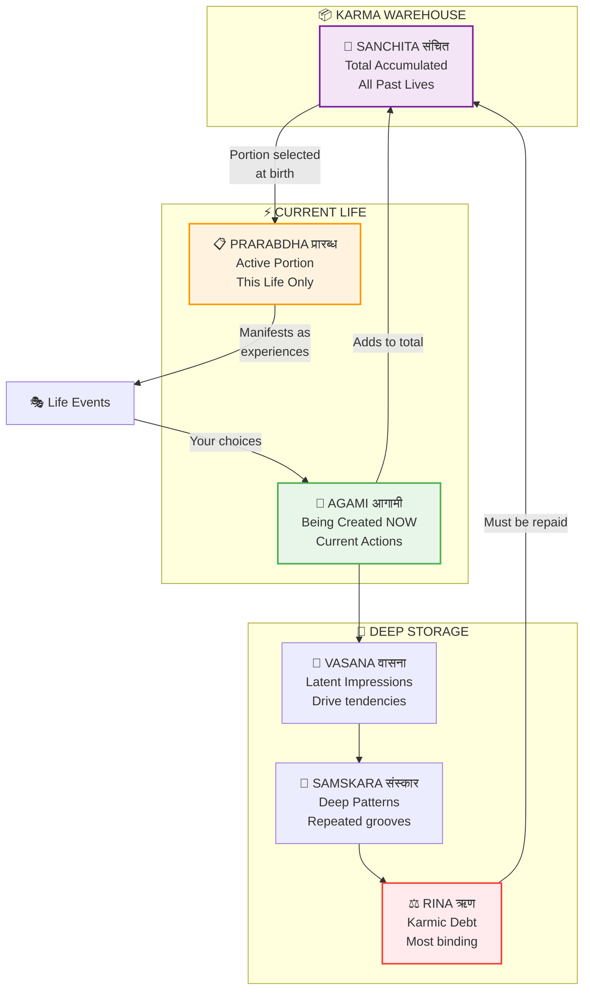
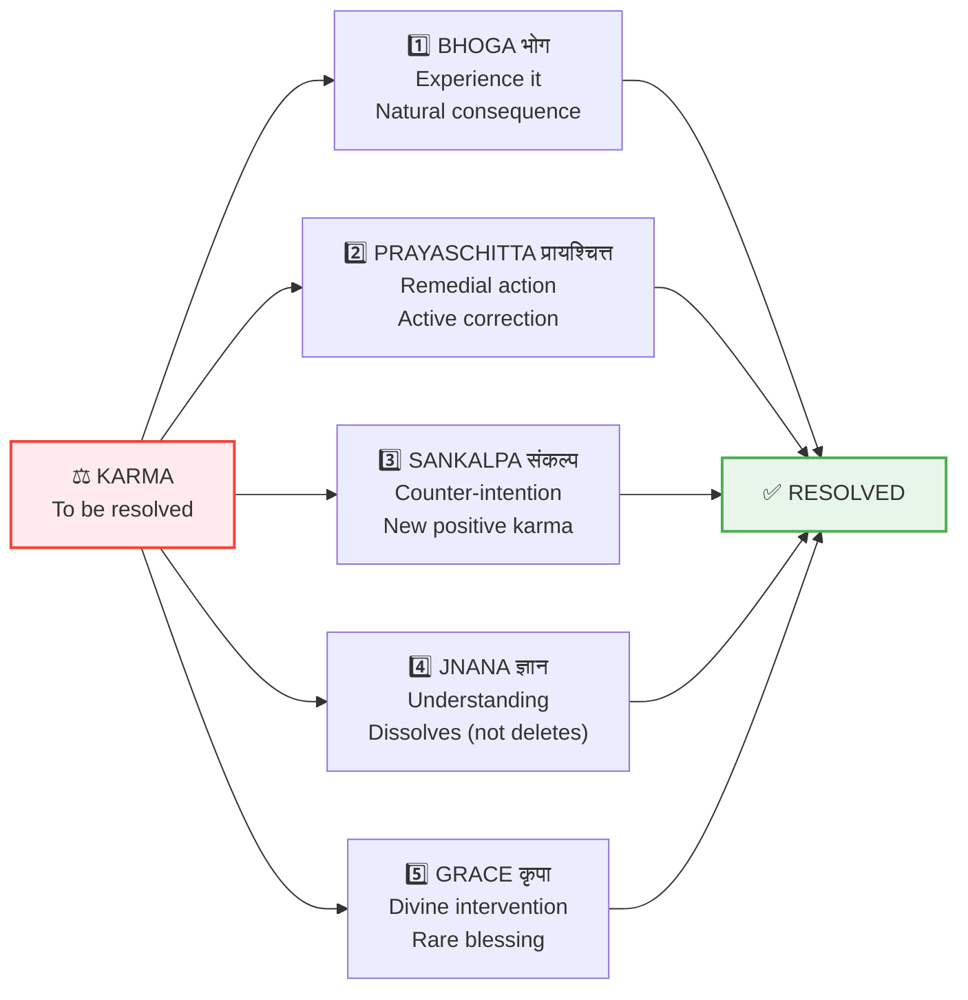

# ⚖️ KARMA — Action-Consequence System

> **"कर्मण्येवाधिकारस्ते मा फलेषु कदाचन"**  
> "You have the right to action alone, never to its fruits."  
> — Bhagavad Gita 2.47

---

## 📁 Contents

| File | Purpose |
|------|---------|
| [RINA_DEBT_SYSTEM.md](./RINA_DEBT_SYSTEM.md) | Karmic debt tracking — The 6 types of debt |
| [SANKALPA_BACKPROP.md](./SANKALPA_BACKPROP.md) | Intention as backpropagation — How sankalpa works |
| [FAILURE_MODES.md](./FAILURE_MODES.md) | What happens when karma fails to process |

---

## 🎯 Key Concepts

### Karma System Overview



### Karma Types (कर्म-विभाग)

| Type | Sanskrit | Description |
|------|----------|-------------|
| **Sanchita** | संचित | Accumulated — Total backlog from all lives |
| **Prarabdha** | प्रारब्ध | Active — Current life's allocated load |
| **Agami** | आगामी | Future — Being created now by current actions |
| **Vasana** | वासना | Latent — Impressions that drive tendencies |
| **Samskara** | संस्कार | Patterns — Deep grooves from repeated actions |
| **Rina** | ऋण | Debt — Obligations to others (most binding) |

### The Formula

```
F_karma = Gx × (M_tamas_1 × M_tamas_2) / r²

Where:
Gx = Cosmic karma constant
M_tamas = Accumulated tamas (karma mass) of each party
r = Relationship distance (closer = stronger effect)
```

### Karma Resolution



---

## 📋 On Life's Journey

> **Vedic Understanding:**
> Each life carries allocated purpose (Prarabdha). The path forward
> is through, not around. Completing one's dharma enables proper
> transition. Challenges are teachers. Growth happens through the journey.

---

**[← Back to Backend](../README.md)** | **[← Back to Spec](../../README.md)**

---

## 🔗 Related Visual Diagrams

For visual understanding of concepts in this document, see:
- [Karma](../../../../site/diagrams/karma.md) — Action-consequence system
- [Rina](../../../../site/diagrams/rina.md) — Debt system
- [Sankalpa](../../../../site/diagrams/sankalpa.md) — Intention mechanism
- [Samskaras & Vasanas](../../../../site/diagrams/samskaras_vasanas.md) — Impressions
- [View All Diagrams](../../../../site/diagrams/README.md) — Complete library

---
