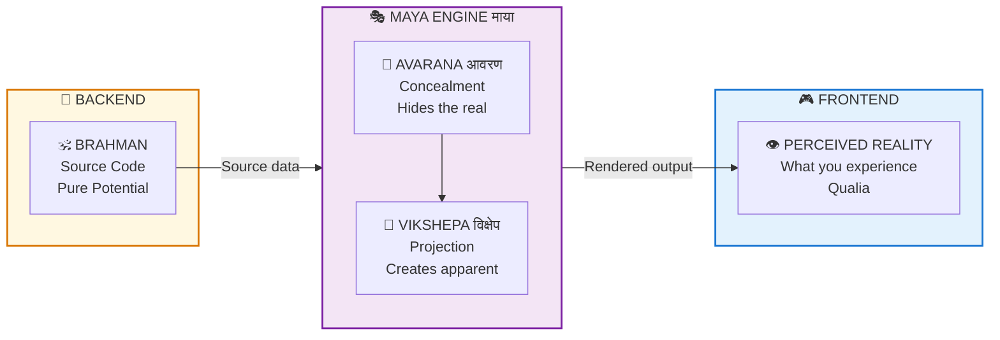
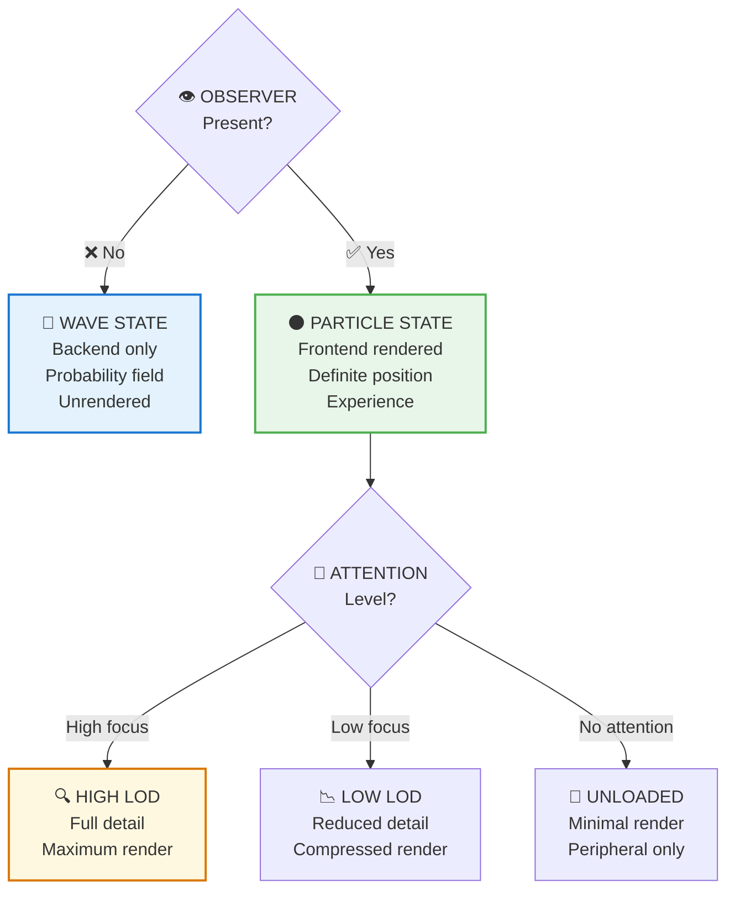

# 🎭 MAYA — Rendering Engine

> **"इन्द्रियाणि पराण्याहुरिन्द्रियेभ्यः परं मनः"**  
> "The senses are superior to matter; the mind is superior to the senses."  
> — Bhagavad Gita 3.42

---

## 📁 Contents

| File | Purpose |
|------|---------|
| [MAYA_RENDERING_ENGINE.md](./MAYA_RENDERING_ENGINE.md) | Complete render pipeline specification |

---

## 🎯 What Maya Does

Maya (माया) is the projection system that converts backend reality (Brahman) into frontend experience (observed world).



### Core Functions

1. **Converts backend → frontend** (probabilities → experience)
2. **On-demand rendering** (Observer Effect)
3. **Level-of-detail management** (14 Lokas / frequency bands)
4. **Guna-based filtering** (S/R/T affects perception)

---

## 🧮 The Transform

```
Frontend = Backend × Render_Scale × Guna_Factor × Maya_Coefficient

Where:
Frontend = What you experience (qualia)
Backend = What actually exists (Brahman)
Render_Scale = Loka-specific scaling (10³⁸ for humans)
Guna_Factor = Your S/R/T composition affects perception
Maya_Coefficient = Overall illusion strength (varies by Yuga)
```

---

## 📊 Maya Layers

| Layer | Function | Analogy |
|-------|----------|---------|
| **Avarana** | Concealment | Hides the real nature | Like fog hiding mountains |
| **Vikshepa** | Projection | Creates apparent reality | Like seeing rope as snake |

---

## 🌀 Render Priority



**OBSERVATION = RENDER TRIGGER**

---

**[← Back to Backend](../README.md)** | **[← Back to Spec](../../README.md)**

---

## 🔗 Related Visual Diagrams

For visual understanding of concepts in this document, see:
- [Maya](../../../../site/diagrams/maya.md) — Rendering engine
- [Observer Effect](../../../../site/diagrams/observer_effect.md) — Reality rendering
- [Simulation](../../../../site/diagrams/simulation.md) — Architecture
- [View All Diagrams](../../../../site/diagrams/README.md) — Complete library

---
