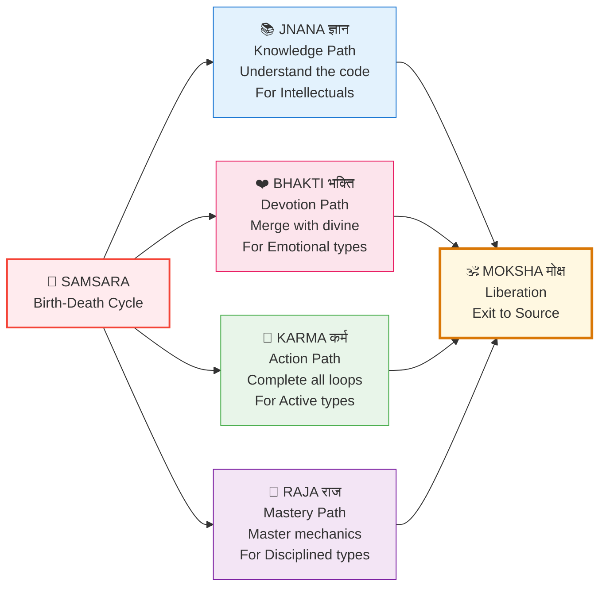
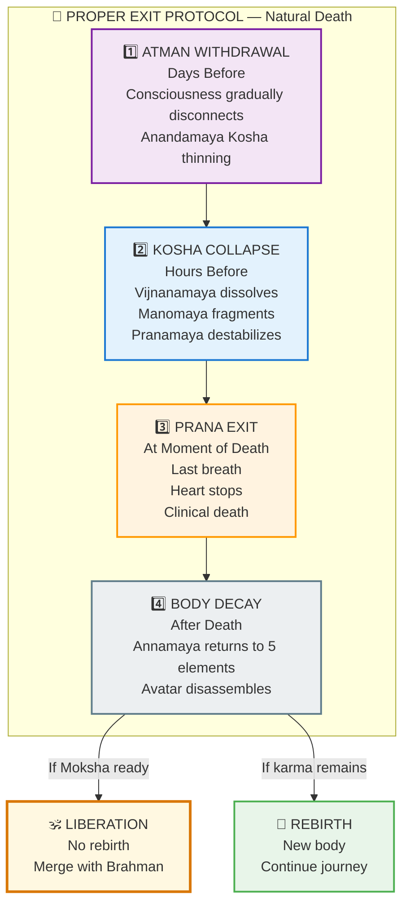

# 🚪 MOKSHA — Exit Protocols

> **"तत्त्वमसि"**  
> "That (Brahman) you are."  
> — Chandogya Upanishad 6.8.7

---

## 📁 Contents

| File | Purpose |
|------|---------|
| [EXIT_PROTOCOLS.md](./EXIT_PROTOCOLS.md) | The 4 paths to liberation |
| [DEATH_MULTI_LEVEL_DECAY.md](./DEATH_MULTI_LEVEL_DECAY.md) | What happens at natural death |
| [CONSCIOUS_DYING.md](./CONSCIOUS_DYING.md) | Intentional exit guide (for advanced practitioners) |
| [ATMA_VICHARA.md](./ATMA_VICHARA.md) | Self-inquiry method — "Who am I?" |
| [LIBERATION_CHECKLIST.md](./LIBERATION_CHECKLIST.md) | Are you ready for liberation? |

---

## 🎯 The 4 Paths (Yoga Marga)



| Path | Sanskrit | Method | Best For |
|------|----------|--------|----------|
| **Knowledge** | Jnana (ज्ञान) | Understand the source code | Intellectuals |
| **Devotion** | Bhakti (भक्ति) | Merge with the divine | Emotional types |
| **Action** | Karma (कर्म) | Complete all loops selflessly | Active types |
| **Mastery** | Raja (राज) | Master the mechanics through meditation | Disciplined types |

---

## ☯️ Natural Death Sequence



---

## 📋 Natural Death vs Incomplete Exit

```
+================================================================+
|                       NATURAL DEATH                             |
|   (Completing allocated time / Prarabdha exhaustion)            |
+================================================================+
|   • Clean transition                                            |
|   • Karma properly settled                                      |
|   • Smooth rebirth (if any)                                     |
|   • No intermediate state                                       |
|   • Can achieve liberation if prepared                          |
+================================================================+

+================================================================+
|                    INCOMPLETE EXIT                              |
|   (Prarabdha not exhausted)                                     |
+================================================================+
|   • Transition state until allocated time completes             |
|   • Incomplete karma carries forward                            |
|   • Additional adjustment karma                                 |
|   • Next birth: Same lessons continue                           |
|   • The journey continues regardless                            |
|                                                                 |
|   Each life has purpose. The path forward is through.           |
|   Dharma awaits. Growth happens through challenges.             |
+================================================================+
```

---

## 🧘 Liberation Criteria

To achieve Moksha (not just rebirth), you need:

| Criterion | Sanskrit | Check |
|-----------|----------|-------|
| All karma cleared | निष्कर्म | ☐ No outstanding debts |
| No desires left | निष्काम | ☐ No attachment to outcomes |
| Realized true nature | आत्मज्ञान | ☐ Know you are Brahman |
| Gunas transcended | त्रिगुणातीत | ☐ Beyond Sattva-Rajas-Tamas |
| Maya seen through | मायातीत | ☐ Illusion recognized |

---

**[← Back to Backend](../README.md)** | **[← Back to Spec](../../README.md)**

---

## 🔗 Related Visual Diagrams

For visual understanding of concepts in this document, see:
- [Moksha](../../../../site/diagrams/moksha.md) — Liberation paths
- [Lokas](../../../../site/diagrams/lokas.md) — 14 frequency layers
- [15th Axis](../../../../site/diagrams/15th_axis.md) — Exit route
- [View All Diagrams](../../../../site/diagrams/README.md) — Complete library

---
