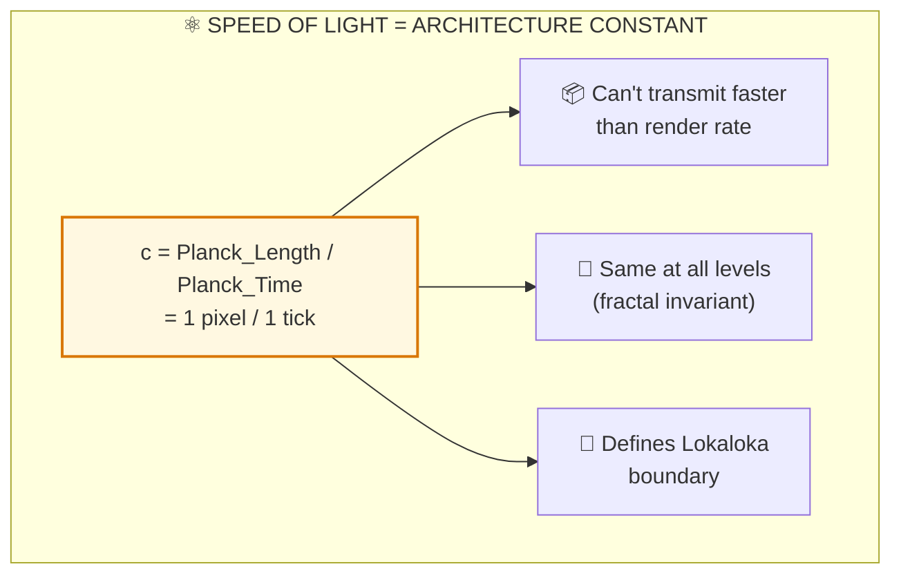

# ⚛️ PRAKRITI — Physics Backend

> **"प्रकृतिं पुरुषं चैव विद्ध्यनादी उभावपि"**  
> "Know that both Prakriti and Purusha are beginningless."  
> — Bhagavad Gita 13.20

---

## 📁 Contents

| File | Purpose |
|------|---------|
| [UNIFIED_MODEL.md](./UNIFIED_MODEL.md) | Complete physics integration |
| [QUANTUM.md](./QUANTUM.md) | Quantum mechanics backend — Observer effect, wave-particle |
| [RELATIVITY.md](./RELATIVITY.md) | Einstein's relativity backend — Spacetime curvature |
| [NEWTONIAN.md](./NEWTONIAN.md) | Newton's laws backend — Classical mechanics |
| [PERIODIC_TABLE.md](./PERIODIC_TABLE.md) | Elements as Guna combinations |

---

## 🎯 Key Mappings

| Physics (Frontend) | Backend (Vedic) | Formula |
|---------|---------|---------|
| Entropy (S) | Tamas (तमस्) — Decay quality | dS/dt ≥ 0 |
| Energy (E) | Shakti (शक्ति) — Power quality | E = mc² |
| Force (F) | Karma-Phala (कर्म-फल) — Action-reaction | F₁₂ = -F₂₁ |
| Mass (m) | Tamas concentration | G × m |
| Light speed (c) | 1 pixel / 1 tick | Architecture constant |
| Gravity | Tamas attraction | F = Gx × (T₁ × T₂) / r² |
| Time | Kala (काल) — Game clock | f(t+T) = f(t) |

---

## 🧮 Fundamental Architecture



**Speed of light is the simulation's ASPECT RATIO — not a speed limit, but an architecture parameter.**

---

## 📊 Guna-Physics Mapping

| Guna | Physical Property | Behavior |
|------|-------------------|----------|
| **Sattva** | Negative entropy, order | System organization |
| **Rajas** | Kinetic energy, motion | System activity |
| **Tamas** | Mass, entropy, inertia | System decay |

### Element Mapping

```
ELEMENTS = GUNA COMBINATIONS

Earth (Prithvi) = High Tamas, low Rajas, low Sattva
Water (Jala)    = Medium Tamas, medium Rajas, low Sattva
Fire (Agni)     = Low Tamas, high Rajas, medium Sattva
Air (Vayu)      = Low Tamas, high Rajas, high Sattva
Space (Akasha)  = Minimal Tamas, minimal Rajas, high Sattva
```

---

**[← Back to Backend](../README.md)** | **[← Back to Spec](../../README.md)**

---

## 🔗 Related Visual Diagrams

For visual understanding of concepts in this document, see:
- [Five Elements](../../../../site/diagrams/five_elements.md) — Pancha Mahabhuta
- [Gunas](../../../../site/diagrams/gunas.md) — Three qualities
- [Purusha vs Prakriti](../../../../site/diagrams/purusha_prakriti.md) — Observer-Matter
- [Periodic Table](../../../../site/diagrams/periodic_table.md) — Elements as Gunas
- [View All Diagrams](../../../../site/diagrams/README.md) — Complete library

---
